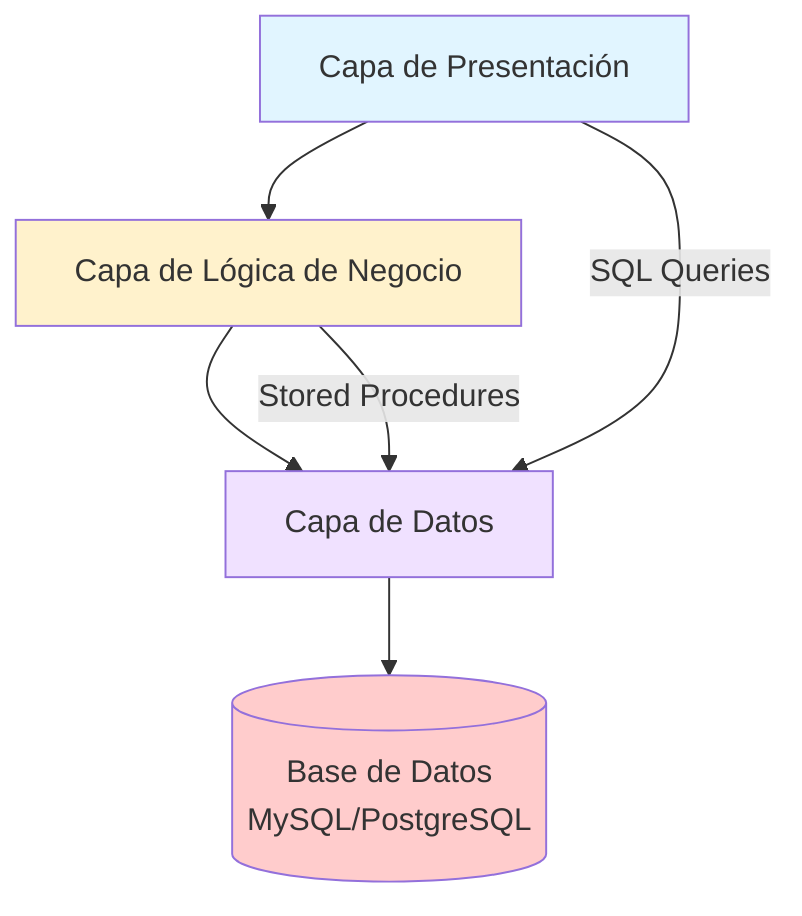
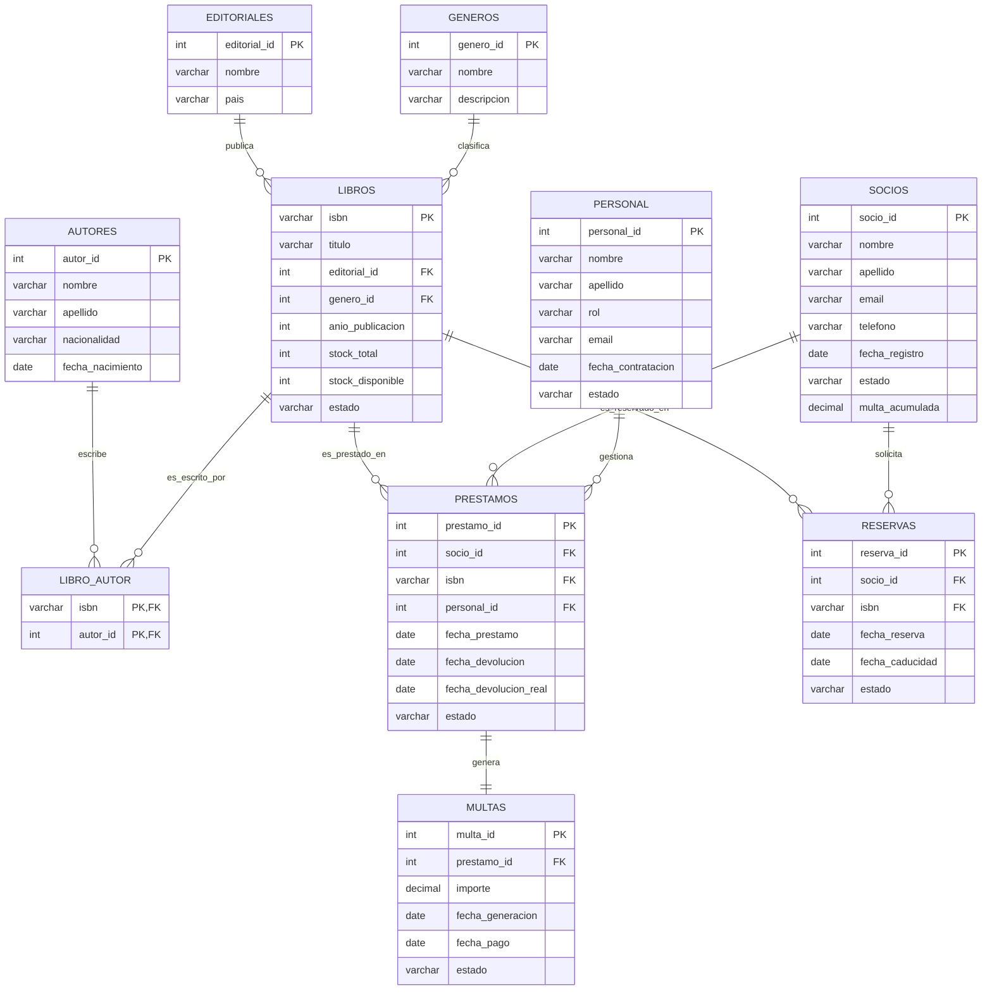

# Caso Técnico: Sistema de Gestión de Biblioteca

## 1. Arquitectura del Sistema

### 1.1 Arquitectura de Tres Capas



**Capa de Presentación**:
- Interfaz de usuario (consola o aplicación web)
- Formularios de entrada de datos
- Visualización de reportes

**Capa de Lógica de Negocio**:
- Stored Procedures
- Triggers
- Validaciones de negocio

**Capa de Datos**:
- Tablas normalizadas
- Índices y constraints
- Transacciones

### 1.2 Tecnologías Recomendadas

| Componente | Tecnología | Versión | Justificación |
|------------|------------|---------|---------------|
| SGBD | MySQL | 8.0+ | Open source, amplia documentación |
| Alternativa | PostgreSQL | 13+ | Más robusto para funciones avanzadas |
| Herramienta GUI | MySQL Workbench | 8.0+ | Diseño visual de BD |
| Alternativa | DBeaver | 21.0+ | Multiplataforma, gratuito |
| Diagramas | draw.io | Web | Gratuito, exporta múltiples formatos |
| Documentación | Markdown | - | Fácil versión control |

## 2. Diseño de Base de Datos

### 2.1 Modelo Entidad-Relación (ER)



### 2.2 Normalización

**Tabla LIBROS (antes de normalización)**:
```sql
-- Forma desnormalizada (NO hacer esto)
CREATE TABLE LIBROS_DESNORMALIZADO (
    isbn VARCHAR(20) PRIMARY KEY,
    titulo VARCHAR(200),
    editorial_nombre VARCHAR(100),  -- Dependencia transitiva
    editorial_pais VARCHAR(50),     -- Dependencia transitiva
    genero_nombre VARCHAR(50),      -- Dependencia transitiva
    autor_nombre VARCHAR(100),      -- Multivalorado
    autor_apellido VARCHAR(100),    -- Multivalorado
    anio_publicacion INT
);
```

**Problemas identificados**:
1. **Dependencia transitiva**: `editorial_pais` depende de `editorial_nombre`, no de `isbn`
2. **Atributo multivalorado**: Un libro puede tener múltiples autores
3. **Redundancia de datos**: El nombre de la editorial se repite

**Solución - Normalización 3FN**:
```sql
-- Tabla EDITORIALES (entidad fuerte)
CREATE TABLE EDITORIALES (
    editorial_id INT PRIMARY KEY AUTO_INCREMENT,
    nombre VARCHAR(100) NOT NULL UNIQUE,
    pais VARCHAR(50),
    INDEX idx_editorial_nombre (nombre)
);

-- Tabla GENEROS (entidad fuerte)
CREATE TABLE GENEROS (
    genero_id INT PRIMARY KEY AUTO_INCREMENT,
    nombre VARCHAR(50) NOT NULL UNIQUE,
    descripcion TEXT
);

-- Tabla AUTORES (entidad fuerte)
CREATE TABLE AUTORES (
    autor_id INT PRIMARY KEY AUTO_INCREMENT,
    nombre VARCHAR(100) NOT NULL,
    apellido VARCHAR(100) NOT NULL,
    nacionalidad VARCHAR(50),
    fecha_nacimiento DATE,
    INDEX idx_autor_nombre (nombre, apellido)
);

-- Tabla LIBROS (entidad fuerte)
CREATE TABLE LIBROS (
    isbn VARCHAR(20) PRIMARY KEY,
    titulo VARCHAR(200) NOT NULL,
    editorial_id INT NOT NULL,
    genero_id INT NOT NULL,
    anio_publicacion INT,
    stock_total INT DEFAULT 1,
    stock_disponible INT DEFAULT 1,
    estado ENUM('Disponible', 'Prestado', 'Reservado', 'En reparación') DEFAULT 'Disponible',
    FOREIGN KEY (editorial_id) REFERENCES EDITORIALES(editorial_id),
    FOREIGN KEY (genero_id) REFERENCES GENEROS(genero_id),
    INDEX idx_libro_titulo (titulo),
    INDEX idx_libro_estado (estado)
);

-- Tabla intermedia para relación muchos a muchos
CREATE TABLE LIBRO_AUTOR (
    isbn VARCHAR(20) NOT NULL,
    autor_id INT NOT NULL,
    PRIMARY KEY (isbn, autor_id),
    FOREIGN KEY (isbn) REFERENCES LIBROS(isbn) ON DELETE CASCADE,
    FOREIGN KEY (autor_id) REFERENCES AUTORES(autor_id) ON DELETE CASCADE
);
```

### 2.3 Diccionario de Datos Completo

| Tabla | Campo | Tipo | Longitud | Clave | Nulo | Default | Descripción |
|-------|-------|------|----------|-------|------|---------|-------------|
| **EDITORIALES** | editorial_id | INT | - | PK | No | AUTO_INCREMENT | Identificador único |
| | nombre | VARCHAR | 100 | UNIQUE | No | - | Nombre editorial |
| | pais | VARCHAR | 50 | - | Sí | - | País de origen |
| | fecha_registro | TIMESTAMP | - | - | No | CURRENT_TIMESTAMP | Fecha alta |
| **GENEROS** | genero_id | INT | - | PK | No | AUTO_INCREMENT | Identificador único |
| | nombre | VARCHAR | 50 | UNIQUE | No | - | Nombre género |
| | descripcion | TEXT | - | - | Sí | - | Descripción |
| **AUTORES** | autor_id | INT | - | PK | No | AUTO_INCREMENT | Identificador único |
| | nombre | VARCHAR | 100 | - | No | - | Nombre autor |
| | apellido | VARCHAR | 100 | - | No | - | Apellido autor |
| | nacionalidad | VARCHAR | 50 | - | Sí | - | Nacionalidad |
| | fecha_nacimiento | DATE | - | - | Sí | - | Fecha nacimiento |
| **LIBROS** | isbn | VARCHAR | 20 | PK | No | - | ISBN único |
| | titulo | VARCHAR | 200 | - | No | - | Título libro |
| | editorial_id | INT | - | FK | No | - | Editorial |
| | genero_id | INT | - | FK | No | - | Género |
| | anio_publicacion | INT | - | - | Sí | - | Año publicación |
| | stock_total | INT | - | - | No | 1 | Total ejemplares |
| | stock_disponible | INT | - | - | No | 1 | Ejemplares disponibles |
| | estado | ENUM | - | - | No | 'Disponible' | Estado actual |
| **SOCIOS** | socio_id | INT | - | PK | No | AUTO_INCREMENT | Identificador único |
| | nombre | VARCHAR | 100 | - | No | - | Nombre socio |
| | apellido | VARCHAR | 100 | - | No | - | Apellido socio |
| | email | VARCHAR | 100 | UNIQUE | No | - | Email único |
| | telefono | VARCHAR | 20 | - | Sí | - | Teléfono |
| | fecha_registro | DATE | - | - | No | CURRENT_DATE | Fecha registro |
| | estado | ENUM | - | - | No | 'Activo' | Estado membresía |
| | multa_acumulada | DECIMAL | 10,2 | - | No | 0.00 | Multas pendientes |
| **PERSONAL** | personal_id | INT | - | PK | No | AUTO_INCREMENT | Identificador único |
| | nombre | VARCHAR | 100 | - | No | - | Nombre empleado |
| | apellido | VARCHAR | 100 | - | No | - | Apellido empleado |
| | rol | ENUM | - | - | No | - | Rol/Cargo |
| | email | VARCHAR | 100 | UNIQUE | No | - | Email único |
| | fecha_contratacion | DATE | - | - | No | - | Fecha contratación |
| | estado | ENUM | - | - | No | 'Activo' | Estado empleado |
| **PRESTAMOS** | prestamo_id | INT | - | PK | No | AUTO_INCREMENT | Identificador único |
| | socio_id | INT | - | FK | No | - | Socio |
| | isbn | VARCHAR | 20 | FK | No | - | Libro |
| | personal_id | INT | - | FK | No | - | Bibliotecario |
| | fecha_prestamo | DATE | - | - | No | CURRENT_DATE | Fecha préstamo |
| | fecha_devolucion | DATE | - | - | No | - | Fecha límite |
| | fecha_devolucion_real | DATE | - | - | Sí | - | Fecha real devolución |
| | estado | ENUM | - | - | No | 'Activo' | Estado préstamo |
| **RESERVAS** | reserva_id | INT | - | PK | No | AUTO_INCREMENT | Identificador único |
| | socio_id | INT | - | FK | No | - | Socio |
| | isbn | VARCHAR | 20 | FK | No | - | Libro |
| | fecha_reserva | DATE | - | - | No | CURRENT_DATE | Fecha reserva |
| | fecha_caducidad | DATE | - | - | No | - | Fecha caducidad |
| | estado | ENUM | - | - | No | 'Pendiente' | Estado reserva |
| **MULTAS** | multa_id | INT | - | PK | No | AUTO_INCREMENT | Identificador único |
| | prestamo_id | INT | - | FK | No | - | Préstamo relacionado |
| | importe | DECIMAL | 10,2 | - | No | - | Importe multa |
| | fecha_generacion | DATE | - | - | No | CURRENT_DATE | Fecha generación |
| | fecha_pago | DATE | - | - | Sí | - | Fecha pago |
| | estado | ENUM | - | - | No | 'Pendiente' | Estado multa |

## 3. Implementación SQL

### 3.1 Estrategia de Implementación

**Orden de creación de objetos**:
1. Tablas base (sin FK)
2. Tablas de referencia
3. Tablas con FK (en orden de dependencia)
4. Índices
5. Constraints
6. Vistas
7. Stored Procedures
8. Triggers

### 3.2 Gestión de Transacciones

```sql
-- Ejemplo de transacción completa para préstamo
DELIMITER $$
CREATE PROCEDURE sp_registrar_prestamo_seguro(
    IN p_id_socio INT,
    IN p_isbn VARCHAR(20),
    IN p_id_personal INT,
    OUT p_resultado VARCHAR(200)
)
BEGIN
    DECLARE EXIT HANDLER FOR SQLEXCEPTION
    BEGIN
        ROLLBACK;
        SET p_resultado = 'ERROR: Transacción fallida';
    END;
    
    START TRANSACTION;
    
    -- Validaciones
    IF NOT EXISTS (SELECT 1 FROM SOCIOS WHERE socio_id = p_id_socio AND estado = 'Activo') THEN
        ROLLBACK;
        SET p_resultado = 'ERROR: Socio no existe o está inactivo';
        LEAVE proc_label;
    END IF;
    
    -- Más validaciones...
    
    -- Inserción del préstamo
    INSERT INTO PRESTAMOS (socio_id, isbn, personal_id, fecha_devolucion)
    VALUES (p_id_socio, p_isbn, p_id_personal, DATE_ADD(CURDATE(), INTERVAL 15 DAY));
    
    -- Actualizar stock disponible
    UPDATE LIBROS 
    SET stock_disponible = stock_disponible - 1,
        estado = CASE WHEN stock_disponible - 1 = 0 THEN 'Prestado' ELSE 'Disponible' END
    WHERE isbn = p_isbn;
    
    COMMIT;
    SET p_resultado = 'Préstamo registrado exitosamente';
    
END$$
DELIMITER ;
```

### 3.3 Optimización con Índices

```sql
-- Índices para mejorar rendimiento
CREATE INDEX idx_libros_titulo ON LIBROS(titulo);
CREATE INDEX idx_libros_editorial ON LIBROS(editorial_id);
CREATE INDEX idx_libros_genero ON LIBROS(genero_id);
CREATE INDEX idx_libros_estado ON LIBROS(estado);

CREATE INDEX idx_socios_email ON SOCIOS(email);
CREATE INDEX idx_socios_estado ON SOCIOS(estado);
CREATE INDEX idx_socios_multa ON SOCIOS(multa_acumulada);

CREATE INDEX idx_prestamos_socio ON PRESTAMOS(socio_id);
CREATE INDEX idx_prestamos_isbn ON PRESTAMOS(isbn);
CREATE INDEX idx_prestamos_estado ON PRESTAMOS(estado);
CREATE INDEX idx_prestamos_fechas ON PRESTAMOS(fecha_prestamo, fecha_devolucion);

CREATE INDEX idx_reservas_socio ON RESERVAS(socio_id);
CREATE INDEX idx_reservas_isbn ON RESERVAS(isbn);
CREATE INDEX idx_reservas_estado ON RESERVAS(estado);

CREATE INDEX idx_multas_prestamo ON MULTAS(prestamo_id);
CREATE INDEX idx_multas_estado ON MULTAS(estado);

-- Índice compuesto para búsquedas complejas
CREATE INDEX idx_prestamos_completo ON PRESTAMOS(socio_id, isbn, estado);
```

### 3.4 Vistas para Reportes

```sql
-- Vista de libros disponibles
CREATE VIEW vw_libros_disponibles AS
SELECT 
    l.isbn,
    l.titulo,
    e.nombre as editorial,
    g.nombre as genero,
    l.stock_disponible,
    GROUP_CONCAT(CONCAT(a.nombre, ' ', a.apellido) SEPARATOR ', ') as autores
FROM LIBROS l
JOIN EDITORIALES e ON l.editorial_id = e.editorial_id
JOIN GENEROS g ON l.genero_id = g.genero_id
JOIN LIBRO_AUTOR la ON l.isbn = la.isbn
JOIN AUTORES a ON la.autor_id = a.autor_id
WHERE l.estado = 'Disponible' AND l.stock_disponible > 0
GROUP BY l.isbn, l.titulo, e.nombre, g.nombre, l.stock_disponible;

-- Vista de préstamos activos
CREATE VIEW vw_prestamos_activos AS
SELECT 
    p.prestamo_id,
    CONCAT(s.nombre, ' ', s.apellido) as socio,
    s.email,
    l.titulo,
    p.fecha_prestamo,
    p.fecha_devolucion,
    DATEDIFF(p.fecha_devolucion, CURDATE()) as dias_restantes
FROM PRESTAMOS p
JOIN SOCIOS s ON p.socio_id = s.socio_id
JOIN LIBROS l ON p.isbn = l.isbn
WHERE p.estado = 'Activo';

-- Vista de multas pendientes
CREATE VIEW vw_multas_pendientes AS
SELECT 
    m.multa_id,
    CONCAT(s.nombre, ' ', s.apellido) as socio,
    s.email,
    l.titulo,
    m.importe,
    m.fecha_generacion,
    DATEDIFF(CURDATE(), m.fecha_generacion) as dias_pendientes
FROM MULTAS m
JOIN PRESTAMOS p ON m.prestamo_id = p.prestamo_id
JOIN SOCIOS s ON p.socio_id = s.socio_id
JOIN LIBROS l ON p.isbn = l.isbn
WHERE m.estado = 'Pendiente';
```

## 4. Stored Procedures Avanzados

### 4.1 Gestión de Préstamos con Validaciones Complejas

```sql
DELIMITER $$
CREATE PROCEDURE sp_registrar_prestamo_completo(
    IN p_socio_id INT,
    IN p_isbn VARCHAR(20),
    IN p_personal_id INT,
    OUT p_prestamo_id INT,
    OUT p_mensaje VARCHAR(200)
)
BEGIN
    DECLARE v_prestamos_activos INT;
    DECLARE v_multas_pendientes DECIMAL(10,2);
    DECLARE v_stock_disponible INT;
    DECLARE v_socio_estado VARCHAR(20);
    DECLARE v_libro_estado VARCHAR(20);
    
    -- Inicializar variables de salida
    SET p_prestamo_id = NULL;
    SET p_mensaje = '';
    
    -- Validación 1: Socio existe y está activo
    SELECT estado, multa_acumulada INTO v_socio_estado, v_multas_pendientes
    FROM SOCIOS WHERE socio_id = p_socio_id;
    
    IF v_socio_estado IS NULL THEN
        SET p_mensaje = 'ERROR: Socio no encontrado';
        LEAVE proc_label;
    END IF;
    
    IF v_socio_estado != 'Activo' THEN
        SET p_mensaje = 'ERROR: Socio no está activo';
        LEAVE proc_label;
    END IF;
    
    -- Validación 2: Límite de multas
    IF v_multas_pendientes > 10.00 THEN
        SET p_mensaje = 'ERROR: Socio tiene multas pendientes superiores a 10€';
        LEAVE proc_label;
    END IF;
    
    -- Validación 3: Límite de préstamos
    SELECT COUNT(*) INTO v_prestamos_activos
    FROM PRESTAMOS
    WHERE socio_id = p_socio_id AND estado = 'Activo';
    
    IF v_prestamos_activos >= 3 THEN
        SET p_mensaje = 'ERROR: Socio ha alcanzado el límite de 3 préstamos';
        LEAVE proc_label;
    END IF;
    
    -- Validación 4: Libro disponible
    SELECT stock_disponible, estado INTO v_stock_disponible, v_libro_estado
    FROM LIBROS WHERE isbn = p_isbn;
    
    IF v_stock_disponible IS NULL THEN
        SET p_mensaje = 'ERROR: Libro no encontrado';
        LEAVE proc_label;
    END IF;
    
    IF v_stock_disponible <= 0 OR v_libro_estado != 'Disponible' THEN
        SET p_mensaje = 'ERROR: Libro no está disponible';
        LEAVE proc_label;
    END IF;
    
    -- Inserción del préstamo
    START TRANSACTION;
    
    INSERT INTO PRESTAMOS (socio_id, isbn, personal_id, fecha_devolucion)
    VALUES (p_socio_id, p_isbn, p_personal_id, DATE_ADD(CURDATE(), INTERVAL 15 DAY));
    
    SET p_prestamo_id = LAST_INSERT_ID();
    
    -- Actualizar stock del libro
    UPDATE LIBROS 
    SET stock_disponible = stock_disponible - 1,
        estado = CASE WHEN (stock_disponible - 1) = 0 THEN 'Prestado' ELSE 'Disponible' END
    WHERE isbn = p_isbn;
    
    COMMIT;
    SET p_mensaje = 'Préstamo registrado exitosamente';
    
    proc_label: BEGIN END;
END$$
DELIMITER ;
```

### 4.2 Sistema de Reservas Inteligente

```sql
DELIMITER $$
CREATE PROCEDURE sp_procesar_reservas_pendientes(
    IN p_isbn VARCHAR(20)
)
BEGIN
    DECLARE v_reserva_id INT;
    DECLARE v_socio_id INT;
    DECLARE v_socio_email VARCHAR(100);
    DECLARE done INT DEFAULT FALSE;
    
    -- Cursor para obtener reservas pendientes del libro
    DECLARE cur_reservas CURSOR FOR
        SELECT r.reserva_id, r.socio_id, s.email
        FROM RESERVAS r
        JOIN SOCIOS s ON r.socio_id = s.socio_id
        WHERE r.isbn = p_isbn AND r.estado = 'Pendiente'
        ORDER BY r.fecha_reserva ASC
        LIMIT 1; -- Solo la primera reserva
    
    DECLARE CONTINUE HANDLER FOR NOT FOUND SET done = TRUE;
    
    OPEN cur_reservas;
    FETCH cur_reservas INTO v_reserva_id, v_socio_id, v_socio_email;
    
    IF NOT done THEN
        -- Actualizar reserva a "Disponible para retiro"
        UPDATE RESERVAS 
        SET estado = 'Disponible', 
            fecha_caducidad = DATE_ADD(CURDATE(), INTERVAL 3 DAY)
        WHERE reserva_id = v_reserva_id;
        
        -- Aquí iría la lógica de notificación (email, SMS)
        -- Por ahora, solo registramos en una tabla de notificaciones
        INSERT INTO NOTIFICACIONES (socio_id, tipo, mensaje, fecha_envio)
        VALUES (v_socio_id, 'Reserva', 
                CONCAT('El libro ', p_isbn, ' está disponible para retiro. Tiene 3 días.'),
                CURDATE());
    END IF;
    
    CLOSE cur_reservas;
END$$
DELIMITER ;
```

### 4.3 Reportes Estadísticos Avanzados

```sql
DELIMITER $$
CREATE PROCEDURE sp_reporte_estadisticas_mensual(
    IN p_mes INT,
    IN p_anio INT,
    OUT p_total_prestamos INT,
    OUT p_total_multas DECIMAL(10,2),
    OUT p_libro_mas_popular VARCHAR(200)
)
BEGIN
    -- Total de préstamos en el período
    SELECT COUNT(*) INTO p_total_prestamos
    FROM PRESTAMOS
    WHERE MONTH(fecha_prestamo) = p_mes 
      AND YEAR(fecha_prestamo) = p_anio;
    
    -- Total de multas generadas
    SELECT COALESCE(SUM(importe), 0) INTO p_total_multas
    FROM MULTAS
    WHERE MONTH(fecha_generacion) = p_mes 
      AND YEAR(fecha_generacion) = p_anio;
    
    -- Libro más popular
    SELECT l.titulo INTO p_libro_mas_popular
    FROM PRESTAMOS p
    JOIN LIBROS l ON p.isbn = l.isbn
    WHERE MONTH(p.fecha_prestamo) = p_mes 
      AND YEAR(p.fecha_prestamo) = p_anio
    GROUP BY l.isbn, l.titulo
    ORDER BY COUNT(*) DESC
    LIMIT 1;
    
    IF p_libro_mas_popular IS NULL THEN
        SET p_libro_mas_popular = 'No hay datos';
    END IF;
END$$
DELIMITER ;
```

## 5. Triggers y Auditoría

### 5.1 Trigger de Validación Complejo

```sql
DELIMITER $$
CREATE TRIGGER trg_prestamo_before_insert
BEFORE INSERT ON PRESTAMOS
FOR EACH ROW
BEGIN
    DECLARE v_stock_disponible INT;
    DECLARE v_socio_estado VARCHAR(20);
    DECLARE v_multas_pendientes DECIMAL(10,2);
    DECLARE v_prestamos_activos INT;
    
    -- Validar stock disponible
    SELECT stock_disponible INTO v_stock_disponible
    FROM LIBROS WHERE isbn = NEW.isbn;
    
    IF v_stock_disponible <= 0 THEN
        SIGNAL SQLSTATE '45000' 
        SET MESSAGE_TEXT = 'Stock no disponible para préstamo';
    END IF;
    
    -- Validar socio activo
    SELECT estado, multa_acumulada INTO v_socio_estado, v_multas_pendientes
    FROM SOCIOS WHERE socio_id = NEW.socio_id;
    
    IF v_socio_estado != 'Activo' THEN
        SIGNAL SQLSTATE '45000' 
        SET MESSAGE_TEXT = 'Socio no está activo';
    END IF;
    
    IF v_multas_pendientes > 10.00 THEN
        SIGNAL SQLSTATE '45000' 
        SET MESSAGE_TEXT = 'Socio tiene multas pendientes > 10€';
    END IF;
    
    -- Validar límite de préstamos
    SELECT COUNT(*) INTO v_prestamos_activos
    FROM PRESTAMOS
    WHERE socio_id = NEW.socio_id AND estado = 'Activo';
    
    IF v_prestamos_activos >= 3 THEN
        SIGNAL SQLSTATE '45000' 
        SET MESSAGE_TEXT = 'Límite de 3 préstamos alcanzado';
    END IF;
    
    -- Establecer fecha de devolución (15 días)
    SET NEW.fecha_devolucion = DATE_ADD(CURDATE(), INTERVAL 15 DAY);
    SET NEW.estado = 'Activo';
END$$
DELIMITER ;
```

### 5.2 Trigger de Auditoría

```sql
-- Tabla de auditoría
CREATE TABLE AUDITORIA_LIBROS (
    auditoria_id INT PRIMARY KEY AUTO_INCREMENT,
    isbn VARCHAR(20),
    campo_modificado VARCHAR(50),
    valor_anterior VARCHAR(255),
    valor_nuevo VARCHAR(255),
    usuario VARCHAR(100),
    fecha_modificacion TIMESTAMP DEFAULT CURRENT_TIMESTAMP,
    tipo_operacion ENUM('INSERT', 'UPDATE', 'DELETE')
);

DELIMITER $$
CREATE TRIGGER trg_libros_after_update
AFTER UPDATE ON LIBROS
FOR EACH ROW
BEGIN
    IF OLD.titulo != NEW.titulo THEN
        INSERT INTO AUDITORIA_LIBROS (isbn, campo_modificado, valor_anterior, valor_nuevo, usuario, tipo_operacion)
        VALUES (NEW.isbn, 'titulo', OLD.titulo, NEW.titulo, USER(), 'UPDATE');
    END IF;
    
    IF OLD.stock_disponible != NEW.stock_disponible THEN
        INSERT INTO AUDITORIA_LIBROS (isbn, campo_modificado, valor_anterior, valor_nuevo, usuario, tipo_operacion)
        VALUES (NEW.isbn, 'stock_disponible', OLD.stock_disponible, NEW.stock_disponible, USER(), 'UPDATE');
    END IF;
    
    IF OLD.estado != NEW.estado THEN
        INSERT INTO AUDITORIA_LIBROS (isbn, campo_modificado, valor_anterior, valor_nuevo, usuario, tipo_operacion)
        VALUES (NEW.isbn, 'estado', OLD.estado, NEW.estado, USER(), 'UPDATE');
    END IF;
END$$
DELIMITER ;
```

## 6. Cursores y Procesamiento Masivo

### 6.1 Cursor para Actualización de Multas

```sql
DELIMITER $$
CREATE PROCEDURE sp_actualizar_multas_diarias()
BEGIN
    DECLARE v_prestamo_id INT;
    DECLARE v_dias_retraso INT;
    DECLARE v_multa_existente DECIMAL(10,2);
    DECLARE v_importe_calculado DECIMAL(10,2);
    DECLARE done INT DEFAULT FALSE;
    
    -- Cursor para préstamos vencidos sin multa o con multa desactualizada
    DECLARE cur_prestamos_vencidos CURSOR FOR
        SELECT p.prestamo_id, DATEDIFF(CURDATE(), p.fecha_devolucion)
        FROM PRESTAMOS p
        LEFT JOIN MULTAS m ON p.prestamo_id = m.prestamo_id AND m.estado = 'Pendiente'
        WHERE p.estado = 'Activo' 
          AND p.fecha_devolucion < CURDATE()
          AND (m.multa_id IS NULL OR m.importe != DATEDIFF(CURDATE(), p.fecha_devolucion) * 0.50);
    
    DECLARE CONTINUE HANDLER FOR NOT FOUND SET done = TRUE;
    
    OPEN cur_prestamos_vencidos;
    
    read_loop: LOOP
        FETCH cur_prestamos_vencidos INTO v_prestamo_id, v_dias_retraso;
        
        IF done THEN
            LEAVE read_loop;
        END IF;
        
        SET v_importe_calculado = LEAST(v_dias_retraso * 0.50, 30.00);
        
        -- Verificar si ya existe multa para este préstamo
        SELECT importe INTO v_multa_existente
        FROM MULTAS
        WHERE prestamo_id = v_prestamo_id AND estado = 'Pendiente'
        LIMIT 1;
        
        IF v_multa_existente IS NULL THEN
            -- Insertar nueva multa
            INSERT INTO MULTAS (prestamo_id, importe, estado)
            VALUES (v_prestamo_id, v_importe_calculado, 'Pendiente');
        ELSEIF v_multa_existente != v_importe_calculado THEN
            -- Actualizar multa existente
            UPDATE MULTAS
            SET importe = v_importe_calculado
            WHERE prestamo_id = v_prestamo_id AND estado = 'Pendiente';
        END IF;
        
    END LOOP;
    
    CLOSE cur_prestamos_vencidos;
END$$
DELIMITER ;
```

### 6.2 Cursor para Generación de Reportes Masivos

```sql
DELIMITER $$
CREATE PROCEDURE sp_generar_reporte_morosidad(
    OUT p_total_socios_morosos INT,
    OUT p_total_multas_generadas DECIMAL(10,2)
)
BEGIN
    DECLARE v_socio_id INT;
    DECLARE v_total_multas_socio DECIMAL(10,2);
    DECLARE done INT DEFAULT FALSE;
    
    -- Cursor para recorrer socios con multas
    DECLARE cur_socios_multas CURSOR FOR
        SELECT socio_id, SUM(importe) as total_multas
        FROM MULTAS m
        JOIN PRESTAMOS p ON m.prestamo_id = p.prestamo_id
        WHERE m.estado = 'Pendiente'
        GROUP BY socio_id
        HAVING total_multas > 0;
    
    DECLARE CONTINUE HANDLER FOR NOT FOUND SET done = TRUE;
    
    -- Tabla temporal para resultados
    CREATE TEMPORARY TABLE IF NOT EXISTS temp_morosidad (
        socio_id INT,
        nombre_completo VARCHAR(200),
        total_multas DECIMAL(10,2),
        cantidad_prestamos INT
    );
    
    OPEN cur_socios_multas;
    
    read_loop: LOOP
        FETCH cur_socios_multas INTO v_socio_id, v_total_multas_socio;
        
        IF done THEN
            LEAVE read_loop;
        END IF;
        
        -- Insertar en tabla temporal con detalles del socio
        INSERT INTO temp_morosidad
        SELECT 
            s.socio_id,
            CONCAT(s.nombre, ' ', s.apellido),
            v_total_multas_socio,
            COUNT(p.prestamo_id)
        FROM SOCIOS s
        JOIN PRESTAMOS p ON s.socio_id = p.socio_id
        WHERE s.socio_id = v_socio_id
        GROUP BY s.socio_id, s.nombre, s.apellido;
        
    END LOOP;
    
    CLOSE cur_socios_multas;
    
    -- Calcular totales
    SELECT COUNT(*), COALESCE(SUM(total_multas), 0) 
    INTO p_total_socios_morosos, p_total_multas_generadas
    FROM temp_morosidad;
    
    -- Mostrar resultados detallados
    SELECT * FROM temp_morosidad ORDER BY total_multas DESC;
    
    -- Limpiar tabla temporal
    DROP TEMPORARY TABLE IF EXISTS temp_morosidad;
END$$
DELIMITER ;
```

## 7. Seguridad y Backup

### 7.1 Usuarios y Permisos

```sql
-- Crear roles de usuario
CREATE USER 'bibliotecario'@'localhost' IDENTIFIED BY 'biblio_2024';
CREATE USER 'admin_biblioteca'@'localhost' IDENTIFIED BY 'admin_2024_secure';

-- Permisos para bibliotecario
GRANT SELECT, INSERT, UPDATE ON biblioteca.* TO 'bibliotecario'@'localhost';
GRANT EXECUTE ON PROCEDURE biblioteca.sp_registrar_prestamo TO 'bibliotecario'@'localhost';
GRANT EXECUTE ON PROCEDURE biblioteca.sp_registrar_devolucion TO 'bibliotecario'@'localhost';

-- Permisos para administrador
GRANT ALL PRIVILEGES ON biblioteca.* TO 'admin_biblioteca'@'localhost';

FLUSH PRIVILEGES;
```

### 7.2 Procedimiento de Backup

```sql
DELIMITER $$
CREATE PROCEDURE sp_backup_diario()
BEGIN
    -- Crear tabla de backup para registros importantes
    CREATE TABLE IF NOT EXISTS backup_prestamos_2024 LIKE PRESTAMOS;
    
    -- Insertar registros del día
    INSERT INTO backup_prestamos_2024
    SELECT * FROM PRESTAMOS 
    WHERE DATE(fecha_prestamo) = CURDATE();
    
    -- Registrar en log de backups
    INSERT INTO LOG_BACKUPS (fecha_backup, tipo, registros_guardados)
    VALUES (NOW(), 'DIARIO', ROW_COUNT());
END$$
DELIMITER ;
```

---

**Documento técnico preparado para**: Proyecto - Gestión de Bases de Datos  
**Nivel**: Avanzado