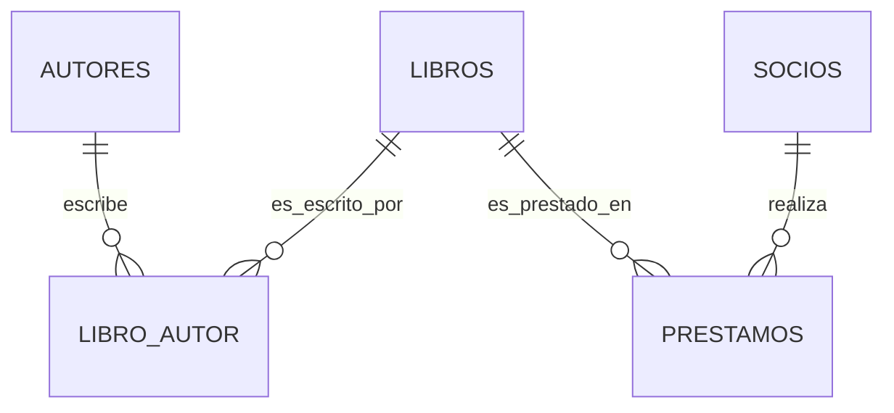

# Guía de Resolución Paso a Paso - Proyecto Biblioteca

## 📋 Índice de Contenidos
1. [Fase 1: Análisis y Diseño (Semanas 1-2)](#fase-1)
2. [Fase 2: Implementación de Base de Datos (Semanas 3-4)](#fase-2)
3. [Fase 3: Desarrollo de Lógica de Negocio (Semanas 5-6)](#fase-3)
4. [Fase 4: Pruebas y Validación (Semana 7)](#fase-4)
5. [Fase 5: Documentación Final (Semana 8)](#fase-5)

---

## 🎯 Fase 1: Análisis y Diseño (Semanas 1-2)

### Paso 1.1: Entender el Caso de Negocio
**Tiempo estimado**: 2 horas

**Acciones**:
1. 📖 Leer completamente el documento [`Caso_Negocio_Biblioteca.md`](01_Caso_Negocio/Caso_Negocio_Biblioteca.md:1)
2. 📝 Identificar los 28 Requisitos Funcionales (RF-01 a RF-28)
3. 🎯 Identificar los 9 Requisitos No Funcionales (RNF-01 a RNF-09)
4. 📋 Listar las 13 Reglas de Negocio (RN-01 a RN-13)

**Entregable**: Documento `analisis_requisitos.md` con:
- Tabla de requisitos priorizados
- Matriz de roles vs funcionalidades
- Diccionario de términos del negocio

**Ejemplo de formato**:
```markdown
| Requisito | Prioridad | Complejidad | Rol Afectado | Estado |
|-----------|-----------|-------------|--------------|--------|
| RF-01     | Alta      | Media       | Bibliotecario| Pendiente|
```

### Paso 1.2: Diseñar el Modelo ER
**Tiempo estimado**: 4 horas

**Acciones**:
1. 🎨 Dibujar el diagrama ER en papel o herramienta digital
2. 🔄 Identificar relaciones (1:1, 1:N, N:M)
3. ✅ Validar cardinalidades con las reglas de negocio

**Entidades principales**:
- ✅ AUTORES (autor_id, nombre, apellido, nacionalidad)
- ✅ LIBROS (isbn, titulo, editorial_id, genero_id, stock)
- ✅ EDITORIALES (editorial_id, nombre, pais)
- ✅ GENEROS (genero_id, nombre, descripcion)
- ✅ SOCIOS (socio_id, nombre, apellido, email, multa_acumulada)
- ✅ PRESTAMOS (prestamo_id, socio_id, isbn, fecha_prestamo, fecha_devolucion)
- ✅ RESERVAS (reserva_id, socio_id, isbn, fecha_reserva, estado)
- ✅ MULTAS (multa_id, prestamo_id, importe, estado)
- ✅ PERSONAL (personal_id, nombre, apellido, rol)

**Entregable**: Archivo [`diagrama_er.mmd`](03_Disenio_BD/Diagrama_ER.mmd:1) con código Mermaid

**Ejemplo de código**:


### Paso 1.3: Normalización
**Tiempo estimado**: 3 horas

**Proceso de normalización**:

**Paso 1.3.1**: Identificar dependencias
```sql
-- Tabla desnormalizada (EJEMPLO DE LO QUE NO HACER)
LIBROS_DESNORMALIZADO {
    isbn, 
    titulo, 
    editorial_nombre,  -- Dependencia transitiva
    editorial_pais,    -- Dependencia transitiva  
    autor_nombre,      -- Multivalorado
    autor_apellido     -- Multivalorado
}
```

**Paso 1.3.2**: Aplicar 1FN (eliminar multivalorados)
- ✅ Separar autores en tabla independiente
- ✅ Crear tabla intermedia LIBRO_AUTOR

**Paso 1.3.3**: Aplicar 2FN (eliminar dependencias parciales)
- ✅ Crear tabla EDITORIALES
- ✅ Crear tabla GENEROS

**Paso 1.3.4**: Aplicar 3FN (eliminar dependencias transitivas)
- ✅ Verificar que todos los atributos dependan solo de la clave primaria

**Entregable**: Documento [`normalizacion.md`](03_Disenio_BD/Normalizacion.md:1) con:
- Tablas antes/después de normalizar
- Justificación de cada paso
- Diagrama de tablas finales

---

## 🗄️ Fase 2: Implementación de Base de Datos (Semanas 3-4)

### Paso 2.1: Crear Script DDL
**Tiempo estimado**: 6 horas

**Orden de creación de objetos**:
1. 📦 Tablas base sin claves foráneas
2. 🔗 Tablas con claves foráneas (en orden de dependencia)
3. 🎯 Índices
4. 🔒 Constraints adicionales

**Estructura del script**:
```sql
-- =============================================
-- 01_Create_Tables.sql
-- =============================================

-- 1. Tablas de referencia (sin dependencias)
CREATE TABLE EDITORIALES (...);
CREATE TABLE GENEROS (...);
CREATE TABLE AUTORES (...);
CREATE TABLE PERSONAL (...);

-- 2. Tablas principales
CREATE TABLE LIBROS (...);
CREATE TABLE SOCIOS (...);

-- 3. Tablas de transacción
CREATE TABLE PRESTAMOS (...);
CREATE TABLE RESERVAS (...);
CREATE TABLE MULTAS (...);

-- 4. Tablas intermedia
CREATE TABLE LIBRO_AUTOR (...);

-- 5. Índices
CREATE INDEX idx_libros_titulo ON LIBROS(titulo);
CREATE INDEX idx_socios_email ON SOCIOS(email);

-- 6. Constraints adicionales
ALTER TABLE LIBROS ADD CONSTRAINT chk_stock CHECK (stock_disponible >= 0);
```

**Entregable**: [`04_SQL_Scripts/DDL/01_Create_Tables.sql`](04_SQL_Scripts/DDL/01_Create_Tables.sql:1)

### Paso 2.2: Poblar Datos de Prueba
**Tiempo estimado**: 4 horas

**Estrategia de datos de prueba**:

**Paso 2.2.1**: Datos maestros (mínimo 5 registros por tabla)
```sql
-- Insertar editoriales
INSERT INTO EDITORIALES (nombre, pais) VALUES 
('Alianza Editorial', 'España'),
('Penguin Random House', 'Estados Unidos'),
('Anagrama', 'España'),
('Salamandra', 'España'),
('Alfaguara', 'España');

-- Insertar géneros
INSERT INTO GENEROS (nombre, descripcion) VALUES
('Novela', 'Narrativa extensa'),
('Ciencia Ficción', 'Ficción científica'),
('Misterio', 'Novela policíaca'),
('Biografía', 'Vida de personas reales'),
('Historia', 'Eventos históricos');
```

**Paso 2.2.2**: Datos de prueba específicos
- ✅ 10 libros diferentes
- ✅ 8 socios con diferentes perfiles
- ✅ 3 bibliotecarios
- ✅ 15 préstamos con diferentes estados
- ✅ 5 reservas activas
- ✅ 3 multas pendientes

**Entregable**: [`04_SQL_Scripts/DML/01_Insert_Sample_Data.sql`](04_SQL_Scripts/DML/01_Insert_Sample_Data.sql:1)

### Paso 2.3: Crear Vistas Básicas
**Tiempo estimado**: 2 horas

**Vistas obligatorias**:
1. [`vw_libros_disponibles`](04_SQL_Scripts/DDL/02_Create_Views.sql:1) - Libros que se pueden prestar
2. [`vw_prestamos_activos`](04_SQL_Scripts/DDL/02_Create_Views.sql:1) - Préstamos en curso
3. [`vw_multas_pendientes`](04_SQL_Scripts/DDL/02_Create_Views.sql:1) - Multas por cobrar
4. [`vw_historial_socio`](04_SQL_Scripts/DDL/02_Create_Views.sql:1) - Préstamos por socio

**Ejemplo de vista**:
```sql
CREATE VIEW vw_libros_disponibles AS
SELECT 
    l.isbn,
    l.titulo,
    e.nombre as editorial,
    g.nombre as genero,
    l.stock_disponible,
    GROUP_CONCAT(CONCAT(a.nombre, ' ', a.apellido)) as autores
FROM LIBROS l
JOIN EDITORIALES e ON l.editorial_id = e.editorial_id
JOIN GENEROS g ON l.genero_id = g.genero_id
JOIN LIBRO_AUTOR la ON l.isbn = la.isbn
JOIN AUTORES a ON la.autor_id = a.autor_id
WHERE l.estado = 'Disponible' AND l.stock_disponible > 0
GROUP BY l.isbn, l.titulo, e.nombre, g.nombre, l.stock_disponible;
```

---

## 🔧 Fase 3: Desarrollo de Lógica de Negocio (Semanas 5-6)

### Paso 3.1: Stored Procedures de Gestión
**Tiempo estimado**: 8 horas

**Procedimientos obligatorios**:

**Paso 3.1.1**: [`sp_registrar_prestamo`](04_SQL_Scripts/Procedimientos/01_Gestion_Prestamos.sql:1)
```sql
DELIMITER $$
CREATE PROCEDURE sp_registrar_prestamo(
    IN p_socio_id INT,
    IN p_isbn VARCHAR(20),
    IN p_personal_id INT,
    OUT p_resultado VARCHAR(200)
)
BEGIN
    -- Validaciones
    -- 1. Socio existe y está activo
    -- 2. Libro disponible
    -- 3. Límite de préstamos no excedido
    -- 4. Multas < 10€
    
    -- Transacción
    START TRANSACTION;
    
    -- Insertar préstamo
    INSERT INTO PRESTAMOS (...) VALUES (...);
    
    -- Actualizar stock
    UPDATE LIBROS SET stock_disponible = stock_disponible - 1 WHERE isbn = p_isbn;
    
    COMMIT;
END$$
DELIMITER ;
```

**Paso 3.1.2**: [`sp_registrar_devolucion`](04_SQL_Scripts/Procedimientos/01_Gestion_Prestamos.sql:1)
- Calcular días de retraso
- Generar multa si aplica
- Actualizar stock

**Paso 3.1.3**: [`sp_renovar_prestamo`](04_SQL_Scripts/Procedimientos/01_Gestion_Prestamos.sql:1)
- Validar que no haya reservas
- Extender fecha de devolución

**Paso 3.1.4**: [`sp_realizar_reserva`](04_SQL_Scripts/Procedimientos/02_Gestion_Reservas.sql:1)
- Validar límite de reservas
- Crear reserva con fecha de caducidad

**Entregable**: 4 procedimientos de gestión funcionando

### Paso 3.2: Triggers de Validación
**Tiempo estimado**: 4 horas

**Triggers obligatorios**:

**Paso 3.2.1**: [`trg_prestamo_before_insert`](04_SQL_Scripts/Disparadores/01_Validacion_Prestamos.sql:1)
```sql
DELIMITER $$
CREATE TRIGGER trg_prestamo_before_insert
BEFORE INSERT ON PRESTAMOS
FOR EACH ROW
BEGIN
    DECLARE v_stock INT;
    DECLARE v_multas DECIMAL(10,2);
    
    -- Validar stock
    SELECT stock_disponible INTO v_stock FROM LIBROS WHERE isbn = NEW.isbn;
    IF v_stock <= 0 THEN
        SIGNAL SQLSTATE '45000' SET MESSAGE_TEXT = 'Stock no disponible';
    END IF;
    
    -- Validar multas del socio
    SELECT multa_acumulada INTO v_multas FROM SOCIOS WHERE socio_id = NEW.socio_id;
    IF v_multas > 10.00 THEN
        SIGNAL SQLSTATE '45000' SET MESSAGE_TEXT = 'Multas pendientes > 10€';
    END IF;
    
    -- Establecer fecha de devolución
    SET NEW.fecha_devolucion = DATE_ADD(CURDATE(), INTERVAL 15 DAY);
END$$
DELIMITER ;
```

**Paso 3.2.2**: [`trg_devolucion_after_update`](04_SQL_Scripts/Disparadores/02_Control_Stock.sql:1)
- Actualizar stock al devolver
- Calcular y generar multa automáticamente

**Paso 3.2.3**: [`trg_reserva_after_update`](04_SQL_Scripts/Disparadores/04_Notificaciones.sql:1)
- Notificar cuando libro reservado está disponible

**Entregable**: 3 triggers funcionando correctamente

### Paso 3.3: Cursores Avanzados
**Tiempo estimado**: 6 horas

**Cursor obligatorio**: [`sp_actualizar_multas_diarias`](04_SQL_Scripts/Cursores/01_Procesamiento_Masivo.sql:1)

```sql
DELIMITER $$
CREATE PROCEDURE sp_actualizar_multas_diarias()
BEGIN
    DECLARE v_prestamo_id INT;
    DECLARE v_dias_retraso INT;
    DECLARE done INT DEFAULT FALSE;
    
    -- Cursor para préstamos vencidos
    DECLARE cur_prestamos CURSOR FOR
        SELECT prestamo_id, DATEDIFF(CURDATE(), fecha_devolucion)
        FROM PRESTAMOS
        WHERE estado = 'Activo' AND fecha_devolucion < CURDATE();
    
    DECLARE CONTINUE HANDLER FOR NOT FOUND SET done = TRUE;
    
    OPEN cur_prestamos;
    
    read_loop: LOOP
        FETCH cur_prestamos INTO v_prestamo_id, v_dias_retraso;
        
        IF done THEN
            LEAVE read_loop;
        END IF;
        
        -- Insertar o actualizar multa
        -- Lógica de cálculo: 0.50€ por día, máximo 30€
        INSERT INTO MULTAS (prestamo_id, importe, estado)
        VALUES (v_prestamo_id, LEAST(v_dias_retraso * 0.50, 30.00), 'Pendiente')
        ON DUPLICATE KEY UPDATE importe = LEAST(v_dias_retraso * 0.50, 30.00);
        
    END LOOP;
    
    CLOSE cur_prestamos;
END$$
DELIMITER ;
```

**Entregable**: Cursor que procesa multas automáticamente

---

## 🧪 Fase 4: Pruebas y Validación (Semana 7)

### Paso 4.1: Crear Casos de Prueba
**Tiempo estimado**: 4 horas

**Casos de prueba por tipo**:

**Paso 4.1.1**: Pruebas de reglas de negocio
```markdown
| Caso | Descripción | Entrada | Resultado Esperado | Estado |
|------|-------------|---------|-------------------|--------|
| PN-01| Préstamo con socio inactivo | socio_id=2(inactivo) | Error: "Socio no activo" | ☐ |
| PN-02| Préstamo con multas >10€ | socio_id=3(multas=15€) | Error: "Multas >10€" | ☐ |
| PN-03| Préstamo con límite alcanzado | socio_id=4(3 préstamos) | Error: "Límite alcanzado" | ☐ |
| PN-04| Préstamo libro no disponible | isbn='123'(stock=0) | Error: "No disponible" | ☐ |
| PN-05| Préstamo válido | socio_id=1, isbn='456' | Éxito: préstamo creado | ☐ |
```

**Paso 4.1.2**: Pruebas de integridad
- ✅ FK constraints
- ✅ CHECK constraints
- ✅ UNIQUE constraints

**Entregable**: [`06_Pruebas/Casos_Prueba.md`](06_Pruebas/Casos_Prueba.md:1)

### Paso 4.2: Ejecutar Pruebas
**Tiempo estimado**: 3 horas

**Script de pruebas automáticas**:
```sql
-- =============================================
-- Script de Pruebas Automatizado
-- =============================================

-- Test 1: Préstamo válido
CALL sp_registrar_prestamo(1, '978-3-16-148410-0', 1, @resultado);
SELECT @resultado AS 'Test 1 Resultado';
-- EXPECTED: 'Préstamo registrado exitosamente'

-- Test 2: Préstamo con socio inactivo
UPDATE SOCIOS SET estado = 'Inactivo' WHERE socio_id = 2;
CALL sp_registrar_prestamo(2, '978-3-16-148410-0', 1, @resultado);
SELECT @resultado AS 'Test 2 Resultado';
-- EXPECTED: 'ERROR: Socio no está activo'
UPDATE SOCIOS SET estado = 'Activo' WHERE socio_id = 2;

-- Test 3: Trigger de validación
INSERT INTO PRESTAMOS (socio_id, isbn, personal_id) VALUES (1, '999-INVALID-999', 1);
-- EXPECTED: Error de trigger
```

**Entregable**: [`06_Pruebas/Script_Pruebas.sql`](06_Pruebas/Script_Pruebas.sql:1) y resultados

### Paso 4.3: Validar Rendimiento
**Tiempo estimado**: 2 horas

**Consultas de validación**:
```sql
-- Verificar uso de índices
EXPLAIN SELECT * FROM PRESTAMOS WHERE socio_id = 1;

-- Medir tiempo de ejecución
SET @inicio = NOW();
CALL sp_reporte_estadisticas_mensual(11, 2024, @total, @multas, @libro);
SELECT TIMEDIFF(NOW(), @inicio) AS tiempo_ejecucion;
```

---

## 📚 Fase 5: Documentación Final (Semana 8)

### Paso 5.1: Crear Informe del Proyecto
**Tiempo estimado**: 6 horas

**Estructura del informe**:
```markdown
# Informe del Proyecto: Sistema de Gestión de Biblioteca

## 1. Resumen Ejecutivo
- Objetivos cumplidos
- Tecnologías utilizadas
- Resultados principales

## 2. Análisis del Caso de Negocio
- Requisitos funcionales implementados
- Reglas de negocio aplicadas

## 3. Diseño Técnico
- Modelo ER (incluir diagrama)
- Proceso de normalización
- Decisiones de diseño

## 4. Implementación
- Scripts SQL (DDL, DML)
- Stored Procedures desarrollados
- Triggers implementados
- Cursores creados

## 5. Pruebas Realizadas
- Casos de prueba ejecutados
- Resultados obtenidos
- Problemas encontrados y soluciones

## 6. Conclusiones y Lecciones Aprendidas
- Dificultades encontradas
- Mejoras futuras
- Conocimientos adquiridos

## 7. Anexos
- Código fuente completo
- Diagramas adicionales
- Bibliografía
```

**Entregable**: [`07_Entregas/Informe_Final.md`](07_Entregas/Informe_Final.md:1)

### Paso 5.2: Preparar Presentación
**Tiempo estimado**: 3 horas

**Contenido de la presentación**:
- Diapositiva 1: Título y autor
- Diapositiva 2: Objetivos del proyecto
- Diapositiva 3: Modelo ER
- Diapositiva 4: Ejemplo de Stored Procedure
- Diapositiva 5: Demo de funcionalidad
- Diapositiva 6: Conclusiones

**Entregable**: Presentación en formato PDF o PPT

### Paso 5.3: Empaquetar Entrega Final
**Tiempo estimado**: 1 hora

**Estructura de carpetas final**:
```
Entrega_Final/
├── 01_Documentacion/
│   ├── Informe_Final.pdf
│   ├── Caso_Negocio.pdf
│   └── Caso_Tecnico.pdf
├── 02_Codigo/
│   ├── DDL_Scripts.sql
│   ├── DML_Scripts.sql
│   ├── Procedures.sql
│   ├── Triggers.sql
│   └── Cursors.sql
├── 03_Pruebas/
│   ├── Casos_Prueba.pdf
│   └── Resultados_Pruebas.pdf
├── 04_Presentacion/
│   └── Presentacion_Proyecto.pptx
└── README_Instalacion.txt
```

---

## 📊 Checklist de Evaluación

### Requisitos Mínimos (Obligatorios)
- [ ] Modelo ER completo y normalizado (3FN)
- [ ] 8 tablas implementadas correctamente
- [ ] 4 Stored Procedures funcionando
- [ ] 2 Triggers implementados
- [ ] 1 Cursor avanzado
- [ ] 3 Vistas creadas
- [ ] Datos de prueba (mínimo 5 registros por tabla)
- [ ] Casos de prueba documentados
- [ ] Informe final completo

### Requisitos Avanzados (Opcionales, puntos extra)
- [ ] Sistema de roles y permisos
- [ ] Procedimiento de backup
- [ ] Trigger de auditoría
- [ ] Cursor adicional con tabla temporal
- [ ] Transacciones complejas
- [ ] Manejo de errores avanzado
- [ ] Optimización con índices compuestos
- [ ] Vistas complejas con GROUP_CONCAT

### Calidad del Código
- [ ] Comentarios claros y útiles
- [ ] Nomenclatura consistente
- [ ] Manejo de errores apropiado
- [ ] Transacciones donde corresponde
- [ ] Código bien indentado

---

## 🚨 Problemas Comunes y Soluciones

### Problema 1: Error de clave foránea
```sql
-- ERROR: Cannot add or update a child row
-- SOLUCIÓN: Verificar que el dato padre existe antes de insertar
SELECT * FROM SOCIOS WHERE socio_id = 999; -- Debe existir
SELECT * FROM LIBROS WHERE isbn = '999';   -- Debe existir
```

### Problema 2: Trigger no se dispara
```sql
-- VERIFICAR: El trigger está creado?
SHOW TRIGGERS LIKE 'trg%';

-- VERIFICAR: El evento coincide (BEFORE/AFTER INSERT/UPDATE)?
-- VERIFICAR: No hay errores de sintaxis
```

### Problema 3: Cursor no encuentra datos
```sql
-- DEBUG: Ejecutar la query del cursor directamente
SELECT prestamo_id, DATEDIFF(CURDATE(), fecha_devolucion)
FROM PRESTAMOS
WHERE estado = 'Activo' AND fecha_devolucion < CURDATE();

-- VERIFICAR: El handler CONTINUE está correcto
DECLARE CONTINUE HANDLER FOR NOT FOUND SET done = TRUE;
```

### Problema 4: Deadlock en transacciones
```sql
-- SOLUCIÓN: Asegurar el mismo orden de acceso a tablas
-- SIEMPRE: LIBROS -> PRESTAMOS -> SOCIOS (o tu orden consistente)
-- NUNCA: SOCIOS -> LIBROS en un procedimiento y LIBROS -> SOCIOS en otro
```

---

## 📈 Cronograma Recomendado

| Semana | Actividad | Horas | Entregable |
|--------|-----------|-------|------------|
| 1 | Análisis de requisitos | 6 | `analisis_requisitos.md` |
| 1 | Diseño ER | 6 | `diagrama_er.mmd` |
| 2 | Normalización | 4 | `normalizacion.md` |
| 2 | DDL Scripts | 8 | `01_Create_Tables.sql` |
| 3 | DML Scripts | 6 | `01_Insert_Sample_Data.sql` |
| 3 | Vistas | 4 | `02_Create_Views.sql` |
| 4 | Stored Procedures | 10 | `01_Gestion_Prestamos.sql` |
| 5 | Triggers | 6 | `01_Validacion_Prestamos.sql` |
| 5 | Cursores | 8 | `01_Procesamiento_Masivo.sql` |
| 6 | Pruebas | 8 | `Casos_Prueba.md` |
| 7 | Correcciones | 6 | Resultados de pruebas |
| 8 | Documentación | 10 | `Informe_Final.md` |
| **Total** | | **76 horas** | **Proyecto completo** |

---

## 🎓 Consejos para el Éxito

### Antes de Empezar
1. 📖 Lee TODO el caso de negocio antes de tocar código
2. 📝 Haz un mapa mental de las relaciones entre tablas
3. 💡 Diseña en papel antes de implementar
4. 🔄 Usa control de versiones (Git) desde el día 1

### Durante el Desarrollo
1. ✅ Prueba cada componente individualmente
2. 🐛 Depura con prints y SELECTs antes de procedimientos complejos
3. 📊 Usa EXPLAIN para verificar índices
4. 💾 Haz backup frecuente de tu código

### Antes de Entregar
1. 🔍 Revisa el checklist de evaluación
2. 🧪 Ejecuta todas las pruebas una última vez
3. 📄 Lee tu informe como si fueras el profesor
4. 💾 Haz una copia de seguridad completa

---

## 📞 Recursos de Ayuda

### Documentación Oficial
- [MySQL 8.0 Reference Manual](https://dev.mysql.com/doc/refman/8.0/en/)
- [PostgreSQL Documentation](https://www.postgresql.org/docs/)

### Herramientas Recomendadas
- **DBeaver**: https://dbeaver.io/ (Gratuito, multiplataforma)
- **MySQL Workbench**: https://www.mysql.com/products/workbench/
- **draw.io**: https://app.diagrams.net/ (Para diagramas ER)

### Foros y Comunidades
- Stack Overflow (etiqueta: mysql / postgresql)
- Reddit: r/Database / r/SQL

---

**¡Éxito con tu proyecto! 🚀**

*Documento preparado para estudiantes - Gestión de Bases de Datos*