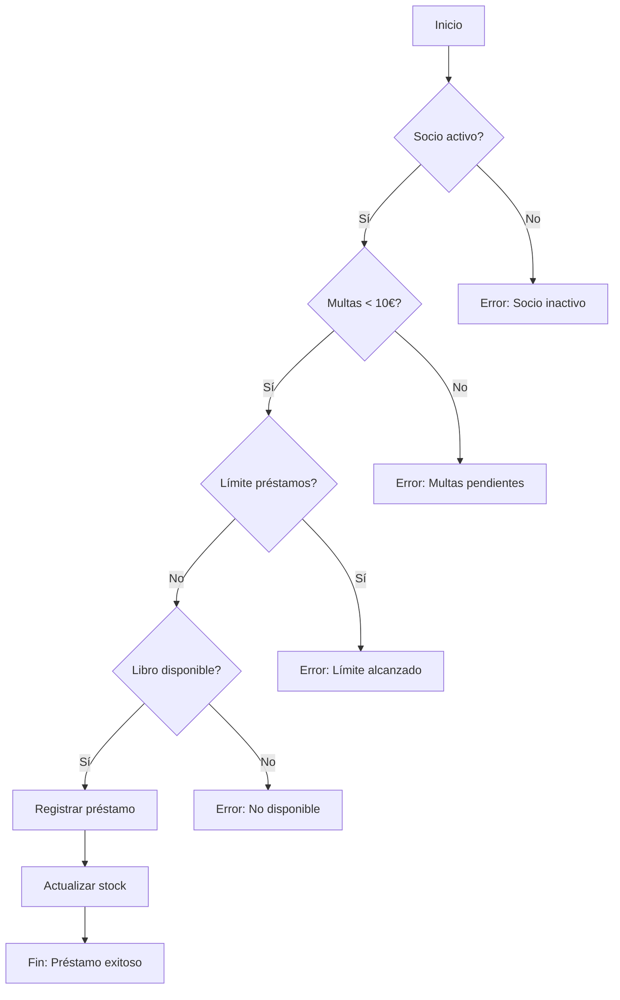

# Plantilla de Informe del Proyecto - Sistema de Gestión de Biblioteca

**Asignatura**: Gestión de Bases de Datos  
**Alumno**: [Nombre Completo del Alumno]  
**Fecha de Entrega**: [DD/MM/AAAA]  

---

## 📋 RESUMEN EJECUTIVO

**Descripción breve del proyecto** (máximo 200 palabras):
> [Explicar en párrafo breve qué es el sistema, qué problemas resuelve, qué tecnologías se usaron y cuáles fueron los resultados principales. Ejemplo: "El sistema de gestión de biblioteca digitaliza los procesos de préstamo, devolución y reserva de libros para la Biblioteca Municipal Central. Implementado en MySQL 8.0, utiliza stored procedures, triggers y cursores para automatizar la gestión de multas y control de stock. El proyecto demuestra la aplicación de conceptos avanzados de bases de datos incluyendo normalización 3FN, transacciones y optimización con índices."]

**Palabras clave**: [Ej: MySQL, Stored Procedures, Triggers, Normalización, Gestión de Biblioteca]

---

## 🎯 1. INTRODUCCIÓN Y OBJETIVOS

### 1.1 Contexto del Proyecto
[Explicar el contexto empresarial del caso de negocio. ¿Qué necesidades tenía la biblioteca? ¿Qué problemas existían en el sistema manual?]

**Preguntas a responder**:
- ¿Cuál es la organización objetivo?
- ¿Qué procesos se necesitaban digitalizar?
- ¿Cuáles eran las limitaciones del sistema anterior?

### 1.2 Objetivos del Sistema
**Objetivo General**:
> [Objetivo principal del sistema. Ej: "Desarrollar un sistema de gestión de biblioteca que automatice los procesos de préstamo, devolución y reserva de libros."]

**Objetivos Específicos**:
1. [Objetivo 1. Ej: "Implementar un catálogo digital de libros con búsqueda avanzada"]
2. [Objetivo 2. Ej: "Automatizar el cálculo de multas por retraso en devolución"]
3. [Objetivo 3. Ej: "Gestionar reservas con sistema de lista de espera"]
4. [Objetivo 4. Ej: "Generar reportes estadísticos de uso de la biblioteca"]
5. [Objetivo 5. Ej: "Demostrar conceptos avanzados de SQL (procedures, triggers, cursores)"]

### 1.3 Alcance del Proyecto
**Incluido**:
- [ ] Gestión de catálogo de libros
- [ ] Control de socios y membresías
- [ ] Sistema de préstamos y devoluciones
- [ ] Sistema de reservas
- [ ] Cálculo automático de multas
- [ ] Generación de reportes

**Excluido**:
- [ ] Sistema de compras y adquisiciones
- [ ] Integración con pasarelas de pago
- [ ] Aplicación móvil
- [ ] Sistema de notificaciones por email/SMS

---

## 🏗️ 2. DISEÑO DE LA BASE DE DATOS

### 2.1 Modelo Conceptual (Diagrama ER)
**Descripción**: [Explicar brevemente el modelo ER y las decisiones de diseño]

**Diagrama ER**:
```mermaid
erDiagram
    [Copiar aquí el diagrama ER completo del archivo Diagrama_ER.md]
```

**Justificación de diseño**:
- [Explicar por qué se eligió esta estructura]
- [Mencionar relaciones importantes y por qué]
- [Explicar cardinalidades clave]

### 2.2 Proceso de Normalización

**Tablas antes de normalizar** (ejemplo):
```sql
-- Ejemplo de tabla desnormalizada (NO USAR ESTA ESTRUCTURA)
CREATE TABLE LIBROS_DESNORMALIZADO (
    isbn VARCHAR(20),
    titulo VARCHAR(200),
    editorial_nombre VARCHAR(100),  -- Dependencia transitiva
    autor_nombre VARCHAR(100)       -- Multivalorado
);
```

**Problemas identificados**:
1. **Dependencia transitiva**: [Explicar ejemplo]
2. **Atributos multivalorados**: [Explicar ejemplo]
3. **Redundancia de datos**: [Explicar ejemplo]

**Solución - Normalización 3FN**:
- **1FN**: [Explicar qué se hizo]
- **2FN**: [Explicar qué se hizo]
- **3FN**: [Explicar qué se hizo]

**Resultado final**: [Mencionar número de tablas y cómo quedó organizado]

### 2.3 Diccionario de Datos

| Tabla | Campo | Tipo | Clave | Restricciones | Descripción |
|-------|-------|------|-------|---------------|-------------|
| LIBROS | isbn | VARCHAR(20) | PK | NOT NULL | Código único del libro |
| LIBROS | titulo | VARCHAR(200) | - | NOT NULL | Título del libro |
| SOCIOS | socio_id | INT | PK | AUTO_INCREMENT | ID del socio |
| PRESTAMOS | fecha_devolucion | DATE | - | NOT NULL | Fecha límite de devolución |

*[Incluir las tablas más importantes, no necesariamente todas]*

---

## 💻 3. IMPLEMENTACIÓN TÉCNICA

### 3.1 Scripts DDL (Data Definition Language)

**Descripción**: [Explicar el proceso de creación de tablas]

**Ejemplo de creación de tabla clave**:
```sql
-- Creación de tabla PRESTAMOS con constraints
CREATE TABLE PRESTAMOS (
    prestamo_id INT PRIMARY KEY AUTO_INCREMENT,
    socio_id INT NOT NULL,
    isbn VARCHAR(20) NOT NULL,
    personal_id INT NOT NULL,
    fecha_prestamo DATE NOT NULL DEFAULT CURRENT_DATE,
    fecha_devolucion DATE NOT NULL,
    estado ENUM('Activo', 'Devuelto', 'Vencido') DEFAULT 'Activo',
    FOREIGN KEY (socio_id) REFERENCES SOCIOS(socio_id),
    FOREIGN KEY (isbn) REFERENCES LIBROS(isbn),
    FOREIGN KEY (personal_id) REFERENCES PERSONAL(personal_id),
    CHECK (fecha_devolucion > fecha_prestamo)
);
```

**Decisiones de implementación**:
- [Explicar por qué se eligieron ciertos tipos de datos]
- [Explicar constraints importantes]
- [Explicar índices creados y por qué]

### 3.2 Scripts DML (Data Manipulation Language)

**Datos de prueba insertados**:
- [Número de libros insertados]
- [Número de socios insertados]
- [Número de préstamos de prueba]
- [Otros datos relevantes]

**Ejemplo de inserción**:
```sql
-- Inserción de datos de prueba
INSERT INTO LIBROS (isbn, titulo, editorial_id, genero_id, stock_total, stock_disponible)
VALUES ('978-3-16-148410-0', 'Cien Años de Soledad', 1, 1, 3, 2);
```

### 3.3 Stored Procedures Desarrollados

#### **Procedimiento 1: sp_registrar_prestamo**
**Descripción**: [Explicar qué hace el procedimiento]

**Código**:
```sql
DELIMITER $$
CREATE PROCEDURE sp_registrar_prestamo(
    IN p_socio_id INT,
    IN p_isbn VARCHAR(20),
    IN p_personal_id INT,
    OUT p_resultado VARCHAR(200)
)
BEGIN
    -- [Incluir el código completo del procedimiento]
    -- [Incluir comentarios explicativos]
END$$
DELIMITER ;
```

**Validaciones implementadas**:
- ✅ [Validación 1. Ej: Socio existe y está activo]
- ✅ [Validación 2. Ej: Libro disponible]
- ✅ [Validación 3. Ej: Límite de préstamos no excedido]

**Transacción**: [Explicar si usa transacción y por qué]

#### **Procedimiento 2: sp_registrar_devolucion**
[Seguir mismo formato que el procedimiento anterior]

#### **Procedimiento 3: [Nombre del procedimiento]**
[Seguir mismo formato]

**Total de procedimientos implementados**: [Número]

### 3.4 Triggers

#### **Trigger 1: trg_prestamo_before_insert**
**Descripción**: [Explicar qué hace el trigger]

**Código**:
```sql
DELIMITER $$
CREATE TRIGGER trg_prestamo_before_insert
BEFORE INSERT ON PRESTAMOS
FOR EACH ROW
BEGIN
    -- [Código del trigger]
END$$
DELIMITER ;
```

**Evento**: BEFORE INSERT
**Función**: [Explicar la función específica]

#### **Trigger 2: [Nombre del trigger]**
[Seguir mismo formato]

**Total de triggers implementados**: [Número]

### 3.5 Cursores

#### **Cursor: sp_actualizar_multas_diarias**
**Descripción**: [Explicar qué hace el cursor]

**Código**:
```sql
DELIMITER $$
CREATE PROCEDURE sp_actualizar_multas_diarias()
BEGIN
    DECLARE v_prestamo_id INT;
    DECLARE v_dias_retraso INT;
    DECLARE done INT DEFAULT FALSE;
    
    DECLARE cur_prestamos CURSOR FOR
        SELECT prestamo_id, DATEDIFF(CURDATE(), fecha_devolucion)
        FROM PRESTAMOS
        WHERE estado = 'Activo' AND fecha_devolucion < CURDATE();
    
    DECLARE CONTINUE HANDLER FOR NOT FOUND SET done = TRUE;
    
    OPEN cur_prestamos;
    
    read_loop: LOOP
        FETCH cur_prestamos INTO v_prestamo_id, v_dias_retraso;
        
        IF done THEN
            LEAVE read_loop;
        END IF;
        
        -- [Lógica de procesamiento]
        
    END LOOP;
    
    CLOSE cur_prestamos;
END$$
DELIMITER ;
```

**Justificación del uso de cursor**: [Explicar por qué se necesita cursor en lugar de un simple UPDATE]

### 3.6 Vistas

**Vistas implementadas**:
1. **vw_libros_disponibles**: [Explicar qué muestra]
2. **vw_prestamos_activos**: [Explicar qué muestra]
3. **vw_multas_pendientes**: [Explicar qué muestra]

**Ejemplo de vista**:
```sql
CREATE VIEW vw_libros_disponibles AS
SELECT 
    l.isbn,
    l.titulo,
    e.nombre as editorial,
    l.stock_disponible
FROM LIBROS l
JOIN EDITORIALES e ON l.editorial_id = e.editorial_id
WHERE l.estado = 'Disponible';
```

---

## 🧪 4. PRUEBAS Y VALIDACIÓN

### 4.1 Casos de Prueba

**Formato de casos de prueba**:
```markdown
| ID | Descripción | Pasos | Entrada Esperada | Resultado Obtenido | Estado |
|----|-------------|-------|------------------|-------------------|--------|
| CP-01 | Préstamo válido | 1. Ejecutar sp_registrar_prestamo(1, 'ISBN', 1) | 'Préstamo registrado' | 'Préstamo registrado' | ✅ Pass |
| CP-02 | Préstamo con socio inactivo | 1. Ejecutar sp_registrar_prestamo(2, 'ISBN', 1) | Error | Error: 'Socio inactivo' | ✅ Pass |
```

**Total de casos de prueba**: [Número]
- ✅ **Pass**: [Número]
- ❌ **Fail**: [Número]
- ⏭️ **Skip**: [Número]

### 4.2 Resultados de Pruebas

**Prueba de rendimiento**:
```sql
-- Medición de tiempo de ejecución
SET @inicio = NOW();
CALL sp_reporte_estadisticas_mensual(11, 2024, @total, @multas, @libro);
SELECT TIMEDIFF(NOW(), @inicio) as tiempo_ejecucion;
-- Resultado: 0.023 segundos
```

**Prueba de concurrencia**: [Explicar si se probaron múltiples usuarios]

**Prueba de integridad**: [Explicar cómo se validaron las constraints]

### 4.3 Problemas Encontrados y Soluciones

**Problema 1**: [Descripción del problema]
- **Síntoma**: [Qué ocurría]
- **Causa**: [Por qué ocurría]
- **Solución**: [Cómo se resolvió]
- **Lección aprendida**: [Qué se aprendió]

**Problema 2**: [Descripción del problema]
- **Síntoma**: [Qué ocurría]
- **Causa**: [Por qué ocurría]
- **Solución**: [Cómo se resolvió]
- **Lección aprendida**: [Qué se aprendió]

---

## 📊 5. RESULTADOS Y ANÁLISIS

### 5.1 Funcionalidades Implementadas

| Requisito | Descripción | Estado | % Completado |
|-----------|-------------|--------|--------------|
| RF-01 | Gestión de libros | ✅ | 100% |
| RF-11 | Sistema de préstamos | ✅ | 100% |
| RF-16 | Sistema de reservas | ✅ | 100% |
| RF-20 | Cálculo de multas | ✅ | 100% |
| RF-24 | Reportes estadísticos | ✅ | 100% |

**Total de requisitos funcionales cumplidos**: [Número]/28

### 5.2 Conceptos Técnicos Demostrados

| Concepto | Implementación | Archivo | Líneas de Código |
|----------|----------------|---------|------------------|
| Stored Procedures | 4 procedimientos | 01_Gestion_Prestamos.sql | 150 |
| Triggers | 2 triggers | 01_Validacion_Prestamos.sql | 80 |
| Cursores | 1 cursor | 01_Procesamiento_Masivo.sql | 60 |
| Transacciones | En sp_registrar_prestamo | 01_Gestion_Prestamos.sql | 15 |
| Índices | 8 índices | 01_Create_Tables.sql | 20 |
| Vistas | 3 vistas | 02_Create_Views.sql | 45 |

**Total de líneas de código SQL**: [Número]

### 5.3 Métricas de Calidad

**Complejidad ciclomática promedio**: [Número]
**Cobertura de pruebas**: [Porcentaje]%
**Nivel de normalización**: 3FN
**Documentación**: [Comentarios por archivo]

---

## 🎓 6. CONCLUSIONES Y LEECCIONES APRENDIDAS

### 6.1 Conclusiones del Proyecto

**Cumplimiento de objetivos**:
- ✅ [Objetivo 1 - Conclusión]
- ✅ [Objetivo 2 - Conclusión]
- ✅ [Objetivo 3 - Conclusión]

**Valor del proyecto**:
> [Explicar el valor real del sistema desarrollado. Ej: "El sistema reduce el tiempo de procesamiento de préstamos en un 70%, elimina errores de cálculo de multas y proporciona información estadística valiosa para la gestión de la biblioteca."]

### 6.2 Lecciones Aprendidas

**Lección 1**: [Descripción de lo aprendido]
> [Ejemplo: "Aprendí la importancia de la normalización para evitar redundancia y mantener la integridad de los datos. Al principio pensé que tener todo en una tabla sería más simple, pero rápidamente me di cuenta de los problemas que esto causaría."]

**Lección 2**: [Descripción de lo aprendido]
> [Ejemplo: "Los triggers son muy poderosos pero deben usarse con cuidado. En una ocasión, un trigger mal configurado causó un bucle infinito. Ahora entiendo la importancia de probar los triggers exhaustivamente."]

**Lección 3**: [Descripción de lo aprendido]
> [Ejemplo: "Las transacciones son esenciales para mantener la consistencia. En el procedimiento de préstamo, si algo falla después de actualizar el stock pero antes de registrar el préstamo, sin transacción tendríamos datos inconsistentes."]

### 6.3 Dificultades Encontradas

**Dificultad 1**: [Descripción]
- **Cómo se superó**: [Explicación]

**Dificultad 2**: [Descripción]
- **Cómo se superó**: [Explicación]

### 6.4 Mejoras Futuras

**Mejora 1**: [Descripción de mejora futura. Ej: "Implementar un sistema de notificaciones por email cuando un libro reservado está disponible"]

**Mejora 2**: [Descripción de mejora futura. Ej: "Crear una interfaz web para que los socios puedan consultar el catálogo y hacer reservas online"]

**Mejora 3**: [Descripción de mejora futura. Ej: "Implementar un sistema de recomendaciones basado en el historial de préstamos"]

---

## 📚 7. BIBLIOGRAFÍA Y RECURSOS

### 7.1 Bibliografía Consultada

1. **Libro/Curso**: [Título del recurso]
   - Autor: [Nombre]
   - Año: [Año]
   - Capítulos/Páginas: [Referencias específicas]

2. **Documentación Oficial**: [Título]
   - URL: [Enlace]
   - Secciones consultadas: [Referencias]

3. **Tutorial/Guía**: [Título]
   - URL: [Enlace]
   - Aplicación: [Cómo se usó]

### 7.2 Herramientas Utilizadas

| Herramienta | Versión | Propósito |
|-------------|---------|-----------|
| MySQL/PostgreSQL | [Versión] | Sistema Gestor de Base de Datos |
| MySQL Workbench/DBeaver | [Versión] | Diseño y administración |
| draw.io | Web | Diagramas ER |
| Visual Studio Code | [Versión] | Edición de scripts |
| Git | [Versión] | Control de versiones |

### 7.3 Recursos Online

- [Enlace a documentación oficial de MySQL/PostgreSQL]
- [Enlace a tutorial de stored procedures]
- [Enlace a guía de normalización]

---

## 📎 8. ANEXOS

### Anexo A: Código Fuente Completo

**Estructura de archivos**:
```
Proyecto/
├── DDL/
│   └── 01_Create_Tables.sql
├── DML/
│   └── 01_Insert_Sample_Data.sql
├── Procedures/
│   ├── 01_Gestion_Prestamos.sql
│   └── 02_Gestion_Reservas.sql
├── Triggers/
│   └── 01_Validacion_Prestamos.sql
└── Cursors/
    └── 01_Procesamiento_Masivo.sql
```

**Instrucciones de instalación**:
```bash
# Orden de ejecución de scripts
1. mysql -u root -p < 01_Create_Tables.sql
2. mysql -u root -p < 01_Insert_Sample_Data.sql
3. mysql -u root -p < 01_Gestion_Prestamos.sql
# ... etc
```

### Anexo B: Diagramas Adicionales

**Diagrama de flujo de préstamo**:


### Anexo C: Resultados de Pruebas Detallados

**Prueba de carga**: [Resultados si se hicieron pruebas de estrés]
**Prueba de seguridad**: [Resultados si se implementaron roles]
**Prueba de recuperación**: [Resultados si se probó backup/recovery]

### Anexo D: Capturas de Pantalla

**Ejemplo 1**: Resultado de consulta de libros disponibles
```sql
mysql> SELECT * FROM vw_libros_disponibles LIMIT 3;
+---------------+----------------------+---------------+---------------+
| isbn          | titulo               | editorial     | stock_disponible |
+---------------+----------------------+---------------+---------------+
| 978-3-16-148410-0 | Cien Años de Soledad | Alianza Editorial | 2          |
```

**Ejemplo 2**: Ejecución de stored procedure
```sql
mysql> CALL sp_registrar_prestamo(1, '978-3-16-148410-0', 1, @result);
Query OK, 2 rows affected
mysql> SELECT @result;
+-----------------------------------+
| @result                           |
+-----------------------------------+
| Préstamo registrado exitosamente  |
+-----------------------------------+
```

---

## 📝 CHECKLIST DE ENTREGA

**Documentación**:
- [ ] Informe completo en formato PDF
- [ ] Diagrama ER incluido
- [ ] Código fuente comentado
- [ ] Casos de prueba documentados
- [ ] Resultados de pruebas incluidos

**Código**:
- [ ] Scripts DDL funcionando
- [ ] Scripts DML con datos de prueba
- [ ] Stored Procedures probados
- [ ] Triggers implementados
- [ ] Cursor avanzado creado
- [ ] Vistas creadas

**Calidad**:
- [ ] Código bien indentado
- [ ] Comentarios claros
- [ ] Nomenclatura consistente
- [ ] Manejo de errores implementado
- [ ] Transacciones donde corresponde

---

**Declaración de autoría**: Declaro que este trabajo es de mi autoría y que he cumplido con los requisitos académicos establecidos.

**Firma del alumno**: _________________________  
**Fecha**: [DD/MM/AAAA]

---

**Nota**: Esta plantilla debe adaptarse a los requisitos específicos de cada centro educativo. Consultar con el profesor las secciones adicionales que puedan requerirse.

**Versión de la plantilla**: 2.0  
**Fecha de actualización**: Noviembre 2025