# 📚 SISTEMA DE GESTIÓN DE BIBLIOTECA
## Proyecto Bases de Datos


---

<div align="center">

**🎯 Proyecto Final de Gestión de Bases de Datos**  
*Sistema completo de gestión de biblioteca municipal con implementación en SQL avanzado*

</div>

---

## 📑 ÍNDICE GENERAL

1. [Introducción y Descripción del Proyecto](#1-introducción-y-descripción-del-proyecto)
2. [Caso de Negocio Completo](#2-caso-de-negocio-completo)
3. [Caso Técnico Completo](#3-caso-técnico-completo)
4. [Diagramas del Sistema](#4-diagramas-del-sistema)
5. [Implementación SQL](#5-implementación-sql)
6. [Guía de Resolución Paso a Paso](#6-guía-de-resolución-paso-a-paso)
7. [Plantilla de Informe del Alumno](#7-plantilla-de-informe-del-alumno)
8. [Evaluación y Rúbrica](#8-evaluación-y-rúbrica)
9. [Anexos](#9-anexos)

---

## 1. INTRODUCCIÓN Y DESCRIPCIÓN DEL PROYECTO

### 1.1 Resumen Ejecutivo

El **Sistema de Gestión de Biblioteca** es un proyecto integrado para el módulo de Gestión de Bases de Datos de los ciclos formativos DAW/DAM. Este sistema digitaliza y automatiza todos los procesos operativos de una biblioteca municipal, desde la gestión del catálogo de libros hasta el control de préstamos, devoluciones, reservas y multas.

El proyecto demuestra la aplicación práctica de conceptos avanzados de bases de datos relacionales incluyendo:
- Diseño de base de datos en 3FN (Tercera Forma Normal)
- Programación SQL avanzada (Stored Procedures, Triggers, Cursors)
- Transacciones y control de concurrencia
- Optimización con índices y constraints
- Implementación de reglas de negocio complejas

### 1.2 Objetivos del Proyecto

**Objetivo General**:  
Desarrollar un sistema de gestión de biblioteca completo que demuestre el dominio de conceptos avanzados de bases de datos relacionales.

**Objetivos Específicos**:
1. Diseñar e implementar un modelo de datos normalizado en 3FN
2. Crear stored procedures para automatizar procesos de negocio
3. Implementar triggers para validaciones y auditoría
4. Desarrollar cursores para procesamiento masivo de datos
5. Generar vistas y reportes estadísticos complejos
6. Aplicar transacciones para garantizar la integridad de datos
7. Documentar completamente todo el proceso de desarrollo

### 1.3 Alcance y Metodología

**Alcance del Sistema**:
- ✅ Gestión completa de catálogo de libros (altas, bajas, modificaciones)
- ✅ Control de socios y membresías
- ✅ Sistema de préstamos y devoluciones con cálculo automático de multas
- ✅ Sistema de reservas con lista de espera
- ✅ Gestión de personal bibliotecario
- ✅ Generación de reportes y estadísticas
- ✅ Control de multas y pagos

**Metodología de Desarrollo**:
1. **Fase 1 (Semanas 1-2)**: Análisis y diseño del modelo de datos
2. **Fase 2 (Semanas 3-4)**: Implementación de la base de datos (DDL y DML)
3. **Fase 3 (Semanas 5-6)**: Desarrollo de lógica de negocio (Procedures, Triggers, Cursors)
4. **Fase 4 (Semana 7)**: Pruebas y validación
5. **Fase 5 (Semana 8)**: Documentación final y entrega

---

## 2. CASO DE NEGOCIO COMPLETO

### 2.1 Descripción del Proyecto

#### Contexto Empresarial
La biblioteca municipal "Biblioteca Central" necesita modernizar su sistema de gestión para mejorar la eficiencia operativa y el servicio a los usuarios. Actualmente, los procesos se realizan manualmente con registros en papel, lo que genera problemas de organización, pérdida de información y lentitud en las operaciones.

#### Objetivos del Sistema
- **Objetivo Principal**: Digitalizar y automatizar la gestión de la biblioteca
- **Objetivos Específicos**:
  - Mejorar el control del catálogo de libros
  - Optimizar el proceso de préstamos y devoluciones
  - Gestionar eficientemente los socios de la biblioteca
  - Implementar un sistema de reservas
  - Generar reportes estadísticos
  - Controlar multas y pagos

### 2.2 Stakeholders y Roles

| Rol | Descripción | Permisos |
|-----|-------------|----------|
| **Socio** | Usuario final de la biblioteca | Consultar catálogo, realizar reservas, ver historial |
| **Bibliotecario** | Encargado de operaciones diarias | Gestionar préstamos/devoluciones, consultar reportes básicos |
| **Administrador** | Supervisor del sistema | Acceso completo a todas las funcionalidades |

### 2.3 Requisitos Funcionales (28 RF)

#### Gestión de Libros
- **RF-01**: Registrar nuevos libros con ISBN, título, autor, editorial, año, género
- **RF-02**: Modificar información de libros existentes
- **RF-03**: Dar de baja libros del catálogo
- **RF-04**: Consultar disponibilidad de libros
- **RF-05**: Búsqueda avanzada por múltiples criterios

#### Gestión de Socios
- **RF-06**: Registrar nuevos socios con datos personales
- **RF-07**: Actualizar información de socios
- **RF-08**: Dar de baja socios
- **RF-09**: Consultar historial de préstamos por socio
- **RF-10**: Gestionar estado de membresía

#### Sistema de Préstamos
- **RF-11**: Registrar préstamos con fecha límite de devolución
- **RF-12**: Registrar devoluciones y calcular multas
- **RF-13**: Controlar límite de libros por socio
- **RF-14**: Validar disponibilidad antes del préstamo
- **RF-15**: Renovar préstamos existentes

#### Sistema de Reservas
- **RF-16**: Permitir reservar libros no disponibles
- **RF-17**: Gestionar lista de espera por libro
- **RF-18**: Notificar cuando un libro reservado está disponible
- **RF-19**: Cancelar reservas

#### Control de Multas
- **RF-20**: Calcular automáticamente multas por retraso
- **RF-21**: Registrar pagos de multas
- **RF-22**: Bloquear préstamos a socios con multas pendientes
- **RF-23**: Generar reporte de multas por período

#### Reportes y Estadísticas
- **RF-24**: Libros más prestados
- **RF-25**: Socios más activos
- **RF-26**: Tasa de ocupación por género
- **RF-27**: Ingresos por multas
- **RF-28**: Inventario completo del catálogo

### 2.4 Requisitos No Funcionales (9 RNF)

#### Rendimiento
- **RNF-01**: Tiempo de respuesta < 2 segundos para consultas simples
- **RNF-02**: Soporte para 100 usuarios concurrentes
- **RNF-03**: Disponibilidad 99% del tiempo

#### Seguridad
- **RNF-04**: Control de acceso por roles
- **RNF-05**: Encriptación de contraseñas
- **RNF-06**: Backup automático diario

#### Usabilidad
- **RNF-07**: Interfaz intuitiva y fácil de usar
- **RNF-08**: Mensajes de error claros y en español
- **RNF-09**: Documentación completa del sistema

### 2.5 Reglas de Negocio (13 RN)

#### Préstamos
- **RN-01**: Máximo 3 libros por socio simultáneamente
- **RN-02**: Período de préstamo: 15 días
- **RN-03**: Posibilidad de 1 renovación por 7 días adicionales
- **RN-04**: No se permiten préstamos a socios con multas > 10€

#### Multas
- **RN-05**: Tarifa: 0.50€ por día de retraso
- **RN-06**: Máximo 30€ por préstamo
- **RN-07**: Pago en efectivo en mostrador

#### Reservas
- **RN-08**: Máximo 2 reservas activas por socio
- **RN-09**: Tiempo de espera: 3 días para retirar libro reservado
- **RN-10**: Prioridad por orden de reserva

#### Libros
- **RN-11**: Cada libro tiene un código único (ej: BIB-00123)
- **RN-12**: Stock mínimo: 1 ejemplar para libros populares
- **RN-13**: Estado: Disponible, Prestado, Reservado, En reparación

---

## 3. CASO TÉCNICO COMPLETO

### 3.1 Arquitectura del Sistema

#### Arquitectura de Tres Capas

```mermaid
graph TB
    A[Capa de Presentación] --> B[Capa de Lógica de Negocio]
    B --> C[Capa de Datos]
    
    A -->|SQL Queries| C
    B -->|Stored Procedures| C
    
    C --> D[(Base de Datos<br/>MySQL/PostgreSQL)]
    
    style A fill:#e1f5ff
    style B fill:#fff2cc
    style C fill:#f0e1ff
    style D fill:#ffcccc
```



**Capa de Presentación**:
- Interfaz de usuario (consola o aplicación web)
- Formularios de entrada de datos
- Visualización de reportes

**Capa de Lógica de Negocio**:
- Stored Procedures
- Triggers
- Validaciones de negocio

**Capa de Datos**:
- Tablas normalizadas
- Índices y constraints
- Transacciones

#### Tecnologías Recomendadas

| Componente | Tecnología | Versión | Justificación |
|------------|------------|---------|---------------|
| SGBD | MySQL | 8.0+ | Open source, amplia documentación |
| Alternativa | PostgreSQL | 13+ | Más robusto para funciones avanzadas |
| Herramienta GUI | MySQL Workbench | 8.0+ | Diseño visual de BD |
| Alternativa | DBeaver | 21.0+ | Multiplataforma, gratuito |
| Diagramas | draw.io | Web | Gratuito, exporta múltiples formatos |
| Documentación | Markdown | - | Fácil versión control |

### 3.2 Diseño de Base de Datos

#### Modelo Entidad-Relación (ER)


#### Normalización 3FN

**Tabla LIBROS (antes de normalización)**:
```sql
-- Forma desnormalizada (NO hacer esto)
CREATE TABLE LIBROS_DESNORMALIZADO (
    isbn VARCHAR(20) PRIMARY KEY,
    titulo VARCHAR(200),
    editorial_nombre VARCHAR(100),  -- Dependencia transitiva
    editorial_pais VARCHAR(50),     -- Dependencia transitiva
    genero_nombre VARCHAR(50),      -- Dependencia transitiva
    autor_nombre VARCHAR(100),      -- Multivalorado
    autor_apellido VARCHAR(100),    -- Multivalorado
    anio_publicacion INT
);
```

**Problemas identificados**:
1. **Dependencia transitiva**: `editorial_pais` depende de `editorial_nombre`, no de `isbn`
2. **Atributo multivalorado**: Un libro puede tener múltiples autores
3. **Redundancia de datos**: El nombre de la editorial se repite

**Solución - Normalización 3FN**:
```sql
-- Tabla EDITORIALES (entidad fuerte)
CREATE TABLE EDITORIALES (
    editorial_id INT PRIMARY KEY AUTO_INCREMENT,
    nombre VARCHAR(100) NOT NULL UNIQUE,
    pais VARCHAR(50),
    INDEX idx_editorial_nombre (nombre)
);

-- Tabla GENEROS (entidad fuerte)
CREATE TABLE GENEROS (
    genero_id INT PRIMARY KEY AUTO_INCREMENT,
    nombre VARCHAR(50) NOT NULL UNIQUE,
    descripcion TEXT
);

-- Tabla AUTORES (entidad fuerte)
CREATE TABLE AUTORES (
    autor_id INT PRIMARY KEY AUTO_INCREMENT,
    nombre VARCHAR(100) NOT NULL,
    apellido VARCHAR(100) NOT NULL,
    nacionalidad VARCHAR(50),
    fecha_nacimiento DATE,
    INDEX idx_autor_nombre (nombre, apellido)
);

-- Tabla LIBROS (entidad fuerte)
CREATE TABLE LIBROS (
    isbn VARCHAR(20) PRIMARY KEY,
    titulo VARCHAR(200) NOT NULL,
    editorial_id INT NOT NULL,
    genero_id INT NOT NULL,
    anio_publicacion INT,
    stock_total INT DEFAULT 1,
    stock_disponible INT DEFAULT 1,
    estado ENUM('Disponible', 'Prestado', 'Reservado', 'En reparación') DEFAULT 'Disponible',
    FOREIGN KEY (editorial_id) REFERENCES EDITORIALES(editorial_id),
    FOREIGN KEY (genero_id) REFERENCES GENEROS(genero_id),
    INDEX idx_libro_titulo (titulo),
    INDEX idx_libro_estado (estado)
);

-- Tabla intermedia para relación muchos a muchos
CREATE TABLE LIBRO_AUTOR (
    isbn VARCHAR(20) NOT NULL,
    autor_id INT NOT NULL,
    PRIMARY KEY (isbn, autor_id),
    FOREIGN KEY (isbn) REFERENCES LIBROS(isbn) ON DELETE CASCADE,
    FOREIGN KEY (autor_id) REFERENCES AUTORES(autor_id) ON DELETE CASCADE
);
```

#### Diccionario de Datos Completo

| Tabla | Campo | Tipo | Longitud | Clave | Nulo | Default | Descripción |
|-------|-------|------|----------|-------|------|---------|-------------|
| **EDITORIALES** | editorial_id | INT | - | PK | No | AUTO_INCREMENT | Identificador único |
| | nombre | VARCHAR | 100 | UNIQUE | No | - | Nombre editorial |
| | pais | VARCHAR | 50 | - | Sí | - | País de origen |
| | fecha_registro | TIMESTAMP | - | - | No | CURRENT_TIMESTAMP | Fecha alta |
| **GENEROS** | genero_id | INT | - | PK | No | AUTO_INCREMENT | Identificador único |
| | nombre | VARCHAR | 50 | UNIQUE | No | - | Nombre género |
| | descripcion | TEXT | - | - | Sí | - | Descripción |
| **AUTORES** | autor_id | INT | - | PK | No | AUTO_INCREMENT | Identificador único |
| | nombre | VARCHAR | 100 | - | No | - | Nombre autor |
| | apellido | VARCHAR | 100 | - | No | - | Apellido autor |
| | nacionalidad | VARCHAR | 50 | - | Sí | - | Nacionalidad |
| | fecha_nacimiento | DATE | - | - | Sí | - | Fecha nacimiento |
| **LIBROS** | isbn | VARCHAR | 20 | PK | No | - | ISBN único |
| | titulo | VARCHAR | 200 | - | No | - | Título libro |
| | editorial_id | INT | - | FK | No | - | Editorial |
| | genero_id | INT | - | FK | No | - | Género |
| | anio_publicacion | INT | - | - | Sí | - | Año publicación |
| | stock_total | INT | - | - | No | 1 | Total ejemplares |
| | stock_disponible | INT | - | - | No | 1 | Ejemplares disponibles |
| | estado | ENUM | - | - | No | 'Disponible' | Estado actual |
| **SOCIOS** | socio_id | INT | - | PK | No | AUTO_INCREMENT | Identificador único |
| | nombre | VARCHAR | 100 | - | No | - | Nombre socio |
| | apellido | VARCHAR | 100 | - | No | - | Apellido socio |
| | email | VARCHAR | 100 | UNIQUE | No | - | Email único |
| | telefono | VARCHAR | 20 | - | Sí | - | Teléfono |
| | fecha_registro | DATE | - | - | No | CURRENT_DATE | Fecha registro |
| | estado | ENUM | - | - | No | 'Activo' | Estado membresía |
| | multa_acumulada | DECIMAL | 10,2 | - | No | 0.00 | Multas pendientes |
| **PERSONAL** | personal_id | INT | - | PK | No | AUTO_INCREMENT | Identificador único |
| | nombre | VARCHAR | 100 | - | No | - | Nombre empleado |
| | apellido | VARCHAR | 100 | - | No | - | Apellido empleado |
| | rol | ENUM | - | - | No | - | Rol/Cargo |
| | email | VARCHAR | 100 | UNIQUE | No | - | Email único |
| | fecha_contratacion | DATE | - | - | No | - | Fecha contratación |
| | estado | ENUM | - | - | No | 'Activo' | Estado empleado |
| **PRESTAMOS** | prestamo_id | INT | - | PK | No | AUTO_INCREMENT | Identificador único |
| | socio_id | INT | - | FK | No | - | Socio |
| | isbn | VARCHAR | 20 | FK | No | - | Libro |
| | personal_id | INT | - | FK | No | - | Bibliotecario |
| | fecha_prestamo | DATE | - | - | No | CURRENT_DATE | Fecha préstamo |
| | fecha_devolucion | DATE | - | - | No | - | Fecha límite |
| | fecha_devolucion_real | DATE | - | - | Sí | - | Fecha real devolución |
| | estado | ENUM | - | - | No | 'Activo' | Estado préstamo |
| **RESERVAS** | reserva_id | INT | - | PK | No | AUTO_INCREMENT | Identificador único |
| | socio_id | INT | - | FK | No | - | Socio |
| | isbn | VARCHAR | 20 | FK | No | - | Libro |
| | fecha_reserva | DATE | - | - | No | CURRENT_DATE | Fecha reserva |
| | fecha_caducidad | DATE | - | - | No | - | Fecha caducidad |
| | estado | ENUM | - | - | No | 'Pendiente' | Estado reserva |
| **MULTAS** | multa_id | INT | - | PK | No | AUTO_INCREMENT | Identificador único |
| | prestamo_id | INT | - | FK | No | - | Préstamo relacionado |
| | importe | DECIMAL | 10,2 | - | No | - | Importe multa |
| | fecha_generacion | DATE | - | - | No | CURRENT_DATE | Fecha generación |
| | fecha_pago | DATE | - | - | Sí | - | Fecha pago |
| | estado | ENUM | - | - | No | 'Pendiente' | Estado multa |

### 3.3 Implementación SQL

#### Estrategia de Implementación

**Orden de creación de objetos**:
1. Tablas base (sin FK)
2. Tablas de referencia
3. Tablas con FK (en orden de dependencia)
4. Índices
5. Constraints
6. Vistas
7. Stored Procedures
8. Triggers

#### Gestión de Transacciones

```sql
-- Ejemplo de transacción completa para préstamo
DELIMITER $$
CREATE PROCEDURE sp_registrar_prestamo_seguro(
    IN p_id_socio INT,
    IN p_isbn VARCHAR(20),
    IN p_id_personal INT,
    OUT p_resultado VARCHAR(200)
)
BEGIN
    DECLARE EXIT HANDLER FOR SQLEXCEPTION
    BEGIN
        ROLLBACK;
        SET p_resultado = 'ERROR: Transacción fallida';
    END;
    
    START TRANSACTION;
    
    -- Validaciones
    IF NOT EXISTS (SELECT 1 FROM SOCIOS WHERE socio_id = p_id_socio AND estado = 'Activo') THEN
        ROLLBACK;
        SET p_resultado = 'ERROR: Socio no existe o está inactivo';
        LEAVE proc_label;
    END IF;
    
    -- Más validaciones...
    
    -- Inserción del préstamo
    INSERT INTO PRESTAMOS (socio_id, isbn, personal_id, fecha_devolucion)
    VALUES (p_id_socio, p_isbn, p_id_personal, DATE_ADD(CURDATE(), INTERVAL 15 DAY));
    
    -- Actualizar stock disponible
    UPDATE LIBROS 
    SET stock_disponible = stock_disponible - 1,
        estado = CASE WHEN stock_disponible - 1 = 0 THEN 'Prestado' ELSE 'Disponible' END
    WHERE isbn = p_isbn;
    
    COMMIT;
    SET p_resultado = 'Préstamo registrado exitosamente';
    
END$$
DELIMITER ;
```

#### Optimización con Índices

```sql
-- Índices para mejorar rendimiento
CREATE INDEX idx_libros_titulo ON LIBROS(titulo);
CREATE INDEX idx_libros_editorial ON LIBROS(editorial_id);
CREATE INDEX idx_libros_genero ON LIBROS(genero_id);
CREATE INDEX idx_libros_estado ON LIBROS(estado);

CREATE INDEX idx_socios_email ON SOCIOS(email);
CREATE INDEX idx_socios_estado ON SOCIOS(estado);
CREATE INDEX idx_socios_multa ON SOCIOS(multa_acumulada);

CREATE INDEX idx_prestamos_socio ON PRESTAMOS(socio_id);
CREATE INDEX idx_prestamos_isbn ON PRESTAMOS(isbn);
CREATE INDEX idx_prestamos_estado ON PRESTAMOS(estado);
CREATE INDEX idx_prestamos_fechas ON PRESTAMOS(fecha_prestamo, fecha_devolucion);

CREATE INDEX idx_reservas_socio ON RESERVAS(socio_id);
CREATE INDEX idx_reservas_isbn ON RESERVAS(isbn);
CREATE INDEX idx_reservas_estado ON RESERVAS(estado);

CREATE INDEX idx_multas_prestamo ON MULTAS(prestamo_id);
CREATE INDEX idx_multas_estado ON MULTAS(estado);

-- Índice compuesto para búsquedas complejas
CREATE INDEX idx_prestamos_completo ON PRESTAMOS(socio_id, isbn, estado);
```

#### Vistas para Reportes

```sql
-- Vista de libros disponibles
CREATE VIEW vw_libros_disponibles AS
SELECT 
    l.isbn,
    l.titulo,
    e.nombre as editorial,
    g.nombre as genero,
    l.stock_disponible,
    GROUP_CONCAT(CONCAT(a.nombre, ' ', a.apellido) SEPARATOR ', ') as autores
FROM LIBROS l
JOIN EDITORIALES e ON l.editorial_id = e.editorial_id
JOIN GENEROS g ON l.genero_id = g.genero_id
JOIN LIBRO_AUTOR la ON l.isbn = la.isbn
JOIN AUTORES a ON la.autor_id = a.autor_id
WHERE l.estado = 'Disponible' AND l.stock_disponible > 0
GROUP BY l.isbn, l.titulo, e.nombre, g.nombre, l.stock_disponible;

-- Vista de préstamos activos
CREATE VIEW vw_prestamos_activos AS
SELECT 
    p.prestamo_id,
    CONCAT(s.nombre, ' ', s.apellido) as socio,
    s.email,
    l.titulo,
    p.fecha_prestamo,
    p.fecha_devolucion,
    DATEDIFF(p.fecha_devolucion, CURDATE()) as dias_restantes
FROM PRESTAMOS p
JOIN SOCIOS s ON p.socio_id = s.socio_id
JOIN LIBROS l ON p.isbn = l.isbn
WHERE p.estado = 'Activo';

-- Vista de multas pendientes
CREATE VIEW vw_multas_pendientes AS
SELECT 
    m.multa_id,
    CONCAT(s.nombre, ' ', s.apellido) as socio,
    s.email,
    l.titulo,
    m.importe,
    m.fecha_generacion,
    DATEDIFF(CURDATE(), m.fecha_generacion) as dias_pendientes
FROM MULTAS m
JOIN PRESTAMOS p ON m.prestamo_id = p.prestamo_id
JOIN SOCIOS s ON p.socio_id = s.socio_id
JOIN LIBROS l ON p.isbn = l.isbn
WHERE m.estado = 'Pendiente';
```

### 3.4 Stored Procedures Avanzados

#### Gestión de Préstamos con Validaciones Complejas

```sql
DELIMITER $$
CREATE PROCEDURE sp_registrar_prestamo_completo(
    IN p_socio_id INT,
    IN p_isbn VARCHAR(20),
    IN p_personal_id INT,
    OUT p_prestamo_id INT,
    OUT p_mensaje VARCHAR(200)
)
BEGIN
    DECLARE v_prestamos_activos INT;
    DECLARE v_multas_pendientes DECIMAL(10,2);
    DECLARE v_stock_disponible INT;
    DECLARE v_socio_estado VARCHAR(20);
    DECLARE v_libro_estado VARCHAR(20);
    
    -- Inicializar variables de salida
    SET p_prestamo_id = NULL;
    SET p_mensaje = '';
    
    -- Validación 1: Socio existe y está activo
    SELECT estado, multa_acumulada INTO v_socio_estado, v_multas_pendientes
    FROM SOCIOS WHERE socio_id = p_socio_id;
    
    IF v_socio_estado IS NULL THEN
        SET p_mensaje = 'ERROR: Socio no encontrado';
        LEAVE proc_label;
    END IF;
    
    IF v_socio_estado != 'Activo' THEN
        SET p_mensaje = 'ERROR: Socio no está activo';
        LEAVE proc_label;
    END IF;
    
    -- Validación 2: Límite de multas
    IF v_multas_pendientes > 10.00 THEN
        SET p_mensaje = 'ERROR: Socio tiene multas pendientes superiores a 10€';
        LEAVE proc_label;
    END IF;
    
    -- Validación 3: Límite de préstamos
    SELECT COUNT(*) INTO v_prestamos_activos
    FROM PRESTAMOS
    WHERE socio_id = p_socio_id AND estado = 'Activo';
    
    IF v_prestamos_activos >= 3 THEN
        SET p_mensaje = 'ERROR: Socio ha alcanzado el límite de 3 préstamos';
        LEAVE proc_label;
    END IF;
    
    -- Validación 4: Libro disponible
    SELECT stock_disponible, estado INTO v_stock_disponible, v_libro_estado
    FROM LIBROS WHERE isbn = p_isbn;
    
    IF v_stock_disponible IS NULL THEN
        SET p_mensaje = 'ERROR: Libro no encontrado';
        LEAVE proc_label;
    END IF;
    
    IF v_stock_disponible <= 0 OR v_libro_estado != 'Disponible' THEN
        SET p_mensaje = 'ERROR: Libro no está disponible';
        LEAVE proc_label;
    END IF;
    
    -- Inserción del préstamo
    START TRANSACTION;
    
    INSERT INTO PRESTAMOS (socio_id, isbn, personal_id, fecha_devolucion)
    VALUES (p_socio_id, p_isbn, p_personal_id, DATE_ADD(CURDATE(), INTERVAL 15 DAY));
    
    SET p_prestamo_id = LAST_INSERT_ID();
    
    -- Actualizar stock del libro
    UPDATE LIBROS 
    SET stock_disponible = stock_disponible - 1,
        estado = CASE WHEN (stock_disponible - 1) = 0 THEN 'Prestado' ELSE 'Disponible' END
    WHERE isbn = p_isbn;
    
    COMMIT;
    SET p_mensaje = 'Préstamo registrado exitosamente';
    
    proc_label: BEGIN END;
END$$
DELIMITER ;
```

#### Sistema de Reservas Inteligente

```sql
DELIMITER $$
CREATE PROCEDURE sp_procesar_reservas_pendientes(
    IN p_isbn VARCHAR(20)
)
BEGIN
    DECLARE v_reserva_id INT;
    DECLARE v_socio_id INT;
    DECLARE v_socio_email VARCHAR(100);
    DECLARE done INT DEFAULT FALSE;
    
    -- Cursor para obtener reservas pendientes del libro
    DECLARE cur_reservas CURSOR FOR
        SELECT r.reserva_id, r.socio_id, s.email
        FROM RESERVAS r
        JOIN SOCIOS s ON r.socio_id = s.socio_id
        WHERE r.isbn = p_isbn AND r.estado = 'Pendiente'
        ORDER BY r.fecha_reserva ASC
        LIMIT 1; -- Solo la primera reserva
    
    DECLARE CONTINUE HANDLER FOR NOT FOUND SET done = TRUE;
    
    OPEN cur_reservas;
    FETCH cur_reservas INTO v_reserva_id, v_socio_id, v_socio_email;
    
    IF NOT done THEN
        -- Actualizar reserva a "Disponible para retiro"
        UPDATE RESERVAS 
        SET estado = 'Disponible', 
            fecha_caducidad = DATE_ADD(CURDATE(), INTERVAL 3 DAY)
        WHERE reserva_id = v_reserva_id;
        
        -- Aquí iría la lógica de notificación (email, SMS)
        -- Por ahora, solo registramos en una tabla de notificaciones
        INSERT INTO NOTIFICACIONES (socio_id, tipo, mensaje, fecha_envio)
        VALUES (v_socio_id, 'Reserva', 
                CONCAT('El libro ', p_isbn, ' está disponible para retiro. Tiene 3 días.'),
                CURDATE());
    END IF;
    
    CLOSE cur_reservas;
END$$
DELIMITER ;
```

#### Reportes Estadísticos Avanzados

```sql
DELIMITER $$
CREATE PROCEDURE sp_reporte_estadisticas_mensual(
    IN p_mes INT,
    IN p_anio INT,
    OUT p_total_prestamos INT,
    OUT p_total_multas DECIMAL(10,2),
    OUT p_libro_mas_popular VARCHAR(200)
)
BEGIN
    -- Total de préstamos en el período
    SELECT COUNT(*) INTO p_total_prestamos
    FROM PRESTAMOS
    WHERE MONTH(fecha_prestamo) = p_mes 
      AND YEAR(fecha_prestamo) = p_anio;
    
    -- Total de multas generadas
    SELECT COALESCE(SUM(importe), 0) INTO p_total_multas
    FROM MULTAS
    WHERE MONTH(fecha_generacion) = p_mes 
      AND YEAR(fecha_generacion) = p_anio;
    
    -- Libro más popular
    SELECT l.titulo INTO p_libro_mas_popular
    FROM PRESTAMOS p
    JOIN LIBROS l ON p.isbn = l.isbn
    WHERE MONTH(p.fecha_prestamo) = p_mes 
      AND YEAR(p.fecha_prestamo) = p_anio
    GROUP BY l.isbn, l.titulo
    ORDER BY COUNT(*) DESC
    LIMIT 1;
    
    IF p_libro_mas_popular IS NULL THEN
        SET p_libro_mas_popular = 'No hay datos';
    END IF;
END$$
DELIMITER ;
```

### 3.5 Triggers y Auditoría

#### Trigger de Validación Complejo

```sql
DELIMITER $$
CREATE TRIGGER trg_prestamo_before_insert
BEFORE INSERT ON PRESTAMOS
FOR EACH ROW
BEGIN
    DECLARE v_stock_disponible INT;
    DECLARE v_socio_estado VARCHAR(20);
    DECLARE v_multas_pendientes DECIMAL(10,2);
    DECLARE v_prestamos_activos INT;
    
    -- Validar stock disponible
    SELECT stock_disponible INTO v_stock_disponible
    FROM LIBROS WHERE isbn = NEW.isbn;
    
    IF v_stock_disponible <= 0 THEN
        SIGNAL SQLSTATE '45000' 
        SET MESSAGE_TEXT = 'Stock no disponible para préstamo';
    END IF;
    
    -- Validar socio activo
    SELECT estado, multa_acumulada INTO v_socio_estado, v_multas_pendientes
    FROM SOCIOS WHERE socio_id = NEW.socio_id;
    
    IF v_socio_estado != 'Activo' THEN
        SIGNAL SQLSTATE '45000' 
        SET MESSAGE_TEXT = 'Socio no está activo';
    END IF;
    
    IF v_multas_pendientes > 10.00 THEN
        SIGNAL SQLSTATE '45000' 
        SET MESSAGE_TEXT = 'Socio tiene multas pendientes > 10€';
    END IF;
    
    -- Validar límite de préstamos
    SELECT COUNT(*) INTO v_prestamos_activos
    FROM PRESTAMOS
    WHERE socio_id = NEW.socio_id AND estado = 'Activo';
    
    IF v_prestamos_activos >= 3 THEN
        SIGNAL SQLSTATE '45000' 
        SET MESSAGE_TEXT = 'Límite de 3 préstamos alcanzado';
    END IF;
    
    -- Establecer fecha de devolución (15 días)
    SET NEW.fecha_devolucion = DATE_ADD(CURDATE(), INTERVAL 15 DAY);
    SET NEW.estado = 'Activo';
END$$
DELIMITER ;
```

#### Trigger de Auditoría

```sql
-- Tabla de auditoría
CREATE TABLE AUDITORIA_LIBROS (
    auditoria_id INT PRIMARY KEY AUTO_INCREMENT,
    isbn VARCHAR(20),
    campo_modificado VARCHAR(50),
    valor_anterior VARCHAR(255),
    valor_nuevo VARCHAR(255),
    usuario VARCHAR(100),
    fecha_modificacion TIMESTAMP DEFAULT CURRENT_TIMESTAMP,
    tipo_operacion ENUM('INSERT', 'UPDATE', 'DELETE')
);

DELIMITER $$
CREATE TRIGGER trg_libros_after_update
AFTER UPDATE ON LIBROS
FOR EACH ROW
BEGIN
    IF OLD.titulo != NEW.titulo THEN
        INSERT INTO AUDITORIA_LIBROS (isbn, campo_modificado, valor_anterior, valor_nuevo, usuario, tipo_operacion)
        VALUES (NEW.isbn, 'titulo', OLD.titulo, NEW.titulo, USER(), 'UPDATE');
    END IF;
    
    IF OLD.stock_disponible != NEW.stock_disponible THEN
        INSERT INTO AUDITORIA_LIBROS (isbn, campo_modificado, valor_anterior, valor_nuevo, usuario, tipo_operacion)
        VALUES (NEW.isbn, 'stock_disponible', OLD.stock_disponible, NEW.stock_disponible, USER(), 'UPDATE');
    END IF;
    
    IF OLD.estado != NEW.estado THEN
        INSERT INTO AUDITORIA_LIBROS (isbn, campo_modificado, valor_anterior, valor_nuevo, usuario, tipo_operacion)
        VALUES (NEW.isbn, 'estado', OLD.estado, NEW.estado, USER(), 'UPDATE');
    END IF;
END$$
DELIMITER ;
```

### 3.6 Cursores y Procesamiento Masivo

#### Cursor para Actualización de Multas

```sql
DELIMITER $$
CREATE PROCEDURE sp_actualizar_multas_diarias()
BEGIN
    DECLARE v_prestamo_id INT;
    DECLARE v_dias_retraso INT;
    DECLARE v_multa_existente DECIMAL(10,2);
    DECLARE v_importe_calculado DECIMAL(10,2);
    DECLARE done INT DEFAULT FALSE;
    
    -- Cursor para préstamos vencidos sin multa o con multa desactualizada
    DECLARE cur_prestamos_vencidos CURSOR FOR
        SELECT p.prestamo_id, DATEDIFF(CURDATE(), p.fecha_devolucion)
        FROM PRESTAMOS p
        LEFT JOIN MULTAS m ON p.prestamo_id = m.prestamo_id AND m.estado = 'Pendiente'
        WHERE p.estado = 'Activo' 
          AND p.fecha_devolucion < CURDATE()
          AND (m.multa_id IS NULL OR m.importe != DATEDIFF(CURDATE(), p.fecha_devolucion) * 0.50);
    
    DECLARE CONTINUE HANDLER FOR NOT FOUND SET done = TRUE;
    
    OPEN cur_prestamos_vencidos;
    
    read_loop: LOOP
        FETCH cur_prestamos_vencidos INTO v_prestamo_id, v_dias_retraso;
        
        IF done THEN
            LEAVE read_loop;
        END IF;
        
        SET v_importe_calculado = LEAST(v_dias_retraso * 0.50, 30.00);
        
        -- Verificar si ya existe multa para este préstamo
        SELECT importe INTO v_multa_existente
        FROM MULTAS
        WHERE prestamo_id = v_prestamo_id AND estado = 'Pendiente'
        LIMIT 1;
        
        IF v_multa_existente IS NULL THEN
            -- Insertar nueva multa
            INSERT INTO MULTAS (prestamo_id, importe, estado)
            VALUES (v_prestamo_id, v_importe_calculado, 'Pendiente');
        ELSEIF v_multa_existente != v_importe_calculado THEN
            -- Actualizar multa existente
            UPDATE MULTAS
            SET importe = v_importe_calculado
            WHERE prestamo_id = v_prestamo_id AND estado = 'Pendiente';
        END IF;
        
    END LOOP;
    
    CLOSE cur_prestamos_vencidos;
END$$
DELIMITER ;
```

#### Cursor para Generación de Reportes Masivos

```sql
DELIMITER $$
CREATE PROCEDURE sp_generar_reporte_morosidad(
    OUT p_total_socios_morosos INT,
    OUT p_total_multas_generadas DECIMAL(10,2)
)
BEGIN
    DECLARE v_socio_id INT;
    DECLARE v_total_multas_socio DECIMAL(10,2);
    DECLARE done INT DEFAULT FALSE;
    
    -- Cursor para recorrer socios con multas
    DECLARE cur_socios_multas CURSOR FOR
        SELECT socio_id, SUM(importe) as total_multas
        FROM MULTAS m
        JOIN PRESTAMOS p ON m.prestamo_id = p.prestamo_id
        WHERE m.estado = 'Pendiente'
        GROUP BY socio_id
        HAVING total_multas > 0;
    
    DECLARE CONTINUE HANDLER FOR NOT FOUND SET done = TRUE;
    
    -- Tabla temporal para resultados
    CREATE TEMPORARY TABLE IF NOT EXISTS temp_morosidad (
        socio_id INT,
        nombre_completo VARCHAR(200),
        total_multas DECIMAL(10,2),
        cantidad_prestamos INT
    );
    
    OPEN cur_socios_multas;
    
    read_loop: LOOP
        FETCH cur_socios_multas INTO v_socio_id, v_total_multas_socio;
        
        IF done THEN
            LEAVE read_loop;
        END IF;
        
        -- Insertar en tabla temporal con detalles del socio
        INSERT INTO temp_morosidad
        SELECT 
            s.socio_id,
            CONCAT(s.nombre, ' ', s.apellido),
            v_total_multas_socio,
            COUNT(p.prestamo_id)
        FROM SOCIOS s
        JOIN PRESTAMOS p ON s.socio_id = p.socio_id
        WHERE s.socio_id = v_socio_id
        GROUP BY s.socio_id, s.nombre, s.apellido;
        
    END LOOP;
    
    CLOSE cur_socios_multas;
    
    -- Calcular totales
    SELECT COUNT(*), COALESCE(SUM(total_multas), 0) 
    INTO p_total_socios_morosos, p_total_multas_generadas
    FROM temp_morosidad;
    
    -- Mostrar resultados detallados
    SELECT * FROM temp_morosidad ORDER BY total_multas DESC;
    
    -- Limpiar tabla temporal
    DROP TEMPORARY TABLE IF EXISTS temp_morosidad;
END$$
DELIMITER ;
```

### 3.7 Seguridad y Backup

#### Usuarios y Permisos

```sql
-- Crear roles de usuario
CREATE USER 'bibliotecario'@'localhost' IDENTIFIED BY 'biblio_2024';
CREATE USER 'admin_biblioteca'@'localhost' IDENTIFIED BY 'admin_2024_secure';

-- Permisos para bibliotecario
GRANT SELECT, INSERT, UPDATE ON biblioteca.* TO 'bibliotecario'@'localhost';
GRANT EXECUTE ON PROCEDURE biblioteca.sp_registrar_prestamo TO 'bibliotecario'@'localhost';
GRANT EXECUTE ON PROCEDURE biblioteca.sp_registrar_devolucion TO 'bibliotecario'@'localhost';

-- Permisos para administrador
GRANT ALL PRIVILEGES ON biblioteca.* TO 'admin_biblioteca'@'localhost';

FLUSH PRIVILEGES;
```

#### Procedimiento de Backup

```sql
DELIMITER $$
CREATE PROCEDURE sp_backup_diario()
BEGIN
    -- Crear tabla de backup para registros importantes
    CREATE TABLE IF NOT EXISTS backup_prestamos_2024 LIKE PRESTAMOS;
    
    -- Insertar registros del día
    INSERT INTO backup_prestamos_2024
    SELECT * FROM PRESTAMOS 
    WHERE DATE(fecha_prestamo) = CURDATE();
    
    -- Registrar en log de backups
    INSERT INTO LOG_BACKUPS (fecha_backup, tipo, registros_guardados)
    VALUES (NOW(), 'DIARIO', ROW_COUNT());
END$$
DELIMITER ;
```

---

## 4. DIAGRAMAS DEL SISTEMA

### 4.1 Diagrama ER Conceptual


**Figura 1: Diagrama ER Conceptual - Sistema de Gestión de Biblioteca**

*Este diagrama muestra las entidades principales, sus atributos clave y las relaciones entre ellas sin detalles técnicos de implementación.*

### 4.2 Diagrama ER Lógico

```mermaid
erDiagram
    %% Diagrama ER Lógico - Con tipos de datos, claves y constraints detallados
    
    AUTORES {
        INT autor_id PK "AUTO_INCREMENT"
        VARCHAR(100) nombre "NOT NULL"
        VARCHAR(100) apellido "NOT NULL"
        VARCHAR(50) nacionalidad "NULL"
        DATE fecha_nacimiento "NULL"
    }
    
    EDITORIALES {
        INT editorial_id PK "AUTO_INCREMENT"
        VARCHAR(100) nombre "NOT NULL, UNIQUE"
        VARCHAR(50) pais "NULL"
        TIMESTAMP fecha_registro "DEFAULT CURRENT_TIMESTAMP"
    }
    
    GENEROS {
        INT genero_id PK "AUTO_INCREMENT"
        VARCHAR(50) nombre "NOT NULL, UNIQUE"
        TEXT descripcion "NULL"
    }
    
    LIBROS {
        VARCHAR(20) isbn PK "NOT NULL, UNIQUE"
        VARCHAR(200) titulo "NOT NULL"
        INT editorial_id FK "NOT NULL"
        INT genero_id FK "NOT NULL"
        INT anio_publicacion "NULL, CHECK >= 1000"
        INT stock_total "NOT NULL, DEFAULT 1, CHECK >= 0"
        INT stock_disponible "NOT NULL, DEFAULT 1, CHECK >= 0"
        ENUM estado "NOT NULL, DEFAULT 'Disponible'"
    }
    
    LIBRO_AUTOR {
        VARCHAR(20) isbn PK,FK "NOT NULL"
        INT autor_id PK,FK "NOT NULL"
    }
    
    SOCIOS {
        INT socio_id PK "AUTO_INCREMENT"
        VARCHAR(100) nombre "NOT NULL"
        VARCHAR(100) apellido "NOT NULL"
        VARCHAR(100) email "NOT NULL, UNIQUE"
        VARCHAR(20) telefono "NULL"
        DATE fecha_registro "NOT NULL, DEFAULT CURRENT_DATE"
        ENUM estado "NOT NULL, DEFAULT 'Activo'"
        DECIMAL(10,2) multa_acumulada "NOT NULL, DEFAULT 0.00, CHECK >= 0"
    }
    
    PERSONAL {
        INT personal_id PK "AUTO_INCREMENT"
        VARCHAR(100) nombre "NOT NULL"
        VARCHAR(100) apellido "NOT NULL"
        ENUM rol "NOT NULL"
        VARCHAR(100) email "NOT NULL, UNIQUE"
        DATE fecha_contratacion "NOT NULL"
        ENUM estado "NOT NULL, DEFAULT 'Activo'"
    }
    
    PRESTAMOS {
        INT prestamo_id PK "AUTO_INCREMENT"
        INT socio_id FK "NOT NULL"
        VARCHAR(20) isbn FK "NOT NULL"
        INT personal_id FK "NOT NULL"
        DATE fecha_prestamo "NOT NULL, DEFAULT CURRENT_DATE"
        DATE fecha_devolucion "NOT NULL"
        DATE fecha_devolucion_real "NULL"
        ENUM estado "NOT NULL, DEFAULT 'Activo'"
    }
    
    RESERVAS {
        INT reserva_id PK "AUTO_INCREMENT"
        INT socio_id FK "NOT NULL"
        VARCHAR(20) isbn FK "NOT NULL"
        DATE fecha_reserva "NOT NULL, DEFAULT CURRENT_DATE"
        DATE fecha_caducidad "NOT NULL"
        ENUM estado "NOT NULL, DEFAULT 'Pendiente'"
    }
    
    MULTAS {
        INT multa_id PK "AUTO_INCREMENT"
        INT prestamo_id FK "NOT NULL, UNIQUE"
        DECIMAL(10,2) importe "NOT NULL, CHECK >= 0 AND <= 30.00"
        DATE fecha_generacion "NOT NULL, DEFAULT CURRENT_DATE"
        DATE fecha_pago "NULL"
        ENUM estado "NOT NULL, DEFAULT 'Pendiente'"
    }
    
    %% Relaciones con cardinalidades específicas
    EDITORIALES ||--o{ LIBROS : "publica (1:N)"
    GENEROS ||--o{ LIBROS : "clasifica (1:N)"
    LIBROS }o--o{ AUTORES : "escrito_por (N:M) via LIBRO_AUTOR"
    SOCIOS }o--o{ LIBROS : "pide_prestado (N:M) via PRESTAMOS"
    PERSONAL }o--o{ LIBROS : "gestiona_prestamos (N:M) via PRESTAMOS"
    SOCIOS }o--o{ LIBROS : "reserva (N:M) via RESERVAS"
    PRESTAMOS ||--o| MULTAS : "genera (1:0..1)"
```

**Figura 2: Diagrama ER Lógico - Sistema de Gestión de Biblioteca**

*Este diagrama muestra las entidades con sus atributos, tipos de datos, claves primarias (PK), claves foráneas (FK), constraints (NOT NULL, UNIQUE, CHECK, DEFAULT) y las relaciones con cardinalidades específicas. Incluye la tabla intermedia LIBRO_AUTOR para la relación muchos a muchos.*

### 4.3 Modelo Relacional

```mermaid
erDiagram
    %% Modelo Relacional - Tablas con columnas, tipos de datos y constraints detallados
    
    %% Tabla AUTORES
    AUTORES {
        INT autor_id PK "AUTO_INCREMENT"
        VARCHAR(100) nombre "NOT NULL"
        VARCHAR(100) apellido "NOT NULL"
        VARCHAR(50) nacionalidad "NULL"
        DATE fecha_nacimiento "NULL"
    }
    
    %% Tabla EDITORIALES
    EDITORIALES {
        INT editorial_id PK "AUTO_INCREMENT"
        VARCHAR(100) nombre "NOT NULL, UNIQUE"
        VARCHAR(50) pais "NULL"
        TIMESTAMP fecha_registro "NOT NULL, DEFAULT CURRENT_TIMESTAMP"
    }
    
    %% Tabla GENEROS
    GENEROS {
        INT genero_id PK "AUTO_INCREMENT"
        VARCHAR(50) nombre "NOT NULL, UNIQUE"
        TEXT descripcion "NULL"
    }
    
    %% Tabla LIBROS
    LIBROS {
        VARCHAR(20) isbn PK "NOT NULL, UNIQUE"
        VARCHAR(200) titulo "NOT NULL"
        INT editorial_id FK "NOT NULL"
        INT genero_id FK "NOT NULL"
        INT anio_publicacion "NULL, CHECK >= 1000 AND <= YEAR(CURDATE())"
        INT stock_total "NOT NULL, DEFAULT 1, CHECK >= 0"
        INT stock_disponible "NOT NULL, DEFAULT 1, CHECK >= 0"
        ENUM estado "NOT NULL, DEFAULT 'Disponible', CHECK IN ('Disponible', 'Prestado', 'Reservado', 'En reparación')"
    }
    
    %% Tabla intermedia LIBRO_AUTOR (relación muchos a muchos)
    LIBRO_AUTOR {
        VARCHAR(20) isbn PK,FK "NOT NULL"
        INT autor_id PK,FK "NOT NULL"
    }
    
    %% Tabla SOCIOS
    SOCIOS {
        INT socio_id PK "AUTO_INCREMENT"
        VARCHAR(100) nombre "NOT NULL"
        VARCHAR(100) apellido "NOT NULL"
        VARCHAR(100) email "NOT NULL, UNIQUE"
        VARCHAR(20) telefono "NULL"
        DATE fecha_registro "NOT NULL, DEFAULT CURRENT_DATE"
        ENUM estado "NOT NULL, DEFAULT 'Activo', CHECK IN ('Activo', 'Inactivo', 'Suspendido')"
        DECIMAL(10,2) multa_acumulada "NOT NULL, DEFAULT 0.00, CHECK >= 0"
    }
    
    %% Tabla PERSONAL
    PERSONAL {
        INT personal_id PK "AUTO_INCREMENT"
        VARCHAR(100) nombre "NOT NULL"
        VARCHAR(100) apellido "NOT NULL"
        ENUM rol "NOT NULL, CHECK IN ('Bibliotecario', 'Administrador', 'Técnico')"
        VARCHAR(100) email "NOT NULL, UNIQUE"
        DATE fecha_contratacion "NOT NULL"
        ENUM estado "NOT NULL, DEFAULT 'Activo', CHECK IN ('Activo', 'Inactivo', 'Vacaciones')"
    }
    
    %% Tabla PRESTAMOS
    PRESTAMOS {
        INT prestamo_id PK "AUTO_INCREMENT"
        INT socio_id FK "NOT NULL"
        VARCHAR(20) isbn FK "NOT NULL"
        INT personal_id FK "NOT NULL"
        DATE fecha_prestamo "NOT NULL, DEFAULT CURRENT_DATE"
        DATE fecha_devolucion "NOT NULL"
        DATE fecha_devolucion_real "NULL"
        ENUM estado "NOT NULL, DEFAULT 'Activo', CHECK IN ('Activo', 'Devuelto', 'Vencido', 'Renovado')"
    }
    
    %% Tabla RESERVAS
    RESERVAS {
        INT reserva_id PK "AUTO_INCREMENT"
        INT socio_id FK "NOT NULL"
        VARCHAR(20) isbn FK "NOT NULL"
        DATE fecha_reserva "NOT NULL, DEFAULT CURRENT_DATE"
        DATE fecha_caducidad "NOT NULL"
        ENUM estado "NOT NULL, DEFAULT 'Pendiente', CHECK IN ('Pendiente', 'Disponible', 'Retirado', 'Caducado', 'Cancelado')"
    }
    
    %% Tabla MULTAS
    MULTAS {
        INT multa_id PK "AUTO_INCREMENT"
        INT prestamo_id FK "NOT NULL, UNIQUE"
        DECIMAL(10,2) importe "NOT NULL, CHECK >= 0 AND <= 30.00"
        DATE fecha_generacion "NOT NULL, DEFAULT CURRENT_DATE"
        DATE fecha_pago "NULL"
        ENUM estado "NOT NULL, DEFAULT 'Pendiente', CHECK IN ('Pendiente', 'Pagada')"
    }
    
    %% Relaciones y Cardinalidades
    EDITORIALES ||--o{ LIBROS : "publica (1:N)"
    GENEROS ||--o{ LIBROS : "clasifica (1:N)"
    LIBROS }o--o{ AUTORES : "escrito_por (N:M) via LIBRO_AUTOR"
    SOCIOS }o--o{ LIBROS : "pide_prestado (N:M) via PRESTAMOS"
    PERSONAL }o--o{ LIBROS : "gestiona_prestamos (N:M) via PRESTAMOS"
    SOCIOS }o--o{ LIBROS : "reserva (N:M) via RESERVAS"
    PRESTAMOS ||--o| MULTAS : "genera (1:0..1)"
```

**Figura 3: Modelo Relacional - Sistema de Gestión de Biblioteca**

*Este modelo muestra todas las tablas con sus columnas, tipos de datos, claves primarias (PK), claves foráneas (FK), constraints CHECK, valores DEFAULT y las relaciones con sus cardinalidades específicas. Incluye la tabla intermedia LIBRO_AUTOR para la relación muchos a muchos entre libros y autores.*

### 4.4 Diagrama de Flujo de Préstamo

```mermaid
flowchart TD
    %% Diagrama de Flujo de Proceso - Préstamo de Libros
    
    %% Inicio del proceso
    Start([Inicio: Solicitud de Préstamo]) --> A[Bibliotecario recibe solicitud]
    
    %% Validación de Socio
    A --> B{¿Socio existe y está activo?}
    B -->|No| C[Rechazar préstamo<br/>Socio inválido]
    C --> End([Fin del Proceso])
    
    B -->|Sí| D{¿Socio tiene multas<br/>pendientes > 10€?}
    D -->|Sí| E[Rechazar préstamo<br/>Multas pendientes]
    E --> End
    
    D -->|No| F{¿Socio tiene menos<br/>de 3 préstamos activos?}
    F -->|No| G[Rechazar préstamo<br/>Límite alcanzado]
    G --> End
    
    %% Validación de Libro
    F -->|Sí| H{¿Libro existe<br/>y está disponible?}
    H -->|No| I[Rechazar préstamo<br/>Libro no disponible]
    I --> End
    
    %% Proceso de Préstamo
    H -->|Sí| J[Registrar préstamo en sistema]
    J --> K[Asignar fecha de devolución<br/>(15 días desde hoy)]
    L --> M[Actualizar stock del libro<br/>stock_disponible - 1]
    
    %% Actualización de estado
    M --> N{¿stock_disponible = 0?}
    N -->|Sí| O[Estado libro = 'Prestado']
    N -->|No| P[Estado libro = 'Disponible']
    
    O --> Q[Generar comprobante de préstamo]
    P --> Q
    
    %% Fin del proceso
    Q --> R[Entregar libro al socio]
    R --> End
    
    %% Subproceso para actualización de stock
    L[Asignar personal bibliotecario] --> M
    
    %% Notas explicativas
    style Start fill:#90EE90,stroke:#333,stroke-width:2px
    style End fill:#FFB6C1,stroke:#333,stroke-width:2px
    style C fill:#FFB6C1,stroke:#333,stroke-width:1px
    style E fill:#FFB6C1,stroke:#333,stroke-width:1px
    style G fill:#FFB6C1,stroke:#333,stroke-width:1px
    style I fill:#FFB6C1,stroke:#333,stroke-width:1px
    style Q fill:#90EE90,stroke:#333,stroke-width:1px
    
    %% Leyenda
    subgraph "Leyenda"
        direction LR
        L1[Sí/No] --> L2[Decisiones]
        L3[Procesos] --> L4[Operaciones]
        L5[Inicio/Fin] --> L6[Eventos]
    end
```

**Figura 4: Diagrama de Flujo de Procesos - Préstamo de Libros**

*Este diagrama muestra el flujo completo del proceso de préstamo de libros, incluyendo todas las validaciones, decisiones y operaciones necesarias para registrar un préstamo exitosamente en el sistema de gestión de biblioteca.*

### 4.5 Diagrama de Casos de Uso

```mermaid
graph TB
    %% Diagrama de Casos de Uso - Sistema de Gestión de Biblioteca
    
    %% Actores del sistema
    actor Socio as "Socio"
    actor Bibliotecario as "Bibliotecario"
    actor Administrador as "Administrador"
    
    %% Sistema de Gestión de Biblioteca
    rectangle "Sistema de Gestión de Biblioteca" as Sistema {
        
        %% Gestión de Libros (RF-01 a RF-05)
        usecase "UC01: Registrar Libro" as UC01
        usecase "UC02: Modificar Libro" as UC02
        usecase "UC03: Eliminar Libro" as UC03
        usecase "UC04: Consultar Disponibilidad" as UC04
        usecase "UC05: Búsqueda Avanzada de Libros" as UC05
        
        %% Gestión de Socios (RF-06 a RF-10)
        usecase "UC06: Registrar Socio" as UC06
        usecase "UC07: Actualizar Socio" as UC07
        usecase "UC08: Eliminar Socio" as UC08
        usecase "UC09: Consultar Historial de Préstamos" as UC09
        usecase "UC10: Gestionar Estado de Membresía" as UC10
        
        %% Sistema de Préstamos (RF-11 a RF-15)
        usecase "UC11: Registrar Préstamo" as UC11
        usecase "UC12: Registrar Devolución" as UC12
        usecase "UC13: Controlar Límite de Préstamos" as UC13
        usecase "UC14: Validar Disponibilidad" as UC14
        usecase "UC15: Renovar Préstamo" as UC15
        
        %% Sistema de Reservas (RF-16 a RF-19)
        usecase "UC16: Reservar Libro" as UC16
        usecase "UC17: Gestionar Lista de Espera" as UC17
        usecase "UC18: Notificar Disponibilidad" as UC18
        usecase "UC19: Cancelar Reserva" as UC19
        
        %% Control de Multas (RF-20 a RF-23)
        usecase "UC20: Calcular Multas Automáticamente" as UC20
        usecase "UC21: Registrar Pago de Multa" as UC21
        usecase "UC22: Bloquear Préstamos por Multas" as UC22
        usecase "UC23: Generar Reporte de Multas" as UC23
        
        %% Reportes y Estadísticas (RF-24 a RF-28)
        usecase "UC24: Reporte Libros Más Prestados" as UC24
        usecase "UC25: Reporte Socios Más Activos" as UC25
        usecase "UC26: Reporte Tasa de Ocupación por Género" as UC26
        usecase "UC27: Reporte Ingresos por Multas" as UC27
        usecase "UC28: Reporte Inventario Completo" as UC28
        
        %% Gestión de Personal
        usecase "UC29: Gestionar Personal Bibliotecario" as UC29
        
        %% Mantenimiento del Sistema
        usecase "UC30: Realizar Backup del Sistema" as UC30
        usecase "UC31: Restaurar Backup" as UC31
    }
    
    %% Relaciones de Actores con Casos de Uso
    
    %% Socio - Solo puede realizar operaciones de consulta y reserva
    Socio --> UC04
    Socio --> UC05
    Socio --> UC09
    Socio --> UC16
    Socio --> UC19
    
    %% Bibliotecario - Puede realizar operaciones diarias de gestión
    Bibliotecario --> UC04
    Bibliotecario --> UC05
    Bibliotecario --> UC11
    Bibliotecario --> UC12
    Bibliotecario --> UC15
    Bibliotecario --> UC16
    Bibliotecario --> UC17
    Bibliotecario --> UC19
    Bibliotecario --> UC21
    Bibliotecario --> UC24
    Bibliotecario --> UC25
    
    %% Administrador - Tiene acceso completo a todas las funcionalidades
    Administrador --> UC01
    Administrador --> UC02
    Administrador --> UC03
    Administrador --> UC04
    Administrador --> UC05
    Administrador --> UC06
    Administrador --> UC07
    Administrador --> UC08
    Administrador --> UC09
    Administrador --> UC10
    Administrador --> UC11
    Administrador --> UC12
    Administrador --> UC13
    Administrador --> UC14
    Administrador --> UC15
    Administrador --> UC16
    Administrador --> UC17
    Administrador --> UC18
    Administrador --> UC19
    Administrador --> UC20
    Administrador --> UC21
    Administrador --> UC22
    Administrador --> UC23
    Administrador --> UC24
    Administrador --> UC25
    Administrador --> UC26
    Administrador --> UC27
    Administrador --> UC28
    Administrador --> UC29
    Administrador --> UC30
    Administrador --> UC31
    
    %% Relaciones entre casos de uso (Include)
    UC11 ..> UC14 : <<include>>
    UC11 ..> UC13 : <<include>>
    UC11 ..> UC22 : <<include>>
    UC12 ..> UC20 : <<include>>
    UC16 ..> UC04 : <<include>>
    UC17 ..> UC18 : <<include>>
    
    %% Relaciones entre casos de uso (Extend)
    UC15 ..> UC14 : <<extend>>
    UC19 ..> UC17 : <<extend>>
    
    %% Agrupación por funcionalidades
    subgraph "Gestión de Catálogo"
        UC01
        UC02
        UC03
        UC04
        UC05
    end
    
    subgraph "Gestión de Socios"
        UC06
        UC07
        UC08
        UC09
        UC10
    end
    
    subgraph "Préstamos y Devoluciones"
        UC11
        UC12
        UC13
        UC14
        UC15
    end
    
    subgraph "Sistema de Reservas"
        UC16
        UC17
        UC18
        UC19
    end
    
    subgraph "Control de Multas"
        UC20
        UC21
        UC22
        UC23
    end
    
    subgraph "Reportes y Estadísticas"
        UC24
        UC25
        UC26
        UC27
        UC28
    end
    
    subgraph "Administración del Sistema"
        UC29
        UC30
        UC31
    end
    
    %% Estilos para mejor visualización
    style Socio fill:#e1f5ff,stroke:#333,stroke-width:2px
    style Bibliotecario fill:#fff2cc,stroke:#333,stroke-width:2px
    style Administrador fill:#f0e1ff,stroke:#333,stroke-width:2px
    style Sistema fill:#ffffff,stroke:#333,stroke-width:3px
```

**Figura 5: Diagrama de Casos de Uso - Sistema de Gestión de Biblioteca**

*Este diagrama muestra los actores del sistema (Socio, Bibliotecario, Administrador) y todas las funcionalidades (casos de uso) a las que tienen acceso, organizadas por módulos de funcionalidad. Incluye relaciones de inclusión (include) y extensión (extend) entre casos de uso.*

---

## 5. IMPLEMENTACIÓN SQL

### 5.1 Script DDL - Creación de Tablas

```sql
-- =============================================
-- 01_DDL_Tablas.sql
-- Sistema de Gestión de Biblioteca
-- =============================================

-- =============================================
-- 1. TABLAS DE REFERENCIA (sin dependencias)
-- =============================================

-- Tabla EDITORIALES
CREATE TABLE EDITORIALES (
    editorial_id INT PRIMARY KEY AUTO_INCREMENT,
    nombre VARCHAR(100) NOT NULL UNIQUE,
    pais VARCHAR(50),
    fecha_registro TIMESTAMP DEFAULT CURRENT_TIMESTAMP,
    INDEX idx_editorial_nombre (nombre)
);

-- Tabla GENEROS
CREATE TABLE GENEROS (
    genero_id INT PRIMARY KEY AUTO_INCREMENT,
    nombre VARCHAR(50) NOT NULL UNIQUE,
    descripcion TEXT,
    INDEX idx_genero_nombre (nombre)
);

-- Tabla AUTORES
CREATE TABLE AUTORES (
    autor_id INT PRIMARY KEY AUTO_INCREMENT,
    nombre VARCHAR(100) NOT NULL,
    apellido VARCHAR(100) NOT NULL,
    nacionalidad VARCHAR(50),
    fecha_nacimiento DATE,
    INDEX idx_autor_nombre (nombre, apellido)
);

-- Tabla PERSONAL
CREATE TABLE PERSONAL (
    personal_id INT PRIMARY KEY AUTO_INCREMENT,
    nombre VARCHAR(100) NOT NULL,
    apellido VARCHAR(100) NOT NULL,
    rol ENUM('Bibliotecario', 'Administrador', 'Técnico') NOT NULL,
    email VARCHAR(100) NOT NULL UNIQUE,
    fecha_contratacion DATE NOT NULL,
    estado ENUM('Activo', 'Inactivo', 'Vacaciones') DEFAULT 'Activo',
    INDEX idx_personal_email (email),
    INDEX idx_personal_estado (estado)
);

-- =============================================
-- 2. TABLAS PRINCIPALES
-- =============================================

-- Tabla LIBROS
CREATE TABLE LIBROS (
    isbn VARCHAR(20) PRIMARY KEY,
    titulo VARCHAR(200) NOT NULL,
    editorial_id INT NOT NULL,
    genero_id INT NOT NULL,
    anio_publicacion INT CHECK (anio_publicacion >= 1000 AND anio_publicacion <= YEAR(CURDATE())),
    stock_total INT NOT NULL DEFAULT 1 CHECK (stock_total >= 0),
    stock_disponible INT NOT NULL DEFAULT 1 CHECK (stock_disponible >= 0),
    estado ENUM('Disponible', 'Prestado', 'Reservado', 'En reparación') DEFAULT 'Disponible',
    FOREIGN KEY (editorial_id) REFERENCES EDITORIALES(editorial_id) ON DELETE RESTRICT,
    FOREIGN KEY (genero_id) REFERENCES GENEROS(genero_id) ON DELETE RESTRICT,
    INDEX idx_libros_titulo (titulo),
    INDEX idx_libros_editorial (editorial_id),
    INDEX idx_libros_genero (genero_id),
    INDEX idx_libros_estado (estado),
    INDEX idx_libros_stock (stock_disponible)
);

-- Tabla SOCIOS
CREATE TABLE SOCIOS (
    socio_id INT PRIMARY KEY AUTO_INCREMENT,
    nombre VARCHAR(100) NOT NULL,
    apellido VARCHAR(100) NOT NULL,
    email VARCHAR(100) NOT NULL UNIQUE,
    telefono VARCHAR(20),
    fecha_registro DATE NOT NULL DEFAULT CURRENT_DATE,
    estado ENUM('Activo', 'Inactivo', 'Suspendido') DEFAULT 'Activo',
    multa_acumulada DECIMAL(10,2) NOT NULL DEFAULT 0.00 CHECK (multa_acumulada >= 0),
    INDEX idx_socios_email (email),
    INDEX idx_socios_estado (estado),
    INDEX idx_socios_multa (multa_acumulada)
);

-- =============================================
-- 3. TABLAS DE TRANSACCIÓN
-- =============================================

-- Tabla PRESTAMOS
CREATE TABLE PRESTAMOS (
    prestamo_id INT PRIMARY KEY AUTO_INCREMENT,
    socio_id INT NOT NULL,
    isbn VARCHAR(20) NOT NULL,
    personal_id INT NOT NULL,
    fecha_prestamo DATE NOT NULL DEFAULT CURRENT_DATE,
    fecha_devolucion DATE NOT NULL,
    fecha_devolucion_real DATE,
    estado ENUM('Activo', 'Devuelto', 'Vencido', 'Renovado') DEFAULT 'Activo',
    FOREIGN KEY (socio_id) REFERENCES SOCIOS(socio_id) ON DELETE RESTRICT,
    FOREIGN KEY (isbn) REFERENCES LIBROS(isbn) ON DELETE RESTRICT,
    FOREIGN KEY (personal_id) REFERENCES PERSONAL(personal_id) ON DELETE RESTRICT,
    INDEX idx_prestamos_socio (socio_id),
    INDEX idx_prestamos_isbn (isbn),
    INDEX idx_prestamos_personal (personal_id),
    INDEX idx_prestamos_estado (estado),
    INDEX idx_prestamos_fechas (fecha_prestamo, fecha_devolucion),
    INDEX idx_prestamos_completo (socio_id, isbn, estado)
);

-- Tabla RESERVAS
CREATE TABLE RESERVAS (
    reserva_id INT PRIMARY KEY AUTO_INCREMENT,
    socio_id INT NOT NULL,
    isbn VARCHAR(20) NOT NULL,
    fecha_reserva DATE NOT NULL DEFAULT CURRENT_DATE,
    fecha_caducidad DATE NOT NULL,
    estado ENUM('Pendiente', 'Disponible', 'Retirado', 'Caducado', 'Cancelado') DEFAULT 'Pendiente',
    FOREIGN KEY (socio_id) REFERENCES SOCIOS(socio_id) ON DELETE CASCADE,
    FOREIGN KEY (isbn) REFERENCES LIBROS(isbn) ON DELETE CASCADE,
    INDEX idx_reservas_socio (socio_id),
    INDEX idx_reservas_isbn (isbn),
    INDEX idx_reservas_estado (estado),
    INDEX idx_reservas_fechas (fecha_reserva, fecha_caducidad)
);

-- Tabla MULTAS
CREATE TABLE MULTAS (
    multa_id INT PRIMARY KEY AUTO_INCREMENT,
    prestamo_id INT NOT NULL UNIQUE,
    importe DECIMAL(10,2) NOT NULL CHECK (importe >= 0 AND importe <= 30.00),
    fecha_generacion DATE NOT NULL DEFAULT CURRENT_DATE,
    fecha_pago DATE,
    estado ENUM('Pendiente', 'Pagada') DEFAULT 'Pendiente',
    FOREIGN KEY (prestamo_id) REFERENCES PRESTAMOS(prestamo_id) ON DELETE CASCADE,
    INDEX idx_multas_prestamo (prestamo_id),
    INDEX idx_multas_estado (estado),
    INDEX idx_multas_fechas (fecha_generacion, fecha_pago)
);

-- =============================================
-- 4. TABLA INTERMEDIA (relación muchos a muchos)
-- =============================================

-- Tabla LIBRO_AUTOR
CREATE TABLE LIBRO_AUTOR (
    isbn VARCHAR(20) NOT NULL,
    autor_id INT NOT NULL,
    PRIMARY KEY (isbn, autor_id),
    FOREIGN KEY (isbn) REFERENCES LIBROS(isbn) ON DELETE CASCADE,
    FOREIGN KEY (autor_id) REFERENCES AUTORES(autor_id) ON DELETE CASCADE,
    INDEX idx_libro_autor_isbn (isbn),
    INDEX idx_libro_autor_autor (autor_id)
);

-- =============================================
-- 5. TABLA DE AUDITORÍA (opcional)
-- =============================================

CREATE TABLE AUDITORIA_LIBROS (
    auditoria_id INT PRIMARY KEY AUTO_INCREMENT,
    isbn VARCHAR(20),
    campo_modificado VARCHAR(50),
    valor_anterior VARCHAR(255),
    valor_nuevo VARCHAR(255),
    usuario VARCHAR(100),
    fecha_modificacion TIMESTAMP DEFAULT CURRENT_TIMESTAMP,
    tipo_operacion ENUM('INSERT', 'UPDATE', 'DELETE'),
    INDEX idx_auditoria_isbn (isbn),
    INDEX idx_auditoria_fecha (fecha_modificacion)
);

-- =============================================
-- 6. TABLA DE LOG DE BACKUPS (opcional)
-- =============================================

CREATE TABLE LOG_BACKUPS (
    log_id INT PRIMARY KEY AUTO_INCREMENT,
    fecha_backup TIMESTAMP DEFAULT CURRENT_TIMESTAMP,
    tipo ENUM('DIARIO', 'SEMANAL', 'MENSUAL') NOT NULL,
    registros_guardados INT NOT NULL,
    archivo VARCHAR(255),
    INDEX idx_log_fecha (fecha_backup),
    INDEX idx_log_tipo (tipo)
);

-- =============================================
-- FIN DEL SCRIPT DDL
-- =============================================
```

### 5.2 Script DML - Datos de Prueba

```sql
-- =============================================
-- 02_DML_Datos_Prueba.sql
-- Sistema de Gestión de Biblioteca
-- =============================================

-- =============================================
-- 1. DATOS DE EDITORIALES (5 registros)
-- =============================================

INSERT INTO EDITORIALES (nombre, pais) VALUES 
('Alianza Editorial', 'España'),
('Penguin Random House', 'Estados Unidos'),
('Anagrama', 'España'),
('Salamandra', 'España'),
('Alfaguara', 'España');

-- =============================================
-- 2. DATOS DE GÉNEROS (5 registros)
-- =============================================

INSERT INTO GENEROS (nombre, descripcion) VALUES
('Novela', 'Narrativa extensa de ficción'),
('Ciencia Ficción', 'Ficción especulativa con elementos científicos'),
('Misterio', 'Novela policíaca y de suspense'),
('Biografía', 'Vida y obra de personas reales'),
('Historia', 'Eventos históricos y análisis del pasado');

-- =============================================
-- 3. DATOS DE AUTORES (8 registros)
-- =============================================

INSERT INTO AUTORES (nombre, apellido, nacionalidad, fecha_nacimiento) VALUES
('Gabriel', 'García Márquez', 'Colombiana', '1927-03-06'),
('Isaac', 'Asimov', 'Rusa-Americana', '1920-01-02'),
('Agatha', 'Christie', 'Británica', '1890-09-15'),
('Mario', 'Vargas Llosa', 'Peruana-Española', '1936-03-28'),
('Jorge', 'Luis Borges', 'Argentina', '1899-08-24'),
('Stephen', 'King', 'Estadounidense', '1947-09-21'),
('Juan', 'Gómez-Jurado', 'Española', '1977-12-16'),
('María', 'Dueñas', 'Española', '1964-01-01');

-- =============================================
-- 4. DATOS DE PERSONAL (3 registros)
-- =============================================

INSERT INTO PERSONAL (nombre, apellido, rol, email, fecha_contratacion, estado) VALUES
('Ana', 'García', 'Bibliotecario', 'ana.garcia@biblioteca.com', '2020-01-15', 'Activo'),
('Carlos', 'Rodríguez', 'Administrador', 'carlos.rodriguez@biblioteca.com', '2019-06-01', 'Activo'),
('María', 'López', 'Bibliotecario', 'maria.lopez@biblioteca.com', '2021-03-10', 'Activo');

-- =============================================
-- 5. DATOS DE LIBROS (10 registros)
-- =============================================

INSERT INTO LIBROS (isbn, titulo, editorial_id, genero_id, anio_publicacion, stock_total, stock_disponible, estado) VALUES
('978-3-16-148410-0', 'Cien Años de Soledad', 1, 1, 1967, 3, 2, 'Disponible'),
('978-0-553-29335-0', 'Fundación', 2, 2, 1951, 2, 1, 'Disponible'),
('978-0-00-711931-8', 'Asesinato en el Orient Express', 3, 3, 1934, 2, 2, 'Disponible'),
('978-84-204-1913-6', 'La Casa de los Espíritus', 4, 1, 1982, 2, 1, 'Disponible'),
('978-84-339-7864-5', 'Ficciones', 5, 1, 1944, 1, 1, 'Disponible'),
('978-0-385-12168-2', 'El Resplandor', 2, 2, 1977, 3, 3, 'Disponible'),
('978-84-666-6026-4', 'Reina Roja', 1, 3, 2018, 2, 0, 'Prestado'),
('978-84-08-12476-7', 'El Tiempo entre Costuras', 4, 1, 2009, 2, 1, 'Disponible'),
('978-0-452-28423-4', '1984', 2, 2, 1949, 3, 2, 'Disponible'),
('978-84-204-8100-3', 'La Ciudad y los Perros', 5, 1, 1963, 2, 2, 'Disponible');

-- =============================================
-- 6. RELACIÓN LIBRO-AUTOR (muchos a muchos)
-- =============================================

INSERT INTO LIBRO_AUTOR (isbn, autor_id) VALUES
('978-3-16-148410-0', 1),
('978-0-553-29335-0', 2),
('978-0-00-711931-8', 3),
('978-84-204-1913-6', 4),
('978-84-339-7864-5', 5),
('978-0-385-12168-2', 6),
('978-84-666-6026-4', 7),
('978-84-08-12476-7', 8),
('978-0-452-28423-4', 2),
('978-84-204-8100-3', 4);

-- =============================================
-- 7. DATOS DE SOCIOS (8 registros)
-- =============================================

INSERT INTO SOCIOS (nombre, apellido, email, telefono, fecha_registro, estado, multa_acumulada) VALUES
('Juan', 'Pérez', 'juan.perez@email.com', '600123456', '2023-01-15', 'Activo', 0.00),
('María', 'González', 'maria.gonzalez@email.com', '600234567', '2023-02-20', 'Activo', 5.00),
('Pedro', 'Sánchez', 'pedro.sanchez@email.com', '600345678', '2023-03-10', 'Activo', 15.00),
('Laura', 'Martínez', 'laura.martinez@email.com', '600456789', '2023-04-05', 'Activo', 0.00),
('David', 'Ruiz', 'david.ruiz@email.com', '600567890', '2023-05-12', 'Inactivo', 0.00),
('Carmen', 'Díaz', 'carmen.diaz@email.com', '600678901', '2023-06-18', 'Activo', 0.00),
('José', 'Álvarez', 'jose.alvarez@email.com', '600789012', '2023-07-22', 'Activo', 8.00),
('Isabel', 'Romero', 'isabel.romero@email.com', '600890123', '2023-08-30', 'Activo', 0.00);

-- =============================================
-- 8. DATOS DE PRÉSTAMOS (15 registros)
-- =============================================

INSERT INTO PRESTAMOS (socio_id, isbn, personal_id, fecha_prestamo, fecha_devolucion, fecha_devolucion_real, estado) VALUES
(1, '978-3-16-148410-0', 1, '2024-10-01', '2024-10-16', NULL, 'Activo'),
(1, '978-0-553-29335-0', 1, '2024-10-05', '2024-10-20', NULL, 'Activo'),
(2, '978-84-666-6026-4', 2, '2024-10-10', '2024-10-25', NULL, 'Activo'),
(3, '978-0-00-711931-8', 1, '2024-09-15', '2024-09-30', '2024-10-02', 'Devuelto'),
(4, '978-84-204-1913-6', 3, '2024-09-20', '2024-10-05', NULL, 'Vencido'),
(5, '978-84-339-7864-5', 1, '2024-08-10', '2024-08-25', '2024-08-24', 'Devuelto'),
(6, '978-0-385-12168-2', 2, '2024-10-12', '2024-10-27', NULL, 'Activo'),
(7, '978-84-08-12476-7', 3, '2024-09-25', '2024-10-10', '2024-10-09', 'Devuelto'),
(8, '978-0-452-28423-4', 1, '2024-10-15', '2024-10-30', NULL, 'Activo'),
(1, '978-84-204-8100-3', 2, '2024-09-18', '2024-10-03', '2024-10-01', 'Devuelto'),
(2, '978-3-16-148410-0', 3, '2024-08-05', '2024-08-20', '2024-08-19', 'Devuelto'),
(3, '978-0-553-29335-0', 1, '2024-07-12', '2024-07-27', '2024-07-26', 'Devuelto'),
(4, '978-0-00-711931-8', 2, '2024-10-08', '2024-10-23', NULL, 'Activo'),
(6, '978-84-666-6026-4', 3, '2024-09-28', '2024-10-13', NULL, 'Vencido'),
(7, '978-84-204-1913-6', 1, '2024-10-20', '2024-11-04', NULL, 'Activo');

-- =============================================
-- 9. DATOS DE RESERVAS (5 registros)
-- =============================================

INSERT INTO RESERVAS (socio_id, isbn, fecha_reserva, fecha_caducidad, estado) VALUES
(1, '978-84-666-6026-4', '2024-10-05', '2024-10-08', 'Pendiente'),
(2, '978-0-385-12168-2', '2024-10-12', '2024-10-15', 'Pendiente'),
(4, '978-84-08-12476-7', '2024-09-28', '2024-10-01', 'Retirado'),
(6, '978-0-452-28423-4', '2024-10-15', '2024-10-18', 'Pendiente'),
(8, '978-84-204-8100-3', '2024-10-18', '2024-10-21', 'Pendiente');

-- =============================================
-- 10. DATOS DE MULTAS (3 registros)
-- =============================================

INSERT INTO MULTAS (prestamo_id, importe, fecha_generacion, fecha_pago, estado) VALUES
(3, 1.00, '2024-10-02', NULL, 'Pendiente'),
(5, 7.50, '2024-10-06', NULL, 'Pendiente'),
(14, 3.00, '2024-10-14', NULL, 'Pendiente');

-- =============================================
-- FIN DEL SCRIPT DML
-- =============================================
```

### 5.3 Script Stored Procedures

```sql
-- =============================================
-- 03_Stored_Procedures.sql
-- Sistema de Gestión de Biblioteca
-- =============================================

DELIMITER $$

-- =============================================
-- PROCEDIMIENTO 1: Registrar Préstamo
-- =============================================
CREATE PROCEDURE sp_registrar_prestamo(
    IN p_socio_id INT,
    IN p_isbn VARCHAR(20),
    IN p_personal_id INT,
    OUT p_resultado VARCHAR(200)
)
BEGIN
    DECLARE v_prestamos_activos INT;
    DECLARE v_multas_pendientes DECIMAL(10,2);
    DECLARE v_stock_disponible INT;
    DECLARE v_socio_estado VARCHAR(20);
    DECLARE v_libro_estado VARCHAR(20);
    
    -- Inicializar resultado
    SET p_resultado = '';
    
    -- Validación 1: Socio existe y está activo
    SELECT estado, multa_acumulada INTO v_socio_estado, v_multas_pendientes
    FROM SOCIOS WHERE socio_id = p_socio_id;
    
    IF v_socio_estado IS NULL THEN
        SET p_resultado = 'ERROR: Socio no encontrado';
        LEAVE proc_label;
    END IF;
    
    IF v_socio_estado != 'Activo' THEN
        SET p_resultado = 'ERROR: Socio no está activo';
        LEAVE proc_label;
    END IF;
    
    -- Validación 2: Límite de multas (RN-04)
    IF v_multas_pendientes > 10.00 THEN
        SET p_resultado = 'ERROR: Socio tiene multas pendientes superiores a 10€';
        LEAVE proc_label;
    END IF;
    
    -- Validación 3: Límite de préstamos (RN-01)
    SELECT COUNT(*) INTO v_prestamos_activos
    FROM PRESTAMOS
    WHERE socio_id = p_socio_id AND estado = 'Activo';
    
    IF v_prestamos_activos >= 3 THEN
        SET p_resultado = 'ERROR: Socio ha alcanzado el límite de 3 préstamos';
        LEAVE proc_label;
    END IF;
    
    -- Validación 4: Libro disponible
    SELECT stock_disponible, estado INTO v_stock_disponible, v_libro_estado
    FROM LIBROS WHERE isbn = p_isbn;
    
    IF v_stock_disponible IS NULL THEN
        SET p_resultado = 'ERROR: Libro no encontrado';
        LEAVE proc_label;
    END IF;
    
    IF v_stock_disponible <= 0 OR v_libro_estado != 'Disponible' THEN
        SET p_resultado = 'ERROR: Libro no está disponible';
        LEAVE proc_label;
    END IF;
    
    -- Inserción del préstamo con transacción
    START TRANSACTION;
    
    INSERT INTO PRESTAMOS (socio_id, isbn, personal_id, fecha_devolucion)
    VALUES (p_socio_id, p_isbn, p_personal_id, DATE_ADD(CURDATE(), INTERVAL 15 DAY));
    
    -- Actualizar stock del libro
    UPDATE LIBROS 
    SET stock_disponible = stock_disponible - 1,
        estado = CASE WHEN (stock_disponible - 1) = 0 THEN 'Prestado' ELSE 'Disponible' END
    WHERE isbn = p_isbn;
    
    COMMIT;
    SET p_resultado = 'Préstamo registrado exitosamente';
    
    proc_label: BEGIN END;
END$$

-- =============================================
-- PROCEDIMIENTO 2: Registrar Devolución
-- =============================================
CREATE PROCEDURE sp_registrar_devolucion(
    IN p_prestamo_id INT,
    IN p_personal_id INT,
    OUT p_resultado VARCHAR(200)
)
BEGIN
    DECLARE v_isbn VARCHAR(20);
    DECLARE v_dias_retraso INT;
    DECLARE v_importe_multa DECIMAL(10,2);
    
    -- Verificar que el préstamo existe y está activo
    SELECT isbn, DATEDIFF(CURDATE(), fecha_devolucion) INTO v_isbn, v_dias_retraso
    FROM PRESTAMOS
    WHERE prestamo_id = p_prestamo_id AND estado = 'Activo';
    
    IF v_isbn IS NULL THEN
        SET p_resultado = 'ERROR: Préstamo no encontrado o ya devuelto';
        LEAVE proc_label;
    END IF;
    
    START TRANSACTION;
    
    -- Actualizar préstamo
    UPDATE PRESTAMOS 
    SET fecha_devolucion_real = CURDATE(),
        estado = 'Devuelto'
    WHERE prestamo_id = p_prestamo_id;
    
    -- Actualizar stock del libro
    UPDATE LIBROS 
    SET stock_disponible = stock_disponible + 1,
        estado = 'Disponible'
    WHERE isbn = v_isbn;
    
    -- Calcular y registrar multa si hay retraso
    IF v_dias_retraso > 0 THEN
        SET v_importe_multa = LEAST(v_dias_retraso * 0.50, 30.00);
        
        INSERT INTO MULTAS (prestamo_id, importe, estado)
        VALUES (p_prestamo_id, v_importe_multa, 'Pendiente');
        
        -- Actualizar multa acumulada del socio
        UPDATE SOCIOS 
        SET multa_acumulada = multa_acumulada + v_importe_multa
        WHERE socio_id = (SELECT socio_id FROM PRESTAMOS WHERE prestamo_id = p_prestamo_id);
        
        SET p_resultado = CONCAT('Devolución registrada. Multa generada: ', v_importe_multa, '€');
    ELSE
        SET p_resultado = 'Devolución registrada exitosamente';
    END IF;
    
    COMMIT;
    
    proc_label: BEGIN END;
END$$

-- =============================================
-- PROCEDIMIENTO 3: Renovar Préstamo
-- =============================================
CREATE PROCEDURE sp_renovar_prestamo(
    IN p_prestamo_id INT,
    OUT p_resultado VARCHAR(200)
)
BEGIN
    DECLARE v_socio_id INT;
    DECLARE v_isbn VARCHAR(20);
    DECLARE v_fecha_actual DATE;
    DECLARE v_renovaciones INT;
    
    -- Obtener datos del préstamo
    SELECT socio_id, isbn, fecha_devolucion INTO v_socio_id, v_isbn, v_fecha_actual
    FROM PRESTAMOS
    WHERE prestamo_id = p_prestamo_id AND estado = 'Activo';
    
    IF v_socio_id IS NULL THEN
        SET p_resultado = 'ERROR: Préstamo no encontrado o no está activo';
        LEAVE proc_label;
    END IF;
    
    -- Verificar si ya fue renovado
    SELECT COUNT(*) INTO v_renovaciones
    FROM PRESTAMOS
    WHERE prestamo_id = p_prestamo_id AND estado = 'Renovado';
    
    IF v_renovaciones > 0 THEN
        SET p_resultado = 'ERROR: Préstamo ya ha sido renovado anteriormente';
        LEAVE proc_label;
    END IF;
    
    -- Verificar que no hay reservas para este libro
    IF EXISTS (SELECT 1 FROM RESERVAS WHERE isbn = v_isbn AND estado = 'Pendiente') THEN
        SET p_resultado = 'ERROR: No se puede renovar, hay reservas pendientes para este libro';
        LEAVE proc_label;
    END IF;
    
    -- Renovar préstamo (7 días adicionales según RN-03)
    UPDATE PRESTAMOS 
    SET fecha_devolucion = DATE_ADD(fecha_devolucion, INTERVAL 7 DAY),
        estado = 'Renovado'
    WHERE prestamo_id = p_prestamo_id;
    
    SET p_resultado = 'Préstamo renovado exitosamente (7 días adicionales)';
    
    proc_label: BEGIN END;
END$$

-- =============================================
-- PROCEDIMIENTO 4: Realizar Reserva
-- =============================================
CREATE PROCEDURE sp_realizar_reserva(
    IN p_socio_id INT,
    IN p_isbn VARCHAR(20),
    OUT p_resultado VARCHAR(200)
)
BEGIN
    DECLARE v_reservas_activas INT;
    DECLARE v_stock_disponible INT;
    
    -- Validar límite de reservas (RN-08)
    SELECT COUNT(*) INTO v_reservas_activas
    FROM RESERVAS
    WHERE socio_id = p_socio_id AND estado = 'Pendiente';
    
    IF v_reservas_activas >= 2 THEN
        SET p_resultado = 'ERROR: Socio ha alcanzado el límite de 2 reservas';
        LEAVE proc_label;
    END IF;
    
    -- Verificar que el libro existe
    SELECT stock_disponible INTO v_stock_disponible
    FROM LIBROS WHERE isbn = p_isbn;
    
    IF v_stock_disponible IS NULL THEN
        SET p_resultado = 'ERROR: Libro no encontrado';
        LEAVE proc_label;
    END IF;
    
    -- Crear reserva
    INSERT INTO RESERVAS (socio_id, isbn, fecha_caducidad)
    VALUES (p_socio_id, p_isbn, DATE_ADD(CURDATE(), INTERVAL 30 DAY));
    
    SET p_resultado = 'Reserva realizada exitosamente';
    
    proc_label: BEGIN END;
END$$

-- =============================================
-- PROCEDIMIENTO 5: Reporte Estadístico Mensual
-- =============================================
CREATE PROCEDURE sp_reporte_estadisticas_mensual(
    IN p_mes INT,
    IN p_anio INT,
    OUT p_total_prestamos INT,
    OUT p_total_multas DECIMAL(10,2),
    OUT p_libro_mas_popular VARCHAR(200)
)
BEGIN
    -- Total de préstamos en el período
    SELECT COUNT(*) INTO p_total_prestamos
    FROM PRESTAMOS
    WHERE MONTH(fecha_prestamo) = p_mes 
      AND YEAR(fecha_prestamo) = p_anio;
    
    -- Total de multas generadas
    SELECT COALESCE(SUM(importe), 0) INTO p_total_multas
    FROM MULTAS
    WHERE MONTH(fecha_generacion) = p_mes 
      AND YEAR(fecha_generacion) = p_anio;
    
    -- Libro más popular
    SELECT l.titulo INTO p_libro_mas_popular
    FROM PRESTAMOS p
    JOIN LIBROS l ON p.isbn = l.isbn
    WHERE MONTH(p.fecha_prestamo) = p_mes 
      AND YEAR(p.fecha_prestamo) = p_anio
    GROUP BY l.isbn, l.titulo
    ORDER BY COUNT(*) DESC
    LIMIT 1;
    
    IF p_libro_mas_popular IS NULL THEN
        SET p_libro_mas_popular = 'No hay datos';
    END IF;
END$$

DELIMITER ;
```

### 5.4 Script Triggers

```sql
-- =============================================
-- 04_Triggers.sql
-- Sistema de Gestión de Biblioteca
-- =============================================

DELIMITER $$

-- =============================================
-- TRIGGER 1: Validación antes de insertar préstamo
-- =============================================
CREATE TRIGGER trg_prestamo_before_insert
BEFORE INSERT ON PRESTAMOS
FOR EACH ROW
BEGIN
    DECLARE v_stock_disponible INT;
    DECLARE v_socio_estado VARCHAR(20);
    DECLARE v_multas_pendientes DECIMAL(10,2);
    DECLARE v_prestamos_activos INT;
    
    -- Validar stock disponible
    SELECT stock_disponible INTO v_stock_disponible
    FROM LIBROS WHERE isbn = NEW.isbn;
    
    IF v_stock_disponible <= 0 THEN
        SIGNAL SQLSTATE '45000' 
        SET MESSAGE_TEXT = 'Stock no disponible para préstamo';
    END IF;
    
    -- Validar socio activo
    SELECT estado, multa_acumulada INTO v_socio_estado, v_multas_pendientes
    FROM SOCIOS WHERE socio_id = NEW.socio_id;
    
    IF v_socio_estado != 'Activo' THEN
        SIGNAL SQLSTATE '45000' 
        SET MESSAGE_TEXT = 'Socio no está activo';
    END IF;
    
    IF v_multas_pendientes > 10.00 THEN
        SIGNAL SQLSTATE '45000' 
        SET MESSAGE_TEXT = 'Socio tiene multas pendientes > 10€';
    END IF;
    
    -- Validar límite de préstamos
    SELECT COUNT(*) INTO v_prestamos_activos
    FROM PRESTAMOS
    WHERE socio_id = NEW.socio_id AND estado = 'Activo';
    
    IF v_prestamos_activos >= 3 THEN
        SIGNAL SQLSTATE '45000' 
        SET MESSAGE_TEXT = 'Límite de 3 préstamos alcanzado';
    END IF;
    
    -- Establecer fecha de devolución (15 días)
    SET NEW.fecha_devolucion = DATE_ADD(CURDATE(), INTERVAL 15 DAY);
    SET NEW.estado = 'Activo';
END$$

-- =============================================
-- TRIGGER 2: Actualizar stock después de devolución
-- =============================================
CREATE TRIGGER trg_devolucion_after_update
AFTER UPDATE ON PRESTAMOS
FOR EACH ROW
BEGIN
    -- Solo si se actualiza a estado 'Devuelto'
    IF NEW.estado = 'Devuelto' AND OLD.estado = 'Activo' THEN
        -- Actualizar stock del libro
        UPDATE LIBROS 
        SET stock_disponible = stock_disponible + 1,
            estado = 'Disponible'
        WHERE isbn = NEW.isbn;
        
        -- Actualizar multa acumulada del socio si hay multa
        UPDATE SOCIOS s
        SET s.multa_acumulada = (
            SELECT COALESCE(SUM(importe), 0)
            FROM MULTAS m
            JOIN PRESTAMOS p ON m.prestamo_id = p.prestamo_id
            WHERE p.socio_id = NEW.socio_id AND m.estado = 'Pendiente'
        )
        WHERE s.socio_id = NEW.socio_id;
    END IF;
END$$

-- =============================================
-- TRIGGER 3: Auditoría de cambios en libros
-- =============================================
CREATE TRIGGER trg_libros_after_update
AFTER UPDATE ON LIBROS
FOR EACH ROW
BEGIN
    IF OLD.titulo != NEW.titulo THEN
        INSERT INTO AUDITORIA_LIBROS (isbn, campo_modificado, valor_anterior, valor_nuevo, usuario, tipo_operacion)
        VALUES (NEW.isbn, 'titulo', OLD.titulo, NEW.titulo, USER(), 'UPDATE');
    END IF;
    
    IF OLD.stock_disponible != NEW.stock_disponible THEN
        INSERT INTO AUDITORIA_LIBROS (isbn, campo_modificado, valor_anterior, valor_nuevo, usuario, tipo_operacion)
        VALUES (NEW.isbn, 'stock_disponible', OLD.stock_disponible, NEW.stock_disponible, USER(), 'UPDATE');
    END IF;
    
    IF OLD.estado != NEW.estado THEN
        INSERT INTO AUDITORIA_LIBROS (isbn, campo_modificado, valor_anterior, valor_nuevo, usuario, tipo_operacion)
        VALUES (NEW.isbn, 'estado', OLD.estado, NEW.estado, USER(), 'UPDATE');
    END IF;
END$$

-- =============================================
-- TRIGGER 4: Generar multa automáticamente
-- =============================================
CREATE TRIGGER trg_multa_after_update
AFTER UPDATE ON PRESTAMOS
FOR EACH ROW
BEGIN
    DECLARE v_dias_retraso INT;
    DECLARE v_importe_multa DECIMAL(10,2);
    
    -- Si se actualiza a Devuelto y hay retraso
    IF NEW.estado = 'Devuelto' AND OLD.estado = 'Activo' AND NEW.fecha_devolucion_real > NEW.fecha_devolucion THEN
        SET v_dias_retraso = DATEDIFF(NEW.fecha_devolucion_real, NEW.fecha_devolucion);
        SET v_importe_multa = LEAST(v_dias_retraso * 0.50, 30.00);
        
        -- Insertar multa
        INSERT INTO MULTAS (prestamo_id, importe, estado)
        VALUES (NEW.prestamo_id, v_importe_multa, 'Pendiente');
    END IF;
END$$

DELIMITER ;
```

### 5.5 Script Cursores

```sql
-- =============================================
-- 05_Cursores.sql
-- Sistema de Gestión de Biblioteca
-- =============================================

DELIMITER $$

-- =============================================
-- CURSOR 1: Actualizar multas diariamente
-- =============================================
CREATE PROCEDURE sp_actualizar_multas_diarias()
BEGIN
    DECLARE v_prestamo_id INT;
    DECLARE v_dias_retraso INT;
    DECLARE v_multa_existente DECIMAL(10,2);
    DECLARE v_importe_calculado DECIMAL(10,2);
    DECLARE done INT DEFAULT FALSE;
    
    -- Cursor para préstamos vencidos sin multa o con multa desactualizada
    DECLARE cur_prestamos_vencidos CURSOR FOR
        SELECT p.prestamo_id, DATEDIFF(CURDATE(), p.fecha_devolucion)
        FROM PRESTAMOS p
        LEFT JOIN MULTAS m ON p.prestamo_id = m.prestamo_id AND m.estado = 'Pendiente'
        WHERE p.estado = 'Activo' 
          AND p.fecha_devolucion < CURDATE()
          AND (m.multa_id IS NULL OR m.importe != DATEDIFF(CURDATE(), p.fecha_devolucion) * 0.50);
    
    DECLARE CONTINUE HANDLER FOR NOT FOUND SET done = TRUE;
    
    OPEN cur_prestamos_vencidos;
    
    read_loop: LOOP
        FETCH cur_prestamos_vencidos INTO v_prestamo_id, v_dias_retraso;
        
        IF done THEN
            LEAVE read_loop;
        END IF;
        
        SET v_importe_calculado = LEAST(v_dias_retraso * 0.50, 30.00);
        
        -- Verificar si ya existe multa para este préstamo
        SELECT importe INTO v_multa_existente
        FROM MULTAS
        WHERE prestamo_id = v_prestamo_id AND estado = 'Pendiente'
        LIMIT 1;
        
        IF v_multa_existente IS NULL THEN
            -- Insertar nueva multa
            INSERT INTO MULTAS (prestamo_id, importe, estado)
            VALUES (v_prestamo_id, v_importe_calculado, 'Pendiente');
        ELSEIF v_multa_existente != v_importe_calculado THEN
            -- Actualizar multa existente
            UPDATE MULTAS
            SET importe = v_importe_calculado
            WHERE prestamo_id = v_prestamo_id AND estado = 'Pendiente';
        END IF;
        
    END LOOP;
    
    CLOSE cur_prestamos_vencidos;
    
    -- Actualizar multas acumuladas de todos los socios
    UPDATE SOCIOS s
    SET s.multa_acumulada = (
        SELECT COALESCE(SUM(m.importe), 0)
        FROM MULTAS m
        JOIN PRESTAMOS p ON m.prestamo_id = p.prestamo_id
        WHERE p.socio_id = s.socio_id AND m.estado = 'Pendiente'
    );
END$$

-- =============================================
-- CURSOR 2: Generar reporte de morosidad
-- =============================================
CREATE PROCEDURE sp_generar_reporte_morosidad(
    OUT p_total_socios_morosos INT,
    OUT p_total_multas_generadas DECIMAL(10,2)
)
BEGIN
    DECLARE v_socio_id INT;
    DECLARE v_total_multas_socio DECIMAL(10,2);
    DECLARE done INT DEFAULT FALSE;
    
    -- Cursor para recorrer socios con multas
    DECLARE cur_socios_multas CURSOR FOR
        SELECT socio_id, SUM(importe) as total_multas
        FROM MULTAS m
        JOIN PRESTAMOS p ON m.prestamo_id = p.prestamo_id
        WHERE m.estado = 'Pendiente'
        GROUP BY socio_id
        HAVING total_multas > 0;
    
    DECLARE CONTINUE HANDLER FOR NOT FOUND SET done = TRUE;
    
    -- Tabla temporal para resultados
    CREATE TEMPORARY TABLE IF NOT EXISTS temp_morosidad (
        socio_id INT,
        nombre_completo VARCHAR(200),
        total_multas DECIMAL(10,2),
        cantidad_prestamos INT,
        dias_mora INT
    );
    
    OPEN cur_socios_multas;
    
    read_loop: LOOP
        FETCH cur_socios_multas INTO v_socio_id, v_total_multas_socio;
        
        IF done THEN
            LEAVE read_loop;
        END IF;
        
        -- Insertar en tabla temporal con detalles del socio
        INSERT INTO temp_morosidad
        SELECT 
            s.socio_id,
            CONCAT(s.nombre, ' ', s.apellido),
            v_total_multas_socio,
            COUNT(p.prestamo_id),
            MAX(DATEDIFF(CURDATE(), p.fecha_devolucion))
        FROM SOCIOS s
        JOIN PRESTAMOS p ON s.socio_id = p.socio_id
        JOIN MULTAS m ON p.prestamo_id = m.prestamo_id
        WHERE s.socio_id = v_socio_id AND m.estado = 'Pendiente'
        GROUP BY s.socio_id, s.nombre, s.apellido;
        
    END LOOP;
    
    CLOSE cur_socios_multas;
    
    -- Calcular totales
    SELECT COUNT(*), COALESCE(SUM(total_multas), 0) 
    INTO p_total_socios_morosos, p_total_multas_generadas
    FROM temp_morosidad;
    
    -- Mostrar resultados detallados
    SELECT * FROM temp_morosidad ORDER BY total_multas DESC;
    
    -- Limpiar tabla temporal
    DROP TEMPORARY TABLE IF EXISTS temp_morosidad;
END$$

-- =============================================
-- CURSOR 3: Procesar reservas pendientes
-- =============================================
CREATE PROCEDURE sp_procesar_reservas_pendientes(
    IN p_isbn VARCHAR(20)
)
BEGIN
    DECLARE v_reserva_id INT;
    DECLARE v_socio_id INT;
    DECLARE v_socio_email VARCHAR(100);
    DECLARE done INT DEFAULT FALSE;
    
    -- Cursor para obtener reservas pendientes del libro
    DECLARE cur_reservas CURSOR FOR
        SELECT r.reserva_id, r.socio_id, s.email
        FROM RESERVAS r
        JOIN SOCIOS s ON r.socio_id = s.socio_id
        WHERE r.isbn = p_isbn AND r.estado = 'Pendiente'
        ORDER BY r.fecha_reserva ASC
        LIMIT 1; -- Solo la primera reserva
    
    DECLARE CONTINUE HANDLER FOR NOT FOUND SET done = TRUE;
    
    OPEN cur_reservas;
    FETCH cur_reservas INTO v_reserva_id, v_socio_id, v_socio_email;
    
    IF NOT done THEN
        -- Actualizar reserva a "Disponible para retiro"
        UPDATE RESERVAS 
        SET estado = 'Disponible', 
            fecha_caducidad = DATE_ADD(CURDATE(), INTERVAL 3 DAY)
        WHERE reserva_id = v_reserva_id;
        
        -- Aquí iría la lógica de notificación (email, SMS)
        -- Por ahora, solo registramos en una tabla de notificaciones
        INSERT INTO NOTIFICACIONES (socio_id, tipo, mensaje, fecha_envio)
        VALUES (v_socio_id, 'Reserva', 
                CONCAT('El libro ', p_isbn, ' está disponible para retiro. Tiene 3 días.'),
                CURDATE());
    END IF;
    
    CLOSE cur_reservas;
END$$

DELIMITER ;
```

---

## 6. GUÍA DE RESOLUCIÓN PASO A PASO

### 📋 Índice de Contenidos
1. [Fase 1: Análisis y Diseño (Semanas 1-2)](#fase-1)
2. [Fase 2: Implementación de Base de Datos (Semanas 3-4)](#fase-2)
3. [Fase 3: Desarrollo de Lógica de Negocio (Semanas 5-6)](#fase-3)
4. [Fase 4: Pruebas y Validación (Semana 7)](#fase-4)
5. [Fase 5: Documentación Final (Semana 8)](#fase-5)

---

### 🎯 Fase 1: Análisis y Diseño (Semanas 1-2)

#### Paso 1.1: Entender el Caso de Negocio
**Tiempo estimado**: 2 horas

**Acciones**:
1. 📖 Leer completamente el documento [`Caso_Negocio_Biblioteca.md`](01_Caso_Negocio/Caso_Negocio_Biblioteca.md:1)
2. 📝 Identificar los 28 Requisitos Funcionales (RF-01 a RF-28)
3. 🎯 Identificar los 9 Requisitos No Funcionales (RNF-01 a RNF-09)
4. 📋 Listar las 13 Reglas de Negocio (RN-01 a RN-13)

**Entregable**: Documento `analisis_requisitos.md` con:
- Tabla de requisitos priorizados
- Matriz de roles vs funcionalidades
- Diccionario de términos del negocio

**Ejemplo de formato**:
```markdown
| Requisito | Prioridad | Complejidad | Rol Afectado | Estado |
|-----------|-----------|-------------|--------------|--------|
| RF-01     | Alta      | Media       | Bibliotecario| Pendiente|
```

#### Paso 1.2: Diseñar el Modelo ER
**Tiempo estimado**: 4 horas

**Acciones**:
1. 🎨 Dibujar el diagrama ER en papel o herramienta digital
2. 🔄 Identificar relaciones (1:1, 1:N, N:M)
3. ✅ Validar cardinalidades con las reglas de negocio

**Entidades principales**:
- ✅ AUTORES (autor_id, nombre, apellido, nacionalidad)
- ✅ LIBROS (isbn, titulo, editorial_id, genero_id, stock)
- ✅ EDITORIALES (editorial_id, nombre, pais)
- ✅ GENEROS (genero_id, nombre, descripcion)
- ✅ SOCIOS (socio_id, nombre, apellido, email, multa_acumulada)
- ✅ PRESTAMOS (prestamo_id, socio_id, isbn, fecha_prestamo, fecha_devolucion)
- ✅ RESERVAS (reserva_id, socio_id, isbn, fecha_reserva, estado)
- ✅ MULTAS (multa_id, prestamo_id, importe, estado)
- ✅ PERSONAL (personal_id, nombre, apellido, rol)

**Entregable**: Archivo [`diagrama_er.mmd`](03_Disenio_BD/Diagrama_ER.mmd:1) con código Mermaid

**Ejemplo de código**:


#### Paso 1.3: Normalización
**Tiempo estimado**: 3 horas

**Proceso de normalización**:

**Paso 1.3.1**: Identificar dependencias
```sql
-- Tabla desnormalizada (EJEMPLO DE LO QUE NO HACER)
LIBROS_DESNORMALIZADO {
    isbn, 
    titulo, 
    editorial_nombre,  -- Dependencia transitiva
    editorial_pais,    -- Dependencia transitiva  
    autor_nombre,      -- Multivalorado
    autor_apellido     -- Multivalorado
}
```

**Paso 1.3.2**: Aplicar 1FN (eliminar multivalorados)
- ✅ Separar autores en tabla independiente
- ✅ Crear tabla intermedia LIBRO_AUTOR

**Paso 1.3.3**: Aplicar 2FN (eliminar dependencias parciales)
- ✅ Crear tabla EDITORIALES
- ✅ Crear tabla GENEROS

**Paso 1.3.4**: Aplicar 3FN (eliminar dependencias transitivas)
- ✅ Verificar que todos los atributos dependan solo de la clave primaria

**Entregable**: Documento [`normalizacion.md`](03_Disenio_BD/Normalizacion.md:1) con:
- Tablas antes/después de normalizar
- Justificación de cada paso
- Diagrama de tablas finales

---

### 🗄️ Fase 2: Implementación de Base de Datos (Semanas 3-4)

#### Paso 2.1: Crear Script DDL
**Tiempo estimado**: 6 horas

**Orden de creación de objetos**:
1. 📦 Tablas base sin claves foráneas
2. 🔗 Tablas con claves foráneas (en orden de dependencia)
3. 🎯 Índices
4. 🔒 Constraints adicionales

**Estructura del script**:
```sql
-- =============================================
-- 01_Create_Tables.sql
-- =============================================

-- 1. Tablas de referencia (sin dependencias)
CREATE TABLE EDITORIALES (...);
CREATE TABLE GENEROS (...);
CREATE TABLE AUTORES (...);
CREATE TABLE PERSONAL (...);

-- 2. Tablas principales
CREATE TABLE LIBROS (...);
CREATE TABLE SOCIOS (...);

-- 3. Tablas de transacción
CREATE TABLE PRESTAMOS (...);
CREATE TABLE RESERVAS (...);
CREATE TABLE MULTAS (...);

-- 4. Tablas intermedia
CREATE TABLE LIBRO_AUTOR (...);

-- 5. Índices
CREATE INDEX idx_libros_titulo ON LIBROS(titulo);
CREATE INDEX idx_socios_email ON SOCIOS(email);

-- 6. Constraints adicionales
ALTER TABLE LIBROS ADD CONSTRAINT chk_stock CHECK (stock_disponible >= 0);
```

**Entregable**: [`04_SQL_Scripts/DDL/01_Create_Tables.sql`](04_SQL_Scripts/DDL/01_Create_Tables.sql:1)

#### Paso 2.2: Poblar Datos de Prueba
**Tiempo estimado**: 4 horas

**Estrategia de datos de prueba**:

**Paso 2.2.1**: Datos maestros (mínimo 5 registros por tabla)
```sql
-- Insertar editoriales
INSERT INTO EDITORIALES (nombre, pais) VALUES 
('Alianza Editorial', 'España'),
('Penguin Random House', 'Estados Unidos'),
('Anagrama', 'España'),
('Salamandra', 'España'),
('Alfaguara', 'España');

-- Insertar géneros
INSERT INTO GENEROS (nombre, descripcion) VALUES
('Novela', 'Narrativa extensa'),
('Ciencia Ficción', 'Ficción científica'),
('Misterio', 'Novela policíaca'),
('Biografía', 'Vida de personas reales'),
('Historia', 'Eventos históricos');
```

**Paso 2.2.2**: Datos de prueba específicos
- ✅ 10 libros diferentes
- ✅ 8 socios con diferentes perfiles
- ✅ 3 bibliotecarios
- ✅ 15 préstamos con diferentes estados
- ✅ 5 reservas activas
- ✅ 3 multas pendientes

**Entregable**: [`04_SQL_Scripts/DML/01_Insert_Sample_Data.sql`](04_SQL_Scripts/DML/01_Insert_Sample_Data.sql:1)

#### Paso 2.3: Crear Vistas Básicas
**Tiempo estimado**: 2 horas

**Vistas obligatorias**:
1. [`vw_libros_disponibles`](04_SQL_Scripts/DDL/02_Create_Views.sql:1) - Libros que se pueden prestar
2. [`vw_prestamos_activos`](04_SQL_Scripts/DDL/02_Create_Views.sql:1) - Préstamos en curso
3. [`vw_multas_pendientes`](04_SQL_Scripts/DDL/02_Create_Views.sql:1) - Multas por cobrar
4. [`vw_historial_socio`](04_SQL_Scripts/DDL/02_Create_Views.sql:1) - Préstamos por socio

**Ejemplo de vista**:
```sql
CREATE VIEW vw_libros_disponibles AS
SELECT 
    l.isbn,
    l.titulo,
    e.nombre as editorial,
    g.nombre as genero,
    l.stock_disponible,
    GROUP_CONCAT(CONCAT(a.nombre, ' ', a.apellido)) as autores
FROM LIBROS l
JOIN EDITORIALES e ON l.editorial_id = e.editorial_id
JOIN GENEROS g ON l.genero_id = g.genero_id
JOIN LIBRO_AUTOR la ON l.isbn = la.isbn
JOIN AUTORES a ON la.autor_id = a.autor_id
WHERE l.estado = 'Disponible' AND l.stock_disponible > 0
GROUP BY l.isbn, l.titulo, e.nombre, g.nombre, l.stock_disponible;
```

---

### 🔧 Fase 3: Desarrollo de Lógica de Negocio (Semanas 5-6)

#### Paso 3.1: Stored Procedures de Gestión
**Tiempo estimado**: 8 horas

**Procedimientos obligatorios**:

**Paso 3.1.1**: [`sp_registrar_prestamo`](04_SQL_Scripts/Procedimientos/01_Gestion_Prestamos.sql:1)
```sql
DELIMITER $$
CREATE PROCEDURE sp_registrar_prestamo(
    IN p_socio_id INT,
    IN p_isbn VARCHAR(20),
    IN p_personal_id INT,
    OUT p_resultado VARCHAR(200)
)
BEGIN
    -- Validaciones
    -- 1. Socio existe y está activo
    -- 2. Libro disponible
    -- 3. Límite de préstamos no excedido
    -- 4. Multas < 10€
    
    -- Transacción
    START TRANSACTION;
    
    -- Insertar préstamo
    INSERT INTO PRESTAMOS (...) VALUES (...);
    
    -- Actualizar stock
    UPDATE LIBROS SET stock_disponible = stock_disponible - 1 WHERE isbn = p_isbn;
    
    COMMIT;
END$$
DELIMITER ;
```

**Paso 3.1.2**: [`sp_registrar_devolucion`](04_SQL_Scripts/Procedimientos/01_Gestion_Prestamos.sql:1)
- Calcular días de retraso
- Generar multa si aplica
- Actualizar stock

**Paso 3.1.3**: [`sp_renovar_prestamo`](04_SQL_Scripts/Procedimientos/01_Gestion_Prestamos.sql:1)
- Validar que no haya reservas
- Extender fecha de devolución

**Paso 3.1.4**: [`sp_realizar_reserva`](04_SQL_Scripts/Procedimientos/02_Gestion_Reservas.sql:1)
- Validar límite de reservas
- Crear reserva con fecha de caducidad

**Entregable**: 4 procedimientos de gestión funcionando

#### Paso 3.2: Triggers de Validación
**Tiempo estimado**: 4 horas

**Triggers obligatorios**:

**Paso 3.2.1**: [`trg_prestamo_before_insert`](04_SQL_Scripts/Disparadores/01_Validacion_Prestamos.sql:1)
```sql
DELIMITER $$
CREATE TRIGGER trg_prestamo_before_insert
BEFORE INSERT ON PRESTAMOS
FOR EACH ROW
BEGIN
    DECLARE v_stock INT;
    DECLARE v_multas DECIMAL(10,2);
    
    -- Validar stock
    SELECT stock_disponible INTO v_stock FROM LIBROS WHERE isbn = NEW.isbn;
    IF v_stock <= 0 THEN
        SIGNAL SQLSTATE '45000' SET MESSAGE_TEXT = 'Stock no disponible';
    END IF;
    
    -- Validar multas del socio
    SELECT multa_acumulada INTO v_multas FROM SOCIOS WHERE socio_id = NEW.socio_id;
    IF v_multas > 10.00 THEN
        SIGNAL SQLSTATE '45000' SET MESSAGE_TEXT = 'Multas pendientes > 10€';
    END IF;
    
    -- Establecer fecha de devolución
    SET NEW.fecha_devolucion = DATE_ADD(CURDATE(), INTERVAL 15 DAY);
END$$
DELIMITER ;
```

**Paso 3.2.2**: [`trg_devolucion_after_update`](04_SQL_Scripts/Disparadores/02_Control_Stock.sql:1)
- Actualizar stock al devolver
- Calcular y generar multa automáticamente

**Paso 3.2.3**: [`trg_reserva_after_update`](04_SQL_Scripts/Disparadores/04_Notificaciones.sql:1)
- Notificar cuando libro reservado está disponible

**Entregable**: 3 triggers funcionando correctamente

#### Paso 3.3: Cursores Avanzados
**Tiempo estimado**: 6 horas

**Cursor obligatorio**: [`sp_actualizar_multas_diarias`](04_SQL_Scripts/Cursores/01_Procesamiento_Masivo.sql:1)

```sql
DELIMITER $$
CREATE PROCEDURE sp_actualizar_multas_diarias()
BEGIN
    DECLARE v_prestamo_id INT;
    DECLARE v_dias_retraso INT;
    DECLARE done INT DEFAULT FALSE;
    
    -- Cursor para préstamos vencidos
    DECLARE cur_prestamos CURSOR FOR
        SELECT prestamo_id, DATEDIFF(CURDATE(), fecha_devolucion)
        FROM PRESTAMOS
        WHERE estado = 'Activo' AND fecha_devolucion < CURDATE();
    
    DECLARE CONTINUE HANDLER FOR NOT FOUND SET done = TRUE;
    
    OPEN cur_prestamos;
    
    read_loop: LOOP
        FETCH cur_prestamos INTO v_prestamo_id, v_dias_retraso;
        
        IF done THEN
            LEAVE read_loop;
        END IF;
        
        -- Insertar o actualizar multa
        -- Lógica de cálculo: 0.50€ por día, máximo 30€
        INSERT INTO MULTAS (prestamo_id, importe, estado)
        VALUES (v_prestamo_id, LEAST(v_dias_retraso * 0.50, 30.00), 'Pendiente')
        ON DUPLICATE KEY UPDATE importe = LEAST(v_dias_retraso * 0.50, 30.00);
        
    END LOOP;
    
    CLOSE cur_prestamos;
END$$
DELIMITER ;
```

**Entregable**: Cursor que procesa multas automáticamente

---

### 🧪 Fase 4: Pruebas y Validación (Semana 7)

#### Paso 4.1: Crear Casos de Prueba
**Tiempo estimado**: 4 horas

**Casos de prueba por tipo**:

**Paso 4.1.1**: Pruebas de reglas de negocio
```markdown
| Caso | Descripción | Entrada | Resultado Esperado | Estado |
|------|-------------|---------|-------------------|--------|
| PN-01| Préstamo con socio inactivo | socio_id=2(inactivo) | Error: "Socio no activo" | ☐ |
| PN-02| Préstamo con multas >10€ | socio_id=3(multas=15€) | Error: "Multas >10€" | ☐ |
| PN-03| Préstamo con límite alcanzado | socio_id=4(3 préstamos) | Error: "Límite alcanzado" | ☐ |
| PN-04| Préstamo libro no disponible | isbn='123'(stock=0) | Error: "No disponible" | ☐ |
| PN-05| Préstamo válido | socio_id=1, isbn='456' | Éxito: préstamo creado | ☐ |
```

**Paso 4.1.2**: Pruebas de integridad
- ✅ FK constraints
- ✅ CHECK constraints
- ✅ UNIQUE constraints

**Entregable**: [`06_Pruebas/Casos_Prueba.md`](06_Pruebas/Casos_Prueba.md:1)

#### Paso 4.2: Ejecutar Pruebas
**Tiempo estimado**: 3 horas

**Script de pruebas automáticas**:
```sql
-- =============================================
-- Script de Pruebas Automatizado
-- =============================================

-- Test 1: Préstamo válido
CALL sp_registrar_prestamo(1, '978-3-16-148410-0', 1, @resultado);
SELECT @resultado AS 'Test 1 Resultado';
-- EXPECTED: 'Préstamo registrado exitosamente'

-- Test 2: Préstamo con socio inactivo
UPDATE SOCIOS SET estado = 'Inactivo' WHERE socio_id = 2;
CALL sp_registrar_prestamo(2, '978-3-16-148410-0', 1, @resultado);
SELECT @resultado AS 'Test 2 Resultado';
-- EXPECTED: 'ERROR: Socio no está activo'
UPDATE SOCIOS SET estado = 'Activo' WHERE socio_id = 2;

-- Test 3: Trigger de validación
INSERT INTO PRESTAMOS (socio_id, isbn, personal_id) VALUES (1, '999-INVALID-999', 1);
-- EXPECTED: Error de trigger
```

**Entregable**: [`06_Pruebas/Script_Pruebas.sql`](06_Pruebas/Script_Pruebas.sql:1) y resultados

#### Paso 4.3: Validar Rendimiento
**Tiempo estimado**: 2 horas

**Consultas de validación**:
```sql
-- Verificar uso de índices
EXPLAIN SELECT * FROM PRESTAMOS WHERE socio_id = 1;

-- Medir tiempo de ejecución
SET @inicio = NOW();
CALL sp_reporte_estadisticas_mensual(11, 2024, @total, @multas, @libro);
SELECT TIMEDIFF(NOW(), @inicio) AS tiempo_ejecucion;
```

---

### 📚 Fase 5: Documentación Final (Semana 8)

#### Paso 5.1: Crear Informe del Proyecto
**Tiempo estimado**: 6 horas

**Estructura del informe**:
```markdown
# Informe del Proyecto: Sistema de Gestión de Biblioteca

## 1. Resumen Ejecutivo
- Objetivos cumplidos
- Tecnologías utilizadas
- Resultados principales

## 2. Análisis del Caso de Negocio
- Requisitos funcionales implementados
- Reglas de negocio aplicadas

## 3. Diseño Técnico
- Modelo ER (incluir diagrama)
- Proceso de normalización
- Decisiones de diseño

## 4. Implementación
- Scripts SQL (DDL, DML)
- Stored Procedures desarrollados
- Triggers implementados
- Cursores creados

## 5. Pruebas Realizadas
- Casos de prueba ejecutados
- Resultados obtenidos
- Problemas encontrados y soluciones

## 6. Conclusiones y Lecciones Aprendidas
- Dificultades encontradas
- Mejoras futuras
- Conocimientos adquiridos

## 7. Anexos
- Código fuente completo
- Diagramas adicionales
- Bibliografía
```

**Entregable**: [`07_Entregas/Informe_Final.md`](07_Entregas/Informe_Final.md:1)

#### Paso 5.2: Preparar Presentación
**Tiempo estimado**: 3 horas

**Contenido de la presentación**:
- Diapositiva 1: Título y autor
- Diapositiva 2: Objetivos del proyecto
- Diapositiva 3: Modelo ER
- Diapositiva 4: Ejemplo de Stored Procedure
- Diapositiva 5: Demo de funcionalidad
- Diapositiva 6: Conclusiones

**Entregable**: Presentación en formato PDF o PPT

#### Paso 5.3: Empaquetar Entrega Final
**Tiempo estimado**: 1 hora

**Estructura de carpetas final**:
```
Entrega_Final/
├── 01_Documentacion/
│   ├── Informe_Final.pdf
│   ├── Caso_Negocio.pdf
│   └── Caso_Tecnico.pdf
├── 02_Codigo/
│   ├── DDL_Scripts.sql
│   ├── DML_Scripts.sql
│   ├── Procedures.sql
│   ├── Triggers.sql
│   └── Cursors.sql
├── 03_Pruebas/
│   ├── Casos_Prueba.pdf
│   └── Resultados_Pruebas.pdf
├── 04_Presentacion/
│   └── Presentacion_Proyecto.pptx
└── README_Instalacion.txt
```

---

### 📊 Checklist de Evaluación

### Requisitos Mínimos (Obligatorios)
- [ ] Modelo ER completo y normalizado (3FN)
- [ ] 8 tablas implementadas correctamente
- [ ] 4 Stored Procedures funcionando
- [ ] 2 Triggers implementados
- [ ] 1 Cursor avanzado
- [ ] 3 Vistas creadas
- [ ] Datos